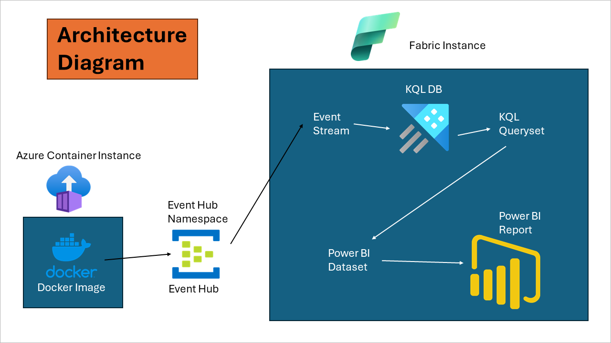

# Microsoft Fabric Real-Time Analytics Workshop

Welcome to the Microsoft Fabric Real-time Analytics end-to-end workshop!

In this workshop, we'll start by rapidly generating real-time data and understanding how that data can be processed and visualized in Microsoft Fabric. With the initial reporting in place, multiple modules are available that explore data warehousing, data lakehouse architecture, data activator, data science, and of course, real-time analytics. The modules are designed to be cohesive but flexible -- they all involve the same core scenario, but have limited dependencies so you can consume the modules that make the most sense for you. 

Analytics on real-time data presents unique challenges compared to traditional batch and near real-time scenarios. With real-time analytics, potentially large volumes of data need continuous ingestion, transformation, and visualization.

The basic architecture of our solution is illustrated below. The app deployed in the beginning of this workshop (either as a docker container or running in Jupyter notebook) will publish events to our Fabric environment. The data is ingested into a KQL database for real-time reporting in Power BI. 

## About the scenario

In this workshop, participants will get hands-on with a ficticious financial company "AbboCost." AbboCost would like to set up a stock monitoring platform to monitor price fluctuations and report on historical data. Throughout the workshop, we'll look at how every aspect of Microsoft Fabric can be incorporated as part of a larger solution -- by having everything in an integrated solution, we'll be able to quickly and securely integrate data, build reports, create data warehouses and lakehouses, forecast using ML models, and more.

## :thinking: Prerequisites

* An [Azure account](https://azure.microsoft.com/free/) with an active subscription.
  * If you are working through this content as part of a proctored workshop, your proctor may be able to provide you with an Azure Pass or other lab environment.
  * If you are a [Visual Studio subscriber](https://azure.microsoft.com/en-us/pricing/member-offers/credit-for-visual-studio-subscribers/), you may leverage this benefit to host the data in your account.
  * If you don't have access to an Azure subscription, you may be able to sign up for a [free account](https://www.azure.com/free).
* You must have the necessary privileges within your Azure subscription to create resources, create Microsoft Fabric capacity, register resource providers (if required), etc. Note that some organizational accounts may have administrative restrictions on Power BI features, which may limit functionality. 

## :books: Learning Modules

Core Modules for real-time analytics:

0. [Environment Setup](./modules/module00.md)
1. [KQL Database Configuration and Ingestion](./modules/module01.md)
2. [Exploring the Data](./modules/module02.md)
3. [Reporting in Power BI](./modules/module03.md)

Additional modules for end-to-end solution:

4. [Data Activator](./modules/module04.md)
5. [Data Warehousing: Synapse Data Warehouse and Data Pipelines](./modules/module05a.md)
6. [Data Lakehouse: Fabric Lakehouse, Notebooks, and Data Wrangler](./modules/module06a.md)
7. [Data Science: Using the Lakehouse and Notebooks to Forecast](./modules/module07a.md)

Continued Learning & Additional Modules

10. [(Optional) Advanced KQL, Dashboards, Troubleshooting](./modules/module10.md)
   * Ex-01: [KQL Queryset Improvements](./modules/moduleex01.md)
   * Ex-02: [Additional Real-time Dashboard](./modules/moduleex02.md)
   * Ex-03: [Predicted vs Actual Reporting](./modules/moduleex03.md)

<a href="#fabric-real-time-workshop">↥ back to top</a>

