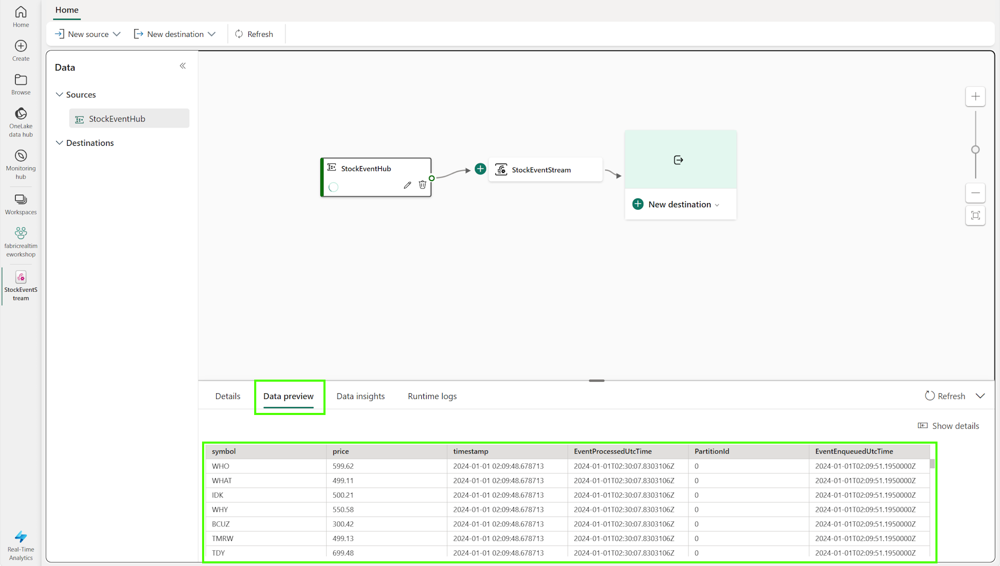

# Module 00 - Lab Environment Setup

**[Home](../README.md)** - [Next Module >](./module01.md)

## :stopwatch: Estimated Duration

30 minutes

## :thinking: Prerequisites

* Access to a Microsoft Fabric environment, or ability to create a Microsoft Fabric trial.

Depending on the deployment method, you may also need: 
* An [Azure account](https://azure.microsoft.com/free) with an active subscription.
* Owner permissions within a Resource Group to create resources and manage role assignments.

## :loudspeaker: Introduction

In order to follow along with the workshop exercises, a set of resources will need to be provisioned. At the heart of the scenario is the real-time stock price generator script that generates a continuous stream of stock prices that are used throughout the workshop. There are two ways to deploy this application:

* Option 1 - Deploy the app via Jupyter notebook
* Option 2 - Deploy the app via Azure Container Instance

When possible, we recommend deploying the stock price generator via Azure Container Instance (option 2). This is because the default Spark cluster will consume a large number of resources. If you intend on completing the lakehouse and data science modules, you may run into resource contention issues when running multiple notebooks. See the [additional learning section](#thinking-additional-learning) for references that discuss sizing and cluster configuration; running the app in a container will avoid these potential issues. (The pay-as-you-go cost for running the container and event hub is roughly $1.70/day (USD), but verify local costs using the [Azure Price Calculator](https://azure.microsoft.com/en-us/pricing/calculator/) -- the ARM template deploys a basic Event Hub and smallest possible 1 vCPU ACI container.) Please remember to deprovision deployments after the lab is complete.

Running via a Jupyter notebook will keep the solution completely within the Fabric environment, however the notebook must be kept running for the data to be generated. If you anticipate completing the lab in a few hours and not diving too deeply into the lakehouse or data science sections, this is may be easiest approach particularly if you are using a Fabric free trial.

You can always revisit this option later, should you wish to make a change. Simply deploy the new option, and change the input to the Eventstream to the new source.

## Table of Contents

1. [Download resource files](#1-download-resource-files)
2. [Create Fabric Capacity and Workspace](#2-create-fabric-capacity-and-workspace)
3. [Option 1 - Deploy and run the app via Jupyter notebook](#3-option-1---deploy-the-app-via-jupyter-notebook)
4. [Option 2 - Deploy the app via Azure Container Instance](#4-option-2---deploy-the-app-via-azure-container-instance)

## 1. Download resource files

Throughout this lab, there are several Jupyter notebooks, SQL scripts, and other assets you will need. These will be listed within each module, but you may prefer to download all resources in the *resources.zip* file below. This zip file contains all of the assets within this repo's */resources* folder. All assets are located in a subfolder with their module number.

Extract this zip file to a convenient location, and use these files instead of manually downloading each asset individually.

* [All Workshop Resources (resources.zip)](https://github.com/microsoft/fabricrealtimelab/raw/main/files/resources.zip)

## 2. Create Fabric Capacity and Workspace

Microsoft Fabric is deployed to an Azure Active Directory tenant. Within each Fabric tenant, Fabric capacities can be created to group resources for various purposes -- this might be done organizationally (sales, marketing, development), geographically, or other logical grouping. 

If a Fabric Trial is available, we recommend taking advantage of that opportunity to try Microsoft Fabric for a period of time (currently 60 days) with no commitment. To see if you are in a trial or eligible for a trial, visit the [Fabric portal](https://app.fabric.microsoft.com/). If you are able to log in or presented the option to start a trial, you should be all set! 

To create a Fabric capacity outside of a trial environment, create a new resource from the Azure portal, and search for Fabric. 

On the Create Fabric capacity page, assign the capacity to a resource group in a region that is available to you or recommended by your proctor, and change the size to the smallest size to minimize costs.

To learn more about Fabric capacities, visit this page:
[https://learn.microsoft.com/en-us/fabric/enterprise/licenses](https://learn.microsoft.com/en-us/fabric/enterprise/licenses)

Next, we'll create the Workspace within our Fabric capacity. Workspaces are assigned to capacities and serve as logical groupings for collaboration. We'll create a workspace within Fabric to house all of the artifacts for this workshop. 

In the [Fabric portal](https://app.fabric.microsoft.com/), click on Workspaces in the left nav and create a new workspace called RealTimeWorkspace.

Be sure to assign the workspace to the capacity created above. To do this, expand the advanced settings and ensure Fabric capacity is selected as the licensing mode, with the capacity created above selected.

## 3. Option 1 - Deploy the app via Jupyter Notebook

This option deploys as a Jupyter notebook, generating our stock prices and publishing to an Eventstream within Fabric.

1. To begin, download the following notebook to a convenient location:

* [Download the Stock Generator notebook](../resources/module00/StockGeneratorNotebook.ipynb)

2. In your Fabric workspace, switch to the Real-Time Analytics persona (bottom left) and create a new Eventstream. Name the Eventstream StockEventStream.

3. On the Eventstream, configure a new source and select Custom App:

4. On the 'Keys' tab of the Custom App, reveal the first connection string and copy it to your clipboard:

5. Switch to the Data Science persona. On the home page for the persona, click 'Import Notebook' and upload the notebook you downloaded earlier:

6. In the notebook, paste the connection string from above in the single quotes of the 'ConnectionString' variable of the first cell. It should look similar to the below:

7. With the connection string in place, click 'Run All' in the top toolbar. The first few cells may take a few moments to start the Spark session and import the required libraries. After a few moments, switch back to the Eventstream to observe a preview of the events generated by the notebook:

With this step completed, we're ready to move on -- you can skip the next step.

## 4. Option 2 - Deploy the app via Azure Container Instance

This option deploys the stock generator app to an Azure Container Instance using an ARM template. The app will generate stock data that publishes the data to an Azure Event Hub, which is also configured during the deployment of the ARM template. 

To auto-deploy the resources, use these steps below. (All templates are located in the /resource/module00 folder, if you have would like to deploy via another method.)

1. `Right-click` or `Ctrl + click` the button below to open the Azure Portal in a new window.

    

2. Beneath the **Resource group** field, click **Create new** and provide a unique name (e.g. `realtimeworkshop`), select a valid location, and then click **Review + create**.

    Suggested Locations:

     * Australia East
     * Canada Central
     * Central India
     * Central US
     * East Asia
     * East US
     * East US 2
     * Germany West Central
     * Japan East
     * Korea Central
     * North Central US
     * Norway East
     * South Central US
     * Switzerland North
     * UAE North
     * West US
     * West US 3

3. Once the validation has passed, click **Create**.

> :bulb: **Problems deploying?**
> If you have issues deploying, here are a couple of things to check: you subscription might have limitations on regions or resources, or a region may have capacity constraints. Try a different region, but if the problem persists please ask a proctor for assistance or file an issue with the project. The default template uses a [managed identity](https://learn.microsoft.com/en-us/entra/identity/managed-identities-azure-resources/overview) for the deployed app to authenticate with the Event Hub. In the event you are not able to use managed identities, you can configure the app to use SAS (Shared Access Signature) keys. Please use this template for using SAS keys: [Deploy to Azure Using SAS Key](https://portal.azure.com/#create/Microsoft.Template/uri/https%3A%2F%2Fraw.githubusercontent.com%2Fmicrosoft%2Ffabricrealtimelab%2Fmain%2Fresources%2Fmodule00%2Ffabricworkshop_arm_sas.json)

4. After the deployment has completed, open the resource group and verify the *Event Hub Namespace* and *Azure Container Instance* (ACI) is deployed: 

5. Open the Event Hub namespace, which will have a name similar to *ehns-123456-fabricworkshop*. On the *Settings* > *Shared access policies* page, click the *stockeventhub_sas* SAS key. Copy the primary key to your clipboard or other safe location, as this will be needed shortly. In short, you'll need the following:

* The Event Hub namespace (such as *ehns-123456-fabricworkshop*)
* The Event Hub name (default name is *stockeventhub*)
* The name of the SAS key (default name is *stockeventhub_sas*)
* The primary key of the SAS key (copy to the clipboard)

6. In your Fabric workspace (we recommend having this open in another tab), switch to the Real-Time Analytics persona (bottom left) and create a new *Eventstream*. Name the Eventstream *StockEventStream*.

7. On the Eventstream, configure a new source and select *Event Hub*:

8. On the Azure Event Hubs configuration page, add a new connection and using the values from Event Hub you noted earlier (the Event Hub namespace, the Event Hub name, the name of the SAS key, and key itself copied to your clipboard), specifying the *$Default* consumer group, and Data format of *JSON*: 

9. With the Event Hub configured, click on *Data Preview*. You should see events including the stock symbol, price, and timestamp.

## :thinking: Additional Learning

* [Spark Concurrency in Microsoft Fabric](https://learn.microsoft.com/en-us/fabric/data-engineering/spark-job-concurrency-and-queueing)
* [Advancing Analytics - Fabric Notebook Concurrency Explained](https://www.advancinganalytics.co.uk/blog/2023/12/13/fabric-notebook-concurrency-explained)

## :tada: Summary

With the notebook or container generating data and ingesting into our Eventstream, we're ready to continue! 

## :white_check_mark: Results

- [x] Configured Fabric environment
- [x] Set up the stock generator app (notebook or ACI)
- [x] Data getting ingested into Fabric Eventstream

[Continue >](./module01.md)
