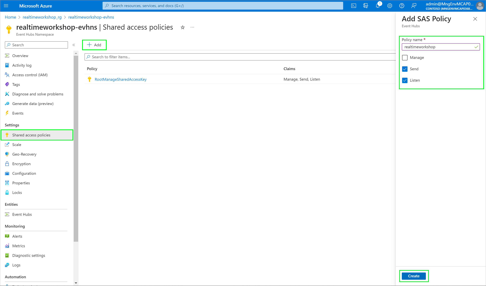
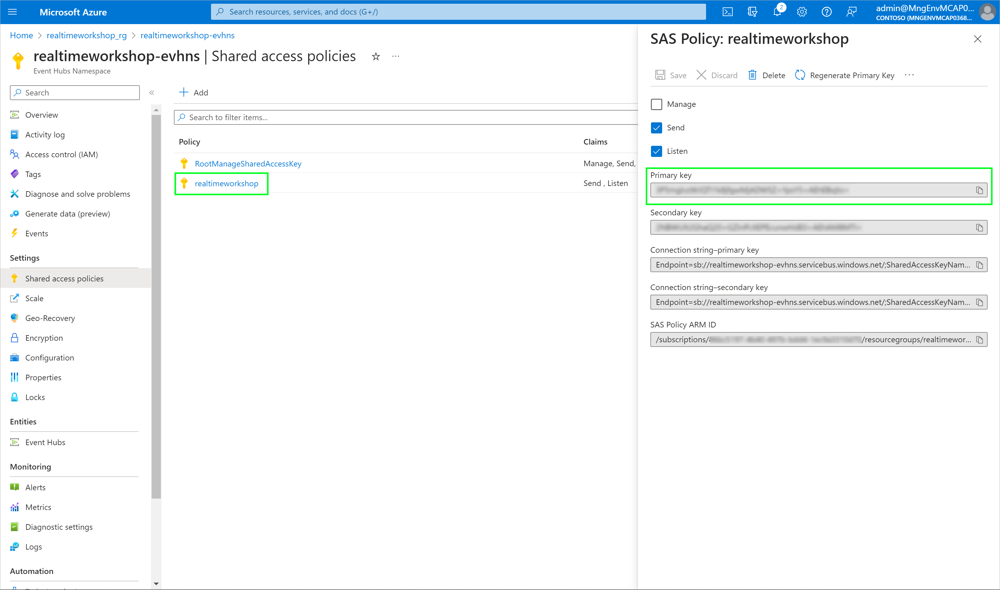
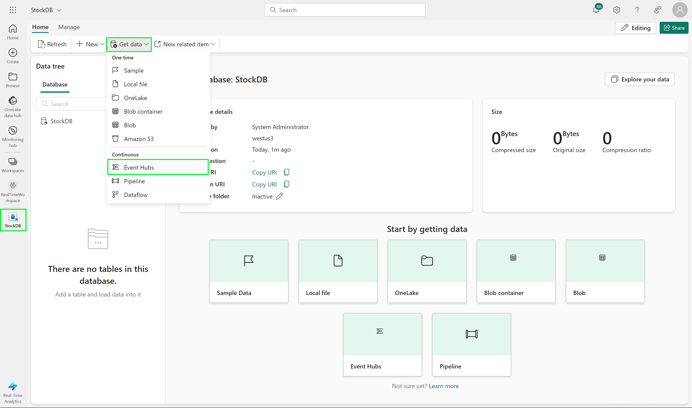
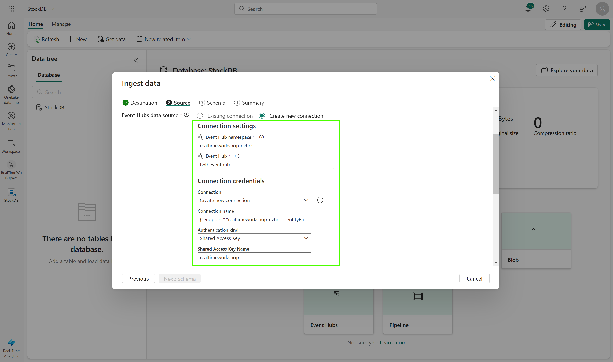
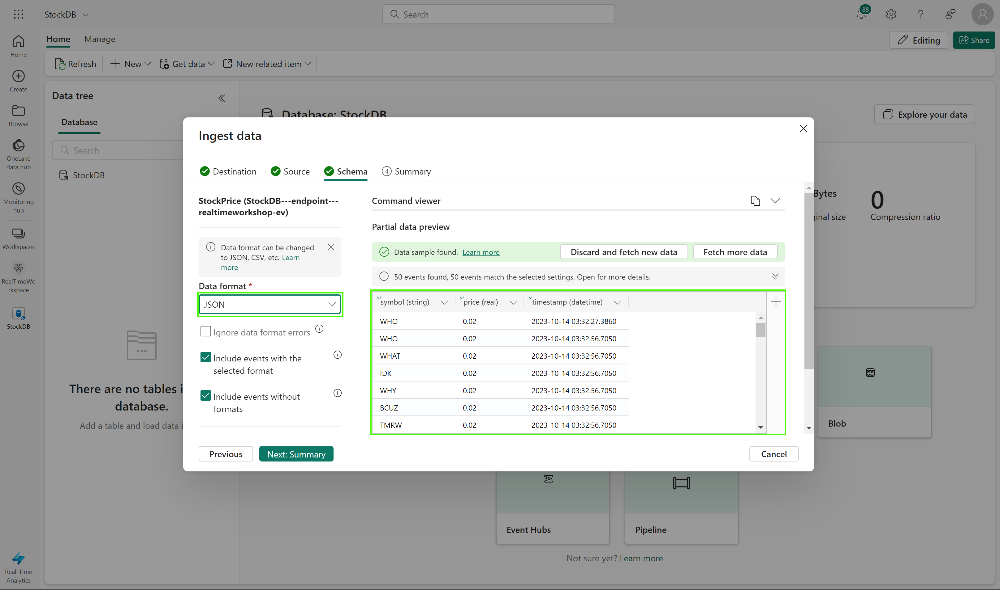
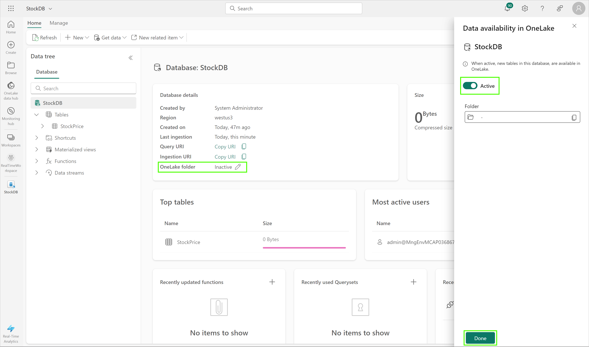

# Module 01 - Fabric Setup and Configuration

[< Previous Module](../modules/module00.md) - **[Home](../README.md)** - [Next Module >](./module02.md)

## :stopwatch: Estimated Duration

30 minutes

## :thinking: Prerequisites

- [x] Lab environment deployed from [setup](../modules/module00.md)

## :loudspeaker: Introduction

With our environment setup complete, we will create a data ingestion stream from Event Hub into Microsoft Fabric so we can create real-time reports. This data will also be stored in Fabric OneLake. 

## Table of Contents

1. [Create Fabric Capacity](#1-create-fabric-capacity)
2. [Retrieve Event Hub Key](#2-retrieve-event-hub-key)
3. [Create Fabric Workspace](#3-create-fabric-workspace)
4. [Create KQL Database](#4-create-kql-database)

## 1. Create Fabric Capacity

Microsoft Fabric is deployed to an Azure Active Directory tenant. Within each Fabric tenant, Fabric capacities can be created to group resources for various purposes -- this might be done organizationally (sales, marketing, development), geographically, or other logical grouping. 

If a Fabric Trial is available, we recommend taking advantage of that opportunity to try Microsoft Fabric for a period of time (currently 60 days) with no commitment.

To create a Fabric capacity outside of a trial environment, create a new resource from the Azure portal, and search for Fabric. 

On the Create Fabric capacity page, assign the capacity to the same resource group created during setup, and change the size to the smallest size to minimize costs. Ensure the capacity is in the same region (by default, West US 3) as all other resources.

To learn more about Fabric capacities, visit this page:
[https://learn.microsoft.com/en-us/fabric/enterprise/licenses](https://learn.microsoft.com/en-us/fabric/enterprise/licenses)

## 2. Retrieve Event Hub Key

In this step, we'll create a new key for accessing the Event Hub, and keep it handy for later use when configuring the KQL Database. 

Open the Event Hub namespace in the Azure portal and click Share access policies, and click Add to add a new SAS key. Use realtimeworkshop as a policyname with send and listen claims, and click create.

Select the key from the list of SAS keys, and copy the primary key to the clipboard, or keep this window open in a tab as we'll need to use the key shortly.

## 3. Create Fabric Workspace

Workspaces are assigned to capacities and serve as logical groupings for collaboration. We'll create a workspace within fabric to house all of the artifacts for this workshop. 

In the [Fabric portal](https://app.fabric.microsoft.com/), click on Workspaces in the left nav and create a new workspace called RealTimeWorkspace.

Be sure to assign the workspace to the capacity created above. To do this, expand the advanced settings and ensure Fabric capacity is selected as the licensing mode, with the capacity created above selected.

## 4. Create KQL Database

Kusto Query Language (KQL) is the query language used by Real-Time analytics in Microsoft Fabric (along with several other solutions, like Azure Data Explorer, Log Analytics, Microsoft 365 Defender, and others). Similar to Structured Query Language (SQL), KQL is optimized for ad-hoc queries over big data, time series data, and data transformation. 

To work with the data, we'll create a KQL database and stream data from the Event Hub into the KQL DB. 

In the Fabric portal, switch to the Real-Time Analytics persona by using the persona icon in the bottom left. This helps contextualize the menus for the features most often used:

Select the RealTimeWorkspace on the left nav, then click New > KQL Database, and name it StockDB.

Once created, select the newly created KQL Database and click the 'Get data' button, and select Event Hubs as the data source.

On the Destination screen, enter StockPrice as a table name and click Next: Source. On the Source page, select Create new connection. 

Under Connection settings, enter the Event Hub Namespace (configured in the ARM template) and Event Hub name (fwtheventhub).

Under Connection credentials, enter the Shared Access Key name (realtimeworkshop) and the Event Hub access key from the earlier step.

Once the connection is saved, advance to the schema page. Change the data format to JSON and ensure you are seeing the mock stock data in the preview window. Then Click Next: Summary.

Once complete, we'll want to be sure to copy this data to OneLake. To do this, click on the StockDB database (if it is not already the active item on screen) and change the OneLake folder to active.

## :tada: Summary

We have created and configured our Fabric environment, created a KQL database, and configured the database to ingest data from the Event Hub. 

## :white_check_mark: Results

- [x] Created the Fabric Capacity
- [x] Created the Fabric Workspace
- [x] Created the KQL Database
- [x] Ingested the Event Hub data

[Continue >](./module02.md)
