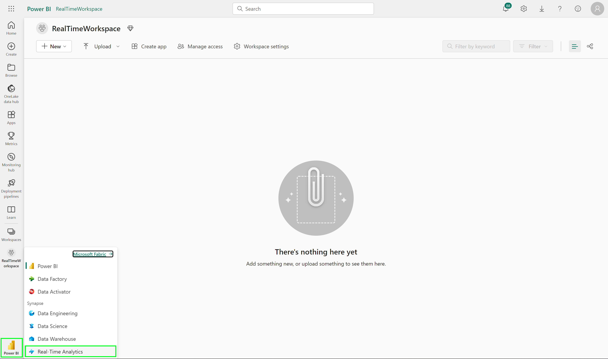
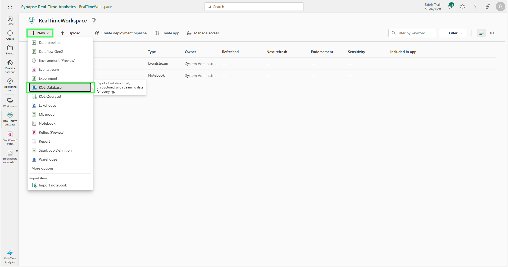
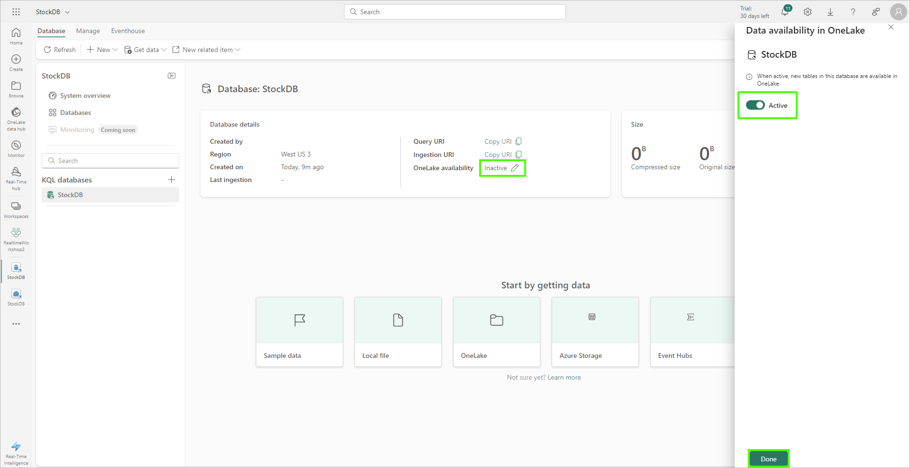
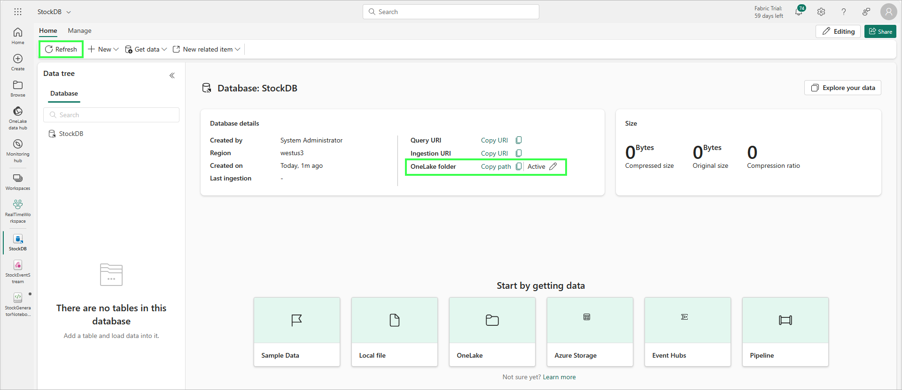
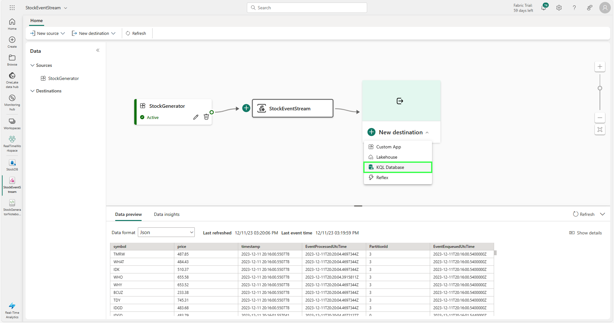
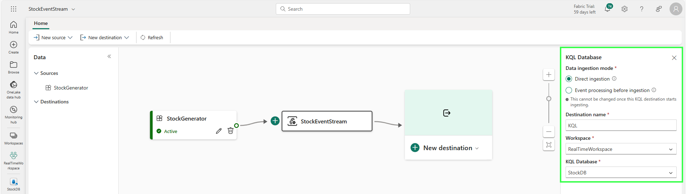
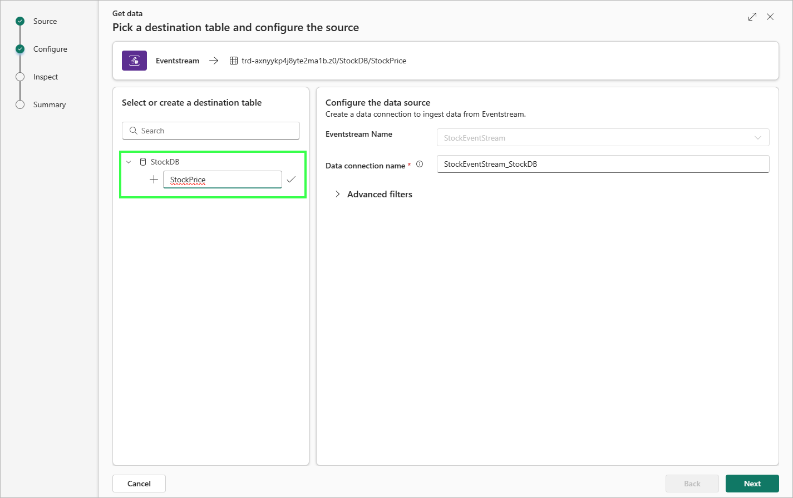
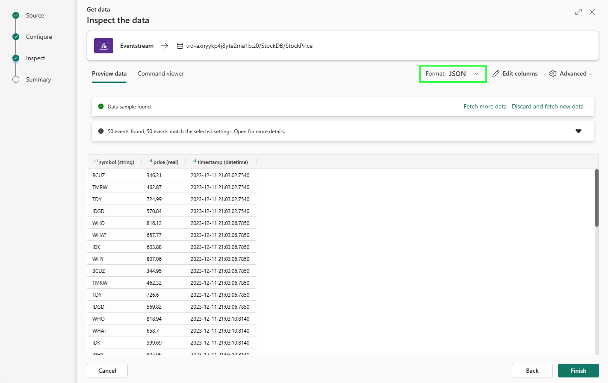
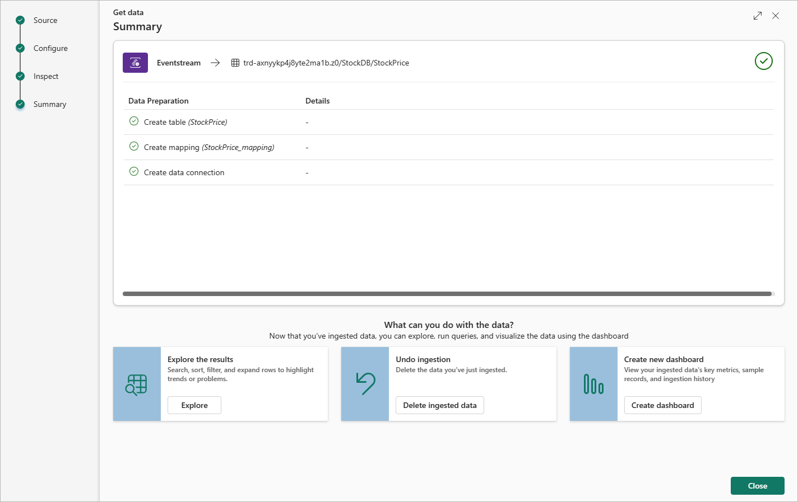

# Module 01 - KQL Database Configuration and Ingestion

[< Previous Module](../modules/module00.md) - **[Home](../README.md)** - [Next Module >](./module02.md)

## :stopwatch: Estimated Duration

30 minutes

## :thinking: Prerequisites

- [x] Lab environment deployed from [setup](../modules/module00.md)

## :loudspeaker: Introduction

With our environment setup complete, we will complete the ingestion of the eventstream so the data is ingested into a KQL database. This data will also be stored in Fabric OneLake. 

## Table of Contents

1. [Create KQL Database](#1-create-kql-database)
2. [Send data from the eventstream to the KQL database](#2-send-data-from-the-eventstream-to-the-kql-database)

## 1. Create KQL Database

Kusto Query Language (KQL) is the query language used by Real-Time analytics in Microsoft Fabric (along with several other solutions, like Azure Data Explorer, Log Analytics, Microsoft 365 Defender, and others). Similar to Structured Query Language (SQL), KQL is optimized for ad-hoc queries over big data, time series data, and data transformation. 

To work with the data, we'll create a KQL database and stream data from the Eventstream into the KQL DB. 

In the Fabric portal, switch to the Real-Time Analytics persona by using the persona icon in the bottom left. This helps contextualize the menus for the features most often used for the current tasks:

Select the RealTimeWorkspace on the left nav, then click *New* > *KQL Database*, and name the database *StockDB*.

When the KQL database is created, we should see the KQL details. An important setting for us to change immediately is enabling *OneLake folders*, which is inactive by default. While this can be changed later, only tables created after the setting is activated will be included in OneLake. Click on the pencil to change the setting and enable OneLake access:

After enabling OneLake, you may need to refresh the page to verify the OneLake folder integration is active:

## 2. Send data from the Eventstream to the KQL database

Navigate back to the Eventstream created in the previous module. Our data should be arriving into our Eventstream, and we'll now configure the data to be ingested into the KQL database we created above. On the Eventstream, click on New destination and select KQL Database:

On the KQL settings, select *Direct ingestion*. While we have the opportunity to process event data at this stage, for our purposes, we will ingest the data directly into the KQL database. Set the destination name to *KQL*, then select your workspace and KQL database created above:

On the first settings page, enter a name for the table to hold our data in our StockDB, such as *StockPrice*:

The next page allows us to inspect and configure the schema. Be sure to change the format from TXT to JSON. The default columns of *symbol*, *price*, and *timestamp* should be formatted like the image below:

On the final page, verify the settings show a green checkmark and if there are no errors, click close to complete the configuration:

## :tada: Summary

With the above steps completed, we have created a KQL database, and configured the database to ingest data from the Eventstream. 

## :white_check_mark: Results

- [x] Created the KQL Database
- [x] Completed the ingestion process from the Eventstream to the KQL database

[Continue >](./module02.md)
