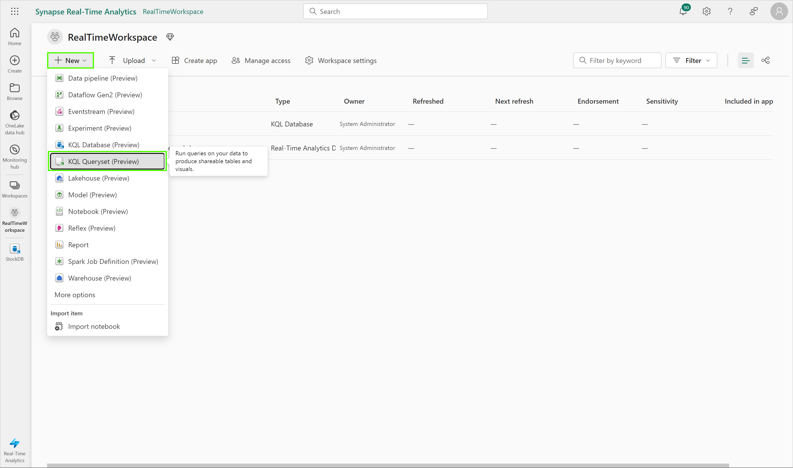

# Module 02 - Exploring the Data

[< Previous Module](../modules/module01.md) - **[Home](../README.md)** - [Next Module >](./module03.md)

## :stopwatch: Estimated Duration

20 minutes

## :thinking: Prerequisites

- [x] Lab environment deployed from [setup](../modules/module00.md)
- [x] Completed [Module 01](../modules/module01.md)

## :loudspeaker: Introduction

Now that our data is streaming into our KQL database, we can begin to query and explore the data, and leverage KQL to gain insights into the data. 

## Table of Contents

1. [Create KQL Queryset](#1-create-kql-queryset)

## 1. Create KQL Queryset

A KQL Queryset is used to run queries, view, and transform data from a KQL database. Like other artifacts, a KQL Queryset exists within the context of a workspace.

From the RealTimeWorkspace, click New > KSQL Queryset, using the name StockByTime. Select the StockDB from the list of available databases. The KQL query window will open, allowing us to query the data.



The default query code will look similar to:

```text
// Use "take" to view a sample number of records in the table and check the data.
StockPrice
| take 100

// See how many records are in the table.
StockPrice
| count

// This query returns the number of ingestions per hour in the given table.
StockPrice
| summarize IngestionCount = count() by bin(ingestion_time(), 1h)
```

## 2. Return recent prices, and calculate the price difference over time

We can begin to add our own calculations, such as calculating the change over time. For example, the [prev()](https://learn.microsoft.com/en-us/azure/data-explorer/kusto/query/prevfunction) function, a type of windowing function, allows us to look at values from previous rows; we can use this to calculate the change in price.

Try the following query and observe the results.

```text
StockPrice
| where timestamp > ago(5m)
| order by timestamp asc, symbol asc
| extend pricedifference = round(price - prev(price, 8), 2)
| extend percentdifference = round(round(price - prev(price, 8), 2) / prev(price, 8), 4)
| serialize previousprice = prev(price,8,0)
```

In this KQL query, the results are limited to rows within the last 5 minutes, which is sufficient for our real time dashboard.

The previous price is calculated by looking at the previous row of the same symbol (8 rows earlier). This requires the data is *serialized* so the order of the data is guaranteed, as required when using functions like *prev()* or *next()*. However, because we are using an *order by*, the data is automatically serialized so using the *serialize* keyword is not strictly required, but might be a good idea for clarity.

While this query is quick and effective, there is a problem with this query. We'll revist this in [Module 05 - Advanced KQL](../modules/module05.md)

## 3. Calculate biggest price changes and time change occured

Let's try a more advanced query. 

 Create another KQL queryset, called StockAggregate, to find out the biggest price difference for each stock, and the time it occured. 

 To do this, we can use the [summarize](https://learn.microsoft.com/en-us/azure/data-explorer/kusto/query/summarizeoperator) operator, which produces a table that aggregates the input table into groups based on the specified parameters. 

```text
 StockPrice
| order by timestamp asc, symbol asc
| extend pricedifference = round(price - prev(price, 8), 2)
| extend percentdifference = round(round(price - prev(price, 8), 2) / prev(price, 8), 4)
| summarize arg_max(pricedifference, timestamp, price) by symbol
```

KQL also has a *bin()* function, which can be used to bucket results based on the bin parameter -- in this case, by specifying a timestamp of 1 hour, the result is aggregated for each hour. Of course, this can be done by minute, hour, day, and so on. 

```text
StockPrice
| summarize avg(price), min(price), max(price) by bin(timestamp, 1h), symbol
| sort by timestamp asc, symbol asc
```

This is particularly useful when creating reports that aggregate real time data over a longer time period.

## :tada: Summary

In this exercise, you create several KQL querysets to explore the data. Moreover, these querysets will serve as filters and transformations of the data to feed into the reports we will create in the next module.

## :thinking: Tips

* Has your stock market crashed or seeing unusual data? Restarting the container will reset the initial stock prices.
* Too much data? Consider adding a row limit filter, like 'take 1000', to limit the number of rows returned.

## :white_check_mark: Results

- [x] Queried the data using KQL

[Continue >](./module03.md)
