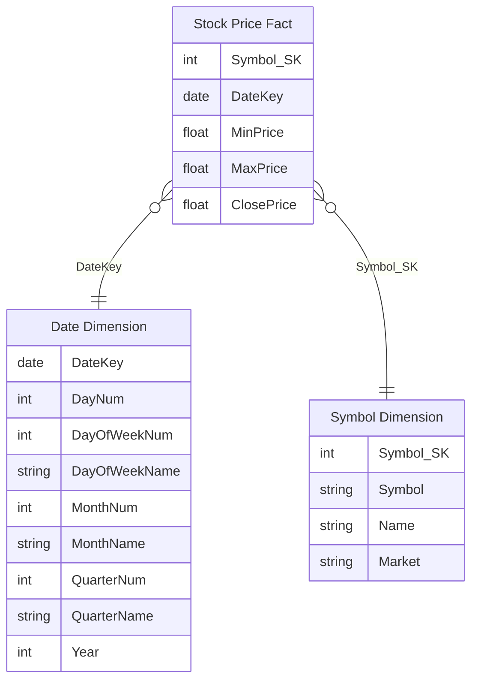
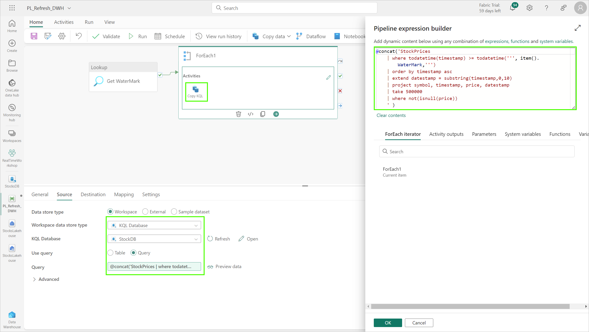

# Module 05a - Data Warehousing: Setup Warehouse and Pipeline

[< Previous Module](./module04.md) - **[Home](../README.md)** - [Next Module >](./module05b.md)

## :stopwatch: Estimated Duration

* 45 minutes for 05a
* 120 minutes overall

## :thinking: Prerequisites

- [x] Lab environment deployed from [setup](../modules/module00.md)
- [x] Completed [Module 01](../modules/module01.md)
- [x] Completed [Module 02](../modules/module02.md)
- [x] Completed [Module 03](../modules/module03.md)

## :book: Sections

This module is broken down into 3 sections:

* [Module 05a - Setting up the Warehouse and Pipeline](./module05a.md)
* [Module 05b - Building the dimension and fact tables, completing the pipeline](./module05b.md)
* [Module 05c - Semantic Modeling and reporting](./module05c.md)

## :loudspeaker: Introduction

Prefer video content? This video gives an overview of the data warehouse solution in this module:
* [Getting Started with Data Warehousing in Microsoft Fabric](https://youtu.be/e6RyPj0Cmec)

In this module, you will build a Synapse Data Warehouse inside Microsoft Fabric to aggregate data from the KQL database. In Microsoft Fabric, there are two primary ways to building a data warehouse: using a Synapse Data Warehouse, the focus of this module, and a lakehouse, the topic of the next module.

A Synapse Data Warehouse stores its data in OneLake in Delta/Parquet format similar to lakehouse tables. However, only a Synapse Data Warehouse offers read/write on the T-SQL endpoint. If you are migrating a data warehouse or more familiar with T-SQL development, using a Synapse Data Warehouse is a logical choice. 

Whether you choose a lakehouse or Synapse Data Warehouse, the end goals are similar: to have highly curated data to support the business analytics requirements. Often, this is done in a star-schema with dimension and fact tables. These tables serve as a single source of truth for the business. 

The data from our sample app currently streams at the rate of 1 request per second per stock symbol, resulting in 86,400 values for each stock per day. For the purposes of our warehouse, we'll collapse that to daily values including a daily high, daily low, and closing price of each stock. This reduces the rowcount from nearly 700,000 to 8. Our data model will look like this:



In our ETL (extract, transform, and load) process, we'll extract all data that hasn't yet been imported, as determined by the current watermark into a staging table. This data will then be summarized, and then placed in the dimension/fact tables. Note that while we are importing only one table (stock prices), the framework we are building supports ingestion for multiple tables. 

## Table of Contents

1. [Create the Synapse Data Warehouse](#1-create-a-synapse-data-warehouse-in-the-fabric-workspace)
2. [Copy or download the queries](#2-copy-or-download-the-queries)
3. [Create the staging and ETL objects](#3-create-the-staging-and-etl-objects)
4. [Build the data pipeline](#4-build-the-data-pipeline)
5. [Build ForEach activity](#5-add-foreach-activity)
6. [Test the Pipeline](#6-test-the-pipeline)

## 1. Create a Synapse Data Warehouse in the Fabric workspace

To get started, we'll first create the Synapse Data Warehouse in our workspace. There are two ways to do this: from the workspace, switch to the Data Warehouse persona (in the bottom left), and select the *Warehouse* button to create a new Synapse Data Warehouse.


Or, from the workspace home page, click *New* to add a new item, and select *Warehouse* to create a new Synapse Data Warehouse.


Name the warehouse *StocksDW*; once created, you'll see the warehouse is largely empty. Click *New SQL query* at the top of the window. We'll start building our schema in the next step:


## 2. Copy or download the queries 

You can either copy the queries inline as you progress, or download/use these script files. All of these queries can be found in the *resources > module05* folder of this repo, and can be downloaded in the following zip file:

* [All Workshop Resources (resources.zip)](https://github.com/microsoft/fabricrealtimelab/raw/main/files/resources.zip)

Individually, you can download these queries using these links:

* [1 - Create Staging and ETL.sql](<../resources/module05/scripts/1 - Create Staging and ETL.sql>)
* [2 - Create Dimension and Fact tables.sql](<../resources/module05/scripts/2 - Create Dimension and Fact tables.sql>)
* [3 - Load Dimension tables.sql](<../resources/module05/scripts/3 - Load Dimension tables.sql>)
* [4 - Create Staging Views.sql](<../resources/module05/scripts/4 - Create Staging Views.sql>)
* [5 - ETL.sp_Fact_Stocks_Daily_Prices_Load.sql](<../resources/module05/scripts/5 - ETL.sp_Fact_Stocks_Daily_Prices_Load.sql>)

Note: SQL statements executed in pipeline activities will need to be copied from the steps below.

## 3. Create the staging and ETL objects

In the queries below, the filename they are in will be listed on the first line, if applicable. 

Run the following query that creates the staging tables that will hold the data during the ETL (Extract, Transform, and Load) process. This will also create the two schemas used -- *stg* and *ETL*; schemas help group workloads by type or function. The *stg* schema is for staging, and contains intermediate tables for the ETL process. The *ETL* schema contains queries used for data movement, as well as a single table for tracking state.  

Note that the begin date for the watermark is arbitrarily chosen as some previous date (1/1/2022), ensuring all data is captured -- this date will be updated on each successful run. 

```sql
/* 1 - Create Staging and ETL.sql */

-- STAGING TABLES
CREATE SCHEMA stg
GO

CREATE TABLE stg.StocksPrices
(
   symbol VARCHAR(5) NOT NULL
   ,timestamp VARCHAR(30) NOT NULL
   ,price FLOAT NOT NULL
   ,datestamp VARCHAR(12) NOT NULL
)
GO

-- ETL TABLES
CREATE SCHEMA ETL
GO
CREATE TABLE ETL.IngestSourceInfo
(
    ObjectName VARCHAR(50) NOT NULL
    ,WaterMark DATETIME2(6)
    ,IsActiveFlag VARCHAR(1)
)

INSERT [ETL].[IngestSourceInfo]
SELECT 'StocksPrices', '1/1/2022 23:59:59', 'Y'
```

The *sp_IngestSourceInfo_Update* procedure updates the watermark; this ensures we are keeping track of which records have already been imported:

```sql
/* 1 - Create Staging and ETL.sql */

CREATE PROC [ETL].[sp_IngestSourceInfo_Update]
@ObjectName VARCHAR(50)
,@WaterMark DATETIME2(6)
AS
BEGIN

UPDATE [ETL].[IngestSourceInfo]
    SET WaterMark = @WaterMark
WHERE 
    ObjectName  = @ObjectName

END

GO
```

This should look similar to:


## 4. Build the data pipeline 

### 4-1. Create the data pipeline

From the workspace (or from within the Data Factory persona), create a new *Data pipeline* named *PL_Refresh_DWH*. 


### 4-2. Create lookup activity: *Get WaterMark*

Create a *Lookup* activity on the pipeline named *Get WaterMark*. On the settings tab, set the *Data store type* to *Workspace*, and set the *Workspace data store type* to *Data Warehouse*. For *Data Warehouse*, choose the *StocksDW* data warehouse. Specify a *Query* using the SQL statement below, and ensure *First row only* is *unchecked*.

```sql
SELECT * FROM [ETL].[IngestSourceInfo] WHERE IsActiveFlag = 'Y'
```

This should look similar to:


## 5. Build ForEach activity

### 5-1. Add ForEach activity

Add a *ForEach* activity to the pipeline (click the *Activities* tab and select *ForEach*). Use the default name or a name of your choice. A ForEach activity is a container that contains any number of child activities to be executed as a group. 

Connect the *On Success* event on the *Lookup* activity to the *ForEach* by dragging from the *On Success* checkbox on the right side of the activity to the *ForEach* activity. On the settings tab of the *ForEach*, set the *Items* to:

```text
@activity('Get WaterMark').output.value
```

This step gets the watermark for all tables we'd like to copy. While we are creating this for a single table, we'd like to make it flexible to be adapted to multiple tables in the future with minimal rework.

This should look similar to the image below:


### 5-2. Add Copy Data activity: *Copy KQL*

Add a *Copy Data* activity within the *ForEach* (click the plus (+) symbol within the ForEach to add a new activity within the ForEach). Configure this new Copy Data activity as follows:

* Name: Copy KQL
* Source: Select the KQL database holding the incoming stock data (StockDB)
* Query: Use the following query to get the data from the KQL table. Note: Verify the table name (in this case, StockPrice) matches the name of your table in your KQL database.

```text
@concat('StockPrice  
    | where todatetime(timestamp) >= todatetime(''', item().WaterMark,''') 
    | order by timestamp asc
    | extend datestamp = substring(timestamp,0,10) 
    | project symbol, timestamp, price, datestamp 
    | take 500000 
    | where not(isnull(price))
    ' )
```

This should look similar to:



You can click the *Preview data* button next to the query to verify data is returned. A window will open where you can specify a watermark -- enter a recent date such as *2023-12-01*.

Switch to the *Destination* tab on the copy activity. On the destination tab, set the destination to the *StocksDW* warehouse, and select the *stg.StocksPrices* table. Under the *Advanced* section, enter the following SQL script to truncate the table before loading the staging table:

```sql
delete stg.StocksPrices
```

This step first deletes old data from the staging table, and then copies the data from the KQL table, selecting data from the last watermark and inserting it into the staging table. Using a watermark is important to avoid processing the entire table; additionally, KQL queries have a maximum rowcount of 500,000 rows. Given the current rate of data ingested, this equates to about 3/4 of one day. 


### 5-3. Add Lookup activity: *Get New WaterMark*

Next, add a *Lookup* activity to the ForEach activity named *Get New WaterMark*. On the *Settings* tab, select the data warehouse in the current workspace, and select *Query* for the *Use Query* option. Enter the following query:

```sql
@concat('Select Max(timestamp) as WaterMark from stg.', item().ObjectName)
```

### 5-4. Add Stored Procedure activity: *Update WaterMark*

Add a new Stored Procedure activity after the *Get New Watermark* activity, with the name *Update WaterMark*. Configure the activity as follows:

* Name: Update WaterMark
* Warehouse: StocksDW
* Stored Procedure: ETL.sp_IngestSourceInfo_Update
* Parameters:
    * ObjectName (string): @item().ObjectName
    * WaterMark (datetime): @activity('Get New WaterMark').output.firstRow.WaterMark

The pipeline should now look similar to:


## 6. Test the Pipeline

While we aren't quite done, we have enough to test to make sure things are working as expected. From the *Home* tab in the pipeline, select *Run*. The pipeline will first validate to find any configuration errors. This initial run will take a few moments, and will copy the data into the staging table. 

From the pipeline, we should see the following output:


In the data warehouse, data should be visible in the staging table, as shown below. Within the data warehouse, selecting a table will show a preview of the data in the table.


While we're in the data warehouse, run the script below to reset the ingestion process. It's often handy in development to have a reset script to allow for incremental testing. This will reset the date and delete the data from the staging table.

```sql
-- Run this to 'RESET' the ingestion tables

exec ETL.sp_IngestSourceInfo_Update 'StocksPrices', '2022-01-01 23:59:59.000000'
GO

delete stg.StocksPrices
GO

delete dim_Symbol
GO

delete fact_Stocks_Daily_Prices
GO
```

## :tada: Summary

In this first part of module 05, we created a Synapse data warehouse, a data pipeline, and implemented the basic logic for our ingestion into the warehouse.

## :white_check_mark: Results

- [x] Created a Synapse data warehouse
- [x] Created a basic data pipeline
- [x] Verified the pipeline is working

## :thinking: Additional Learning

* [Data Warehousing in Fabric](https://learn.microsoft.com/en-us/fabric/data-warehouse/data-warehousing)

[Continue >](./module05b.md)