# Module 05a - Data Warehousing

[< Previous Module](../modules/module04.md) - **[Home](../README.md)** - [Next Module >](./module05b.md)

## :stopwatch: Estimated Duration

* 45 minutes for 05a
* 120 minutes overall

## :thinking: Prerequisites

- [x] Lab environment deployed from [setup](../modules/module00.md)
- [x] Completed [Module 01](../modules/module01.md)
- [x] Completed [Module 02](../modules/module02.md)
- [x] Completed [Module 03](../modules/module03.md)

## :loudspeaker: Introduction

In this module, you will build a Synapse Data Warehouse inside Microsoft Fabric to aggregate data from the KQL database. In Microsoft Fabric, there are two primary ways to building a data warehouse: using a Synapse Data Warehouse, the focus of this module, and a lakehouse, the topic of the next module.

A Synapse Data Warehouse stores its data in OneLake in Delta/Parquet format similar to lakehouse tables. However, only a Synapse Data Warehouse offers read/write on the T-SQL endpoint. If you are migrating a data warehouse or more familiar with T-SQL development, using a Synapse Data Warehouse is a logical choice. 

Whether you choose a lakehouse or Synapse Data Warehouse, the end goals are similar: to have highly curated data to support the business analytics requirements. Often, this is done in a star-schema with dimension and fact tables. These tables serve as a single source of truth for the business. 

The data from our sample app currently streams at the rate of 1 request per second per stock symbol, resulting in 86,400 values for each stock per day. For the purposes of our warehouse, we'll collapse that to daily values including a daily high, daily low, and closing price of each stock. This reduces the rowcount from nearly 700,000 to 8. Our data model will look like this:

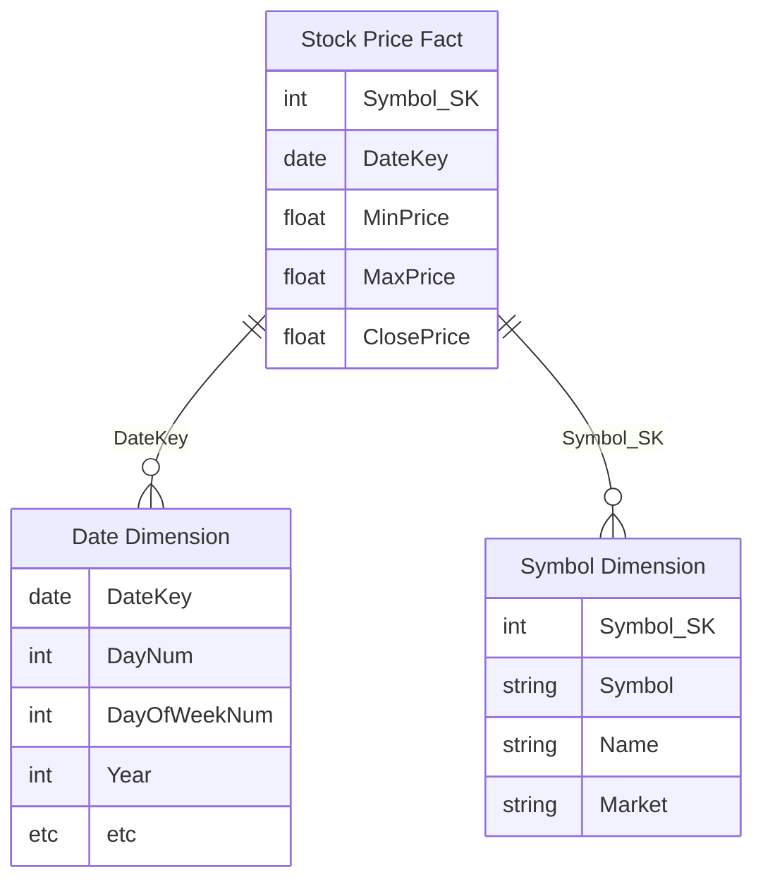

In our ETL (extract, transform, and load) process, we'll extract all data that hasn't yet been imported, as determined by the current watermark into a staging table. This data will then be summarized, and then placed in the dimension/fact tables. Note that while we are importing only one table (stock prices), the framework we are building supports ingestion for multiple tables. 

This module is broken down into 3 submodules:
* [Module 05a - Setting up the Warehouse and Pipeline](./module05a.md)
* [Module 05b - Building the dimension and fact tables, completing the pipeline](./module05b.md)
* [Module 05c - Semantic Modeling and reporting](./module05c.md)

## Table of Contents

1. [Create the Synapse Data Warehouse](#1-create-a-synapse-data-warehouse-in-the-fabric-workspace)
2. [Create pipeline](#2-create-pipeline)
3. [Add ForEach activity](#3-add-foreach-activity)
4. [Test the Pipeline](#4-test-the-pipeline)

## 1. Create a Synapse Data Warehouse in the Fabric workspace

To get started, we'll first create the Synapse Data Warehouse in our workspace. There are two ways to do this: from the workspace, switch to the Data Warehouse persona (in the bottom left), and select the Warehouse button to create a new Synapse Data Warehouse.

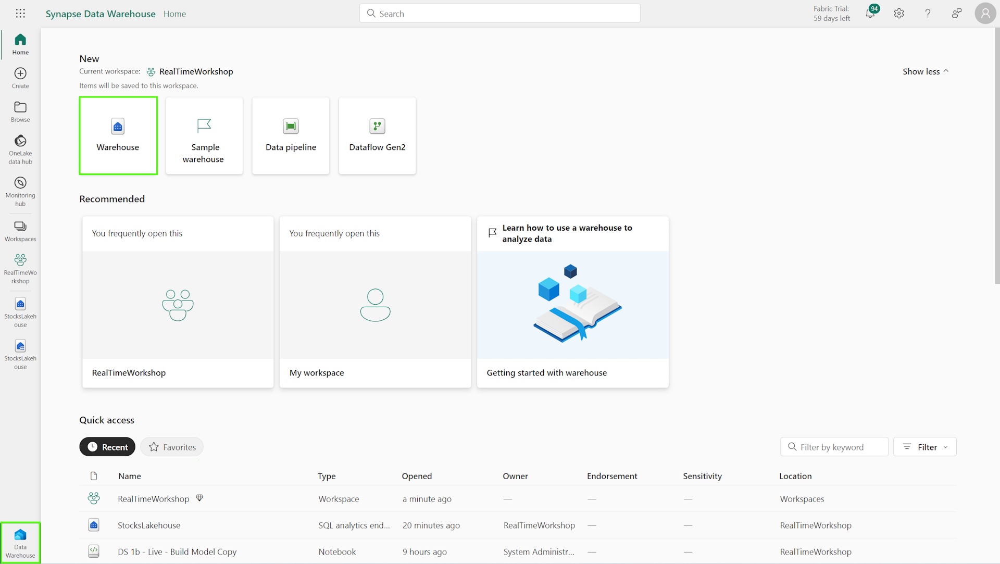

Or, from the workspace home page, click *New* to add a new item, and select *Warehouse* to create a new Synapse Data Warehouse.

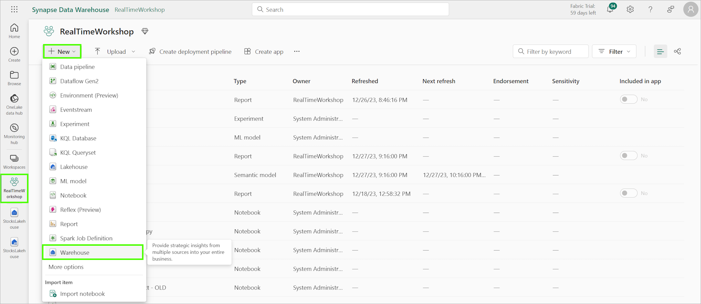

Name the warehouse StocksDW (or another name, if you prefer). Once created, you'll see the warehouse is largely empty. Click *New SQL query* at the top of the window. We'll start building our schema in the next step:

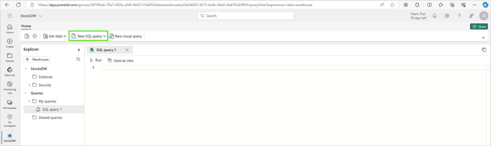

## 2. Create the schema for stocks and metadata

If you prefer, you can create separate SQL queries for each of these SQL scripts, or you can re-use the same query editor.

All of these queries can be found in the resources > module05 folder, or can be downloaded in the following zip file:
[All SQL Queries](../resources/module05/scripts/sqlscripts.zip)

Run the following query that creates the staging tables that will hold the data during the ETL (Extract, Transform, and Load) process. This will also create the two schemas used -- stg and ETL; schemas help group workloads by type or function. Note that the begin date for the waterwark is arbitrarily chosen as some previous date (12/31/2022), ensuring all data is captured.

```sql
-- STAGING TABLES
CREATE SCHEMA stg
GO

CREATE TABLE stg.StocksPrices
(
   symbol VARCHAR(5) NOT NULL
   ,timestamp VARCHAR(30) NOT NULL
   ,price FLOAT NOT NULL
   ,datestamp VARCHAR(12) NOT NULL
)
GO

-- ETL TABLES
CREATE SCHEMA ETL
GO
CREATE TABLE ETL.IngestSourceInfo
(
    ObjectName VARCHAR(50) NOT NULL
    ,WaterMark DATETIME2(6)
    ,IsActiveFlag VARCHAR(1)
)

INSERT [ETL].[IngestSourceInfo]
SELECT 'StocksPrices', '12/31/2022 23:59:59', 'Y'
```

The sp_IngestSourceInfo_Update procedure updates the watermark; this ensures we are keeping track of which records have already been imported:

```sql
CREATE PROC [ETL].[sp_IngestSourceInfo_Update]
@ObjectName VARCHAR(50)
,@WaterMark DATETIME2(6)
AS
BEGIN

UPDATE [ETL].[IngestSourceInfo]
    SET WaterMark = @WaterMark
WHERE 
    ObjectName  = @ObjectName

END

GO
```

This should look similar to:

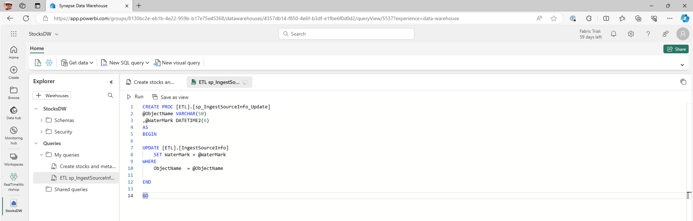

## 2. Create pipeline 

From the workspace (or from within the Data Factory persona), create a new pipeline named PL_Refresh_DWH. 

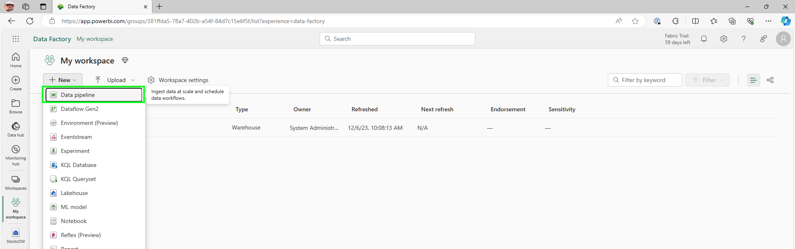

Create a lookup activity on the pipeline named Get WaterMark. On the settings tab, select the data warehouse as the data store type, and specify the StocksDW data warehouse. Specify a query using the SQL statement below, and ensure First row only is unchecked.

```sql
SELECT * FROM [ETL].[IngestSourceInfo] WHERE IsActiveFlag = 'Y'
```

This should look similar to:

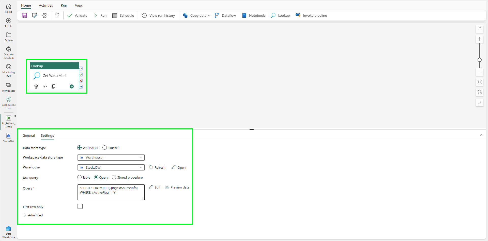

## 3. Add ForEach activity

Add a ForEach activity to the pipeline. Connect the On Success event on the Lookup activity to the ForEach by dragging from the On Success checkbox on the right side of the activity to the ForEach activity. On the settings tab of the ForEach, set the Items to:

```text
@activity('Get WaterMark').output.value
```

This should look similar to the image below:

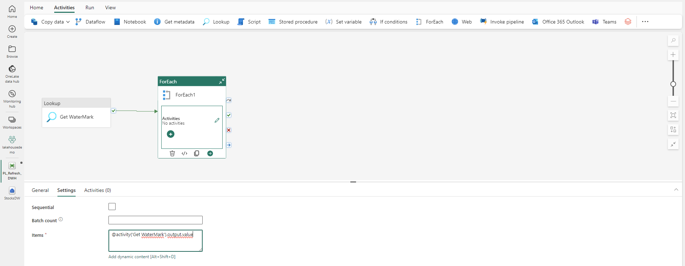

Add a Copy Data activity within the ForEach. On this activity:

* Name: Copy KQL
* Source: Select the KQL database holding the incoming stock data (StockDB)
* Query: Use the following query to get the data from the KQL table. Note: Verify the table name (in this case, StockPrice) matches the name of your table in your KQL database.

```text
@concat('StockPrice  
    | where todatetime(timestamp) >= todatetime(''', item().WaterMark,''') 
    | order by timestamp asc
    | extend datestamp = substring(timestamp,0,10) 
    | project symbol, timestamp, price, datestamp 
    | take 500000 
    | where not(isnull(price))
    ' )
```

This should look similar to:

[Copy KQL Query](../images/module05/pipeline-copykql-stockprices.png)

Switch to the *Destination* tab on the copy activity.

* Destination: On the destination tab, set the destination to the StocksDW warehouse, and select the stg.StocksPrices table. Under the Advanced section, enter the following SQL script to truncate the table before loading the staging table:

```sql
delete stg.StocksPrices
```

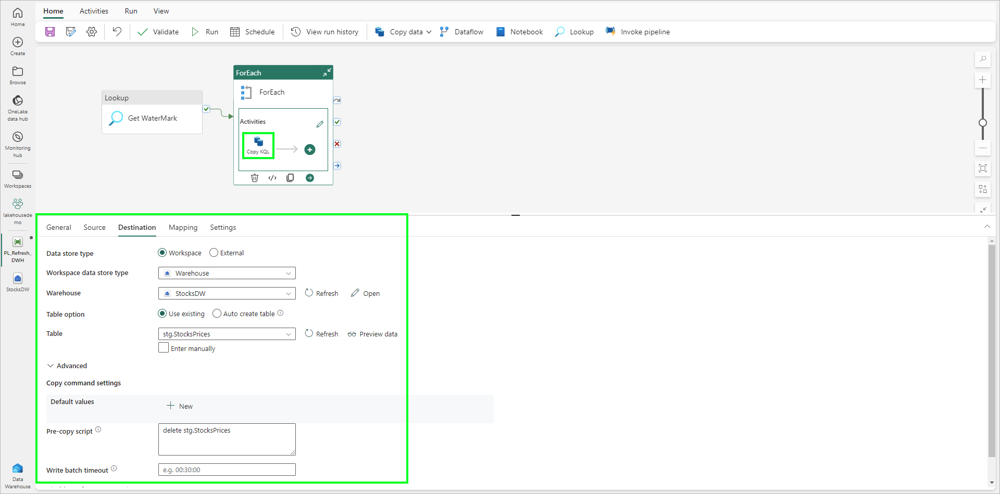

Next, add a Lookup Activity to the ForEach activity named Get New Watermark. On the Settings tab, select the data warehouse and use the following query:

```sql
@concat('Select Max(timestamp) as WaterMark from stg.', item().ObjectName)
```

Add a new Stored Procedure activity after the Get New Watermark activity, with the name Update WaterMark. Configure the activity as follows:

* Name: Update WaterMark
* Source: StocksDW
* Stored Procedure: ETL.sp_IngestSourceInfo_Update
* Parameters:
 * ObjectName: @item().ObjectName
 * WaterMark: @activity('Get New WaterMark').output.firstRow.WaterMark

The pipeline should now look similar to:


## 4. Test the Pipeline

While we aren't quite done, we have enough to test to make sure things are working as expected. From the Home tab in the pipeline, select Run. This initial run will take a few moments, and will copy the data into the staging table. 

From the pipeline, we should see the following output:

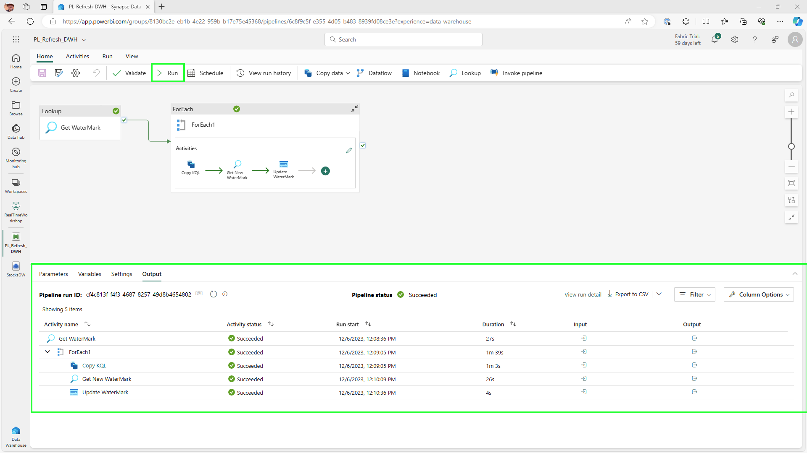

In the data warehouse, we should also see data in the staging table, as shown below:

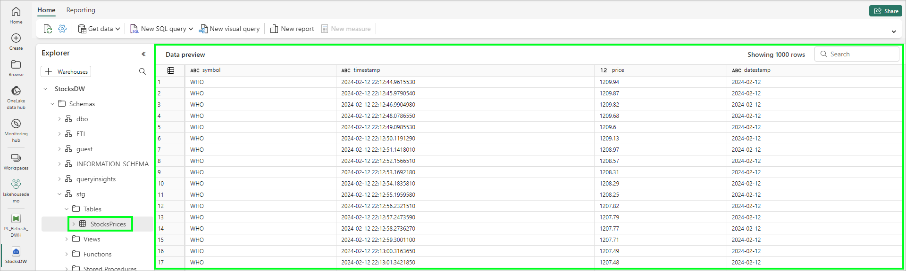

Note: if we'd like 'reset' our ingestion pipeline, we can run a query like the one below. It's often handy in development to have a reset script to allow for incremental testing. This will reset the date and delete the data from the staging table.

```sql
-- ONLY RUN THIS TO 'RESET' the ingestion tables

exec ETL.sp_IngestSourceInfo_Update 'StocksPrices', '2022-12-31 23:59:59.000000'
GO

delete stg.StocksPrices
GO

delete dim_Symbol
GO

delete fact_Stocks_Daily_Prices
GO
```

## :tada: Summary

In this first part of module 05, we created a Synapse Data Warehouse, a Data Pipeline, and implemented the basic logic for our ingestion into the warehouse.

## :white_check_mark: Results

- [x] Created a Synapse Data Warehouse
- [x] Created a basic Pipeline
- [x] Verified the pipeline is working

## :thinking: Additional Learning

* [Data Warehousing in Fabric](https://learn.microsoft.com/en-us/fabric/data-warehouse/data-warehousing)

[Continue >](./module05b.md)