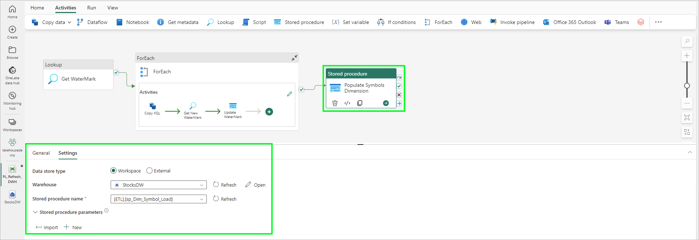
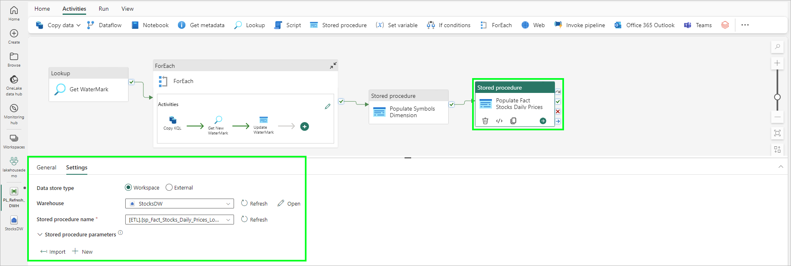
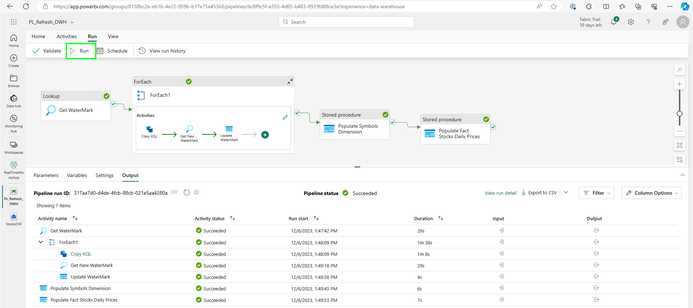
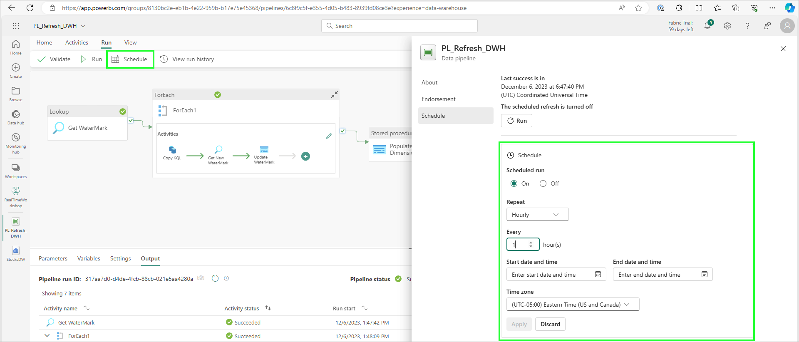

# Module 05b - Data Warehousing: Build Star Schema

[< Previous Module](./module05a.md) - **[Home](../README.md)** - [Next Module >](./module05c.md)

## :stopwatch: Estimated Duration

* 45 minutes for 05b
* 120 minutes overall

## :thinking: Prerequisites

- [x] Completed [Module 05a](../modules/module05a.md)

## :book: Sections

This module is broken down into 3 sections:

* [Module 05a - Setting up the Warehouse and Pipeline](./module05a.md)
* [Module 05b - Building the dimension and fact tables, completing the pipeline](./module05b.md)
* [Module 05c - Semantic Modeling and reporting](./module05c.md)

## :loudspeaker: Introduction

With the completion of Module 05a, we have the plumbing in place to ingest data from the KQL database into our data warehouse. The next step is to prep the dimension tables. 

For the date dimension, we'll load this during this module with values for the foreseeable future. 

For the symbol dimension, we'll incrementally load that during the pipeline -- this way, if new stocks are added at some point, they will get added to the Symbol dimension table during the execution of the pipeline.

We'll also create views to support the pipeline by making it easier to load data from the staging table by aggregating the min, max, and closing price of the stock.

## Table of Contents

1. [Create the dimension and fact tables](#1-create-the-dimension-and-fact-tables)
2. [Load the date dimension](#2-load-the-date-dimension)
3. [Create the procedure to load the Symbol dimension](#3-create-the-procedure-to-load-the-symbol-dimension)
4. [Create the views](#4-create-the-views)
5. [Add activity to load symbols](#5-add-activity-to-load-symbols)
6. [Create the procedure to load daily prices](#6-create-the-procedure-to-load-daily-prices)
7. [Add activity to the pipeline to load daily stock prices](#7-add-activity-to-the-pipeline-to-load-daily-stock-prices)
8. [Run the pipeline](#8-run-the-pipeline)
9. [Schedule the pipeline](#9-schedule-the-pipeline)

## 1. Create the dimension and fact tables

In our data warehouse, run the following SQL to create the fact and dimension tables. As in the previous step, you can run this ad-hoc or create a SQL query to save the query for future use.

```sql
/* 2 - Create Dimension and Fact tables.sql */

-- Dimensions and Facts (dbo)
CREATE TABLE dbo.fact_Stocks_Daily_Prices
(
   Symbol_SK INT NOT NULL
   ,PriceDateKey DATE NOT NULL
   ,MinPrice FLOAT NOT NULL
   ,MaxPrice FLOAT NOT NULL
   ,ClosePrice FLOAT NOT NULL
)
GO

CREATE TABLE dbo.dim_Symbol
(
    Symbol_SK INT NOT NULL
    ,Symbol VARCHAR(5) NOT NULL
    ,Name VARCHAR(25)
    ,Market VARCHAR(15)
)
GO

CREATE TABLE dbo.dim_Date 
(
    [DateKey] DATE NOT NULL
    ,[DayOfMonth] int
    ,[DayOfWeeK] int
    ,[DayOfWeekName] varchar(25)
    ,[Year] int
    ,[Month] int
    ,[MonthName] varchar(25)
    ,[Quarter] int
    ,[QuarterName] varchar(2)
)
GO
```

## 2. Load the date dimension

The date dimension is differentiated in that it can be loaded once with all of the values we'd need. Run the following script, which creates a procedure to populate the date dimension table with a large range of values. 

```sql
/* 3 - Load Dimension tables.sql */

CREATE PROC [ETL].[sp_Dim_Date_Load]
@BeginDate DATE = NULL
,@EndDate DATE = NULL
AS
BEGIN

SET @BeginDate = ISNULL(@BeginDate, '2022-01-01')
SET @EndDate = ISNULL(@EndDate, DATEADD(year, 2, GETDATE()))

DECLARE @N AS INT = 0
DECLARE @NumberOfDates INT = DATEDIFF(day,@BeginDate, @EndDate)
DECLARE @SQL AS NVARCHAR(MAX)
DECLARE @STR AS VARCHAR(MAX) = ''

WHILE @N <= @NumberOfDates
    BEGIN
    SET @STR = @STR + CAST(DATEADD(day,@N,@BeginDate) AS VARCHAR(10)) 
    
    IF @N < @NumberOfDates
        BEGIN
            SET @STR = @STR + ','
        END

    SET @N = @N + 1;
    END

SET @SQL = 'INSERT INTO dbo.dim_Date ([DateKey]) SELECT CAST([value] AS DATE) FROM STRING_SPLIT(@STR, '','')';

EXEC sys.sp_executesql @SQL, N'@STR NVARCHAR(MAX)', @STR;

UPDATE dbo.dim_Date
SET 
    [DayOfMonth] = DATEPART(day,DateKey)
    ,[DayOfWeeK] = DATEPART(dw,DateKey)
    ,[DayOfWeekName] = DATENAME(weekday, DateKey)
    ,[Year] = DATEPART(yyyy,DateKey)
    ,[Month] = DATEPART(month,DateKey)
    ,[MonthName] = DATENAME(month, DateKey)
    ,[Quarter] = DATEPART(quarter,DateKey)
    ,[QuarterName] = CONCAT('Q',DATEPART(quarter,DateKey))

END
GO
```

From a new query window, execute the above procedure by running the following script:

```sql
/* 3 - Load Dimension tables.sql */
Exec ETL.sp_Dim_Date_Load
```

## 3. Create the procedure to load the Symbol dimension

Similar to the date dimension, each stock symbol corresponds to a row in the Symbols dimension table. This table holds details of the stock, such as company name, and the market the stock is listed with.

Run the script below -- this will create the procedure that will load the stock symbol dimension. We'll execute this in the pipeline to handle any new stocks that might enter the feed.

```sql
/* 3 - Load Dimension tables.sql */

CREATE PROC [ETL].[sp_Dim_Symbol_Load]
AS
BEGIN

DECLARE @MaxSK INT = (SELECT ISNULL(MAX(Symbol_SK),0) FROM [dbo].[dim_Symbol])

INSERT [dbo].[dim_Symbol]
SELECT  
    Symbol_SK = @MaxSK + ROW_NUMBER() OVER(ORDER BY Symbol)  
    , Symbol
    , Name
    ,Market
FROM 
    (SELECT DISTINCT
    sdp.Symbol 
    , Name  = 'Stock ' + sdp.Symbol 
    , Market = CASE SUBSTRING(Symbol,1,1)
                    WHEN 'B' THEN 'NASDAQ'
                    WHEN 'W' THEN 'NASDAQ'
                    WHEN 'I' THEN 'NYSE'
                    WHEN 'T' THEN 'NYSE'
                    ELSE 'No Market'
                END
    FROM 
        [stg].[vw_StocksDailyPrices] sdp
    WHERE 
        sdp.Symbol NOT IN (SELECT Symbol FROM [dbo].[dim_Symbol])
    ) stg

END
GO
```

## 4. Create the views

Next, we'll create the views that support the aggregation of the data during the load. When the pipeline runs, data is copied from the KQL database into our staging table, where we'll aggregate all of the data for each stock into a min, max, and closing price for each day. 

```sql
/* 4 - Create Staging Views.sql */

CREATE VIEW [stg].[vw_StocksDailyPrices] 
AS 
SELECT 
    Symbol = symbol
    ,PriceDate = datestamp
    ,MIN(price) as MinPrice
    ,MAX(price) as MaxPrice
    ,(SELECT TOP 1 price FROM [stg].[StocksPrices] sub
    WHERE sub.symbol = prices.symbol and sub.datestamp = prices.datestamp
    ORDER BY sub.timestamp DESC
    ) as ClosePrice
FROM 
    [stg].[StocksPrices] prices
GROUP BY
    symbol, datestamp
GO
/**************************************/
CREATE VIEW stg.vw_StocksDailyPricesEX
AS
SELECT
    ds.[Symbol_SK]
    ,dd.DateKey as PriceDateKey
    ,MinPrice
    ,MaxPrice
    ,ClosePrice
FROM 
    [stg].[vw_StocksDailyPrices] sdp
INNER JOIN [dbo].[dim_Date] dd
    ON dd.DateKey = sdp.PriceDate
INNER JOIN [dbo].[dim_Symbol] ds
    ON ds.Symbol = sdp.Symbol
GO
```

## 5. Add activity to load symbols

In the pipeline, add a new *Stored Procedure* activity named *Populate Symbols Dimension* that executes the procedure that loads the stock symbols. This should be connected to the success output of the foreach activity (not within the foreach activity), as shown below.

* Name: Populate Symbols Dimension
* Settings: 
  * Stored procedure name: [ETL].[sp_Dim_Symbol_Load]



## 6. Create the procedure to load daily prices

Next, run the script below to create the procedure that builds the fact table. This procedure merges data from staging into the fact table. If the pipeline is running throughout the day, the values will be updated to reflect any changes in the min, max, and closing price. (Note: currently, Fabric data warehouse does not yet support the T-SQL merge statement; because of this, data will be updated and then inserted as needed.)

```sql
/* 5 - ETL.sp_Fact_Stocks_Daily_Prices_Load.sql */

CREATE PROCEDURE [ETL].[sp_Fact_Stocks_Daily_Prices_Load]
AS
BEGIN
BEGIN TRANSACTION

    UPDATE fact
    SET 
        fact.MinPrice = CASE 
                        WHEN fact.MinPrice IS NULL THEN stage.MinPrice
                        ELSE CASE WHEN fact.MinPrice < stage.MinPrice THEN fact.MinPrice ELSE stage.MinPrice END
                    END
        ,fact.MaxPrice = CASE 
                        WHEN fact.MaxPrice IS NULL THEN stage.MaxPrice
                        ELSE CASE WHEN fact.MaxPrice > stage.MaxPrice THEN fact.MaxPrice ELSE stage.MaxPrice END
                    END
        ,fact.ClosePrice = CASE 
                        WHEN fact.ClosePrice IS NULL THEN stage.ClosePrice
                        WHEN stage.ClosePrice IS NULL THEN fact.ClosePrice
                        ELSE stage.ClosePrice
                    END 
    FROM [dbo].[fact_Stocks_Daily_Prices] fact  
    INNER JOIN [stg].[vw_StocksDailyPricesEX] stage
        ON fact.PriceDateKey = stage.PriceDateKey
        AND fact.Symbol_SK = stage.Symbol_SK

    INSERT INTO [dbo].[fact_Stocks_Daily_Prices]  
        (Symbol_SK, PriceDateKey, MinPrice, MaxPrice, ClosePrice)
    SELECT
        Symbol_SK, PriceDateKey, MinPrice, MaxPrice, ClosePrice
    FROM 
        [stg].[vw_StocksDailyPricesEX] stage
    WHERE NOT EXISTS (
        SELECT * FROM [dbo].[fact_Stocks_Daily_Prices] fact
        WHERE fact.PriceDateKey = stage.PriceDateKey
            AND fact.Symbol_SK = stage.Symbol_SK
    )

COMMIT

END
GO
```

## 7. Add activity to the pipeline to load daily stock prices

Add another *Stored Procedure* activity to the pipeline named *Populate Fact Stocks Daily Prices* that loads the stocks prices from staging into the fact table. Connect the success output of the *Populate Symbols Dimension* to the new *Populate Fact Stocks Daily Prices* activity.

* Name: Populate Fact Stocks Daily Prices
* Settings: 
    * Stored procedure name: [ETL].[sp_Fact_Stocks_Daily_Prices_Load]



## 8. Run the pipeline

Our pipeline should be complete! Run the pipeline by clicking the *Run* button, and verify the pipeline runs and fact and dimension tables are being loaded. 



## 9. Schedule the pipeline

Next, schedule the pipeline to run periodically. This will vary by business case, but this could be run frequently (every few minutes) or throughout the day (note: in this specific case, because there are roughly 700k rows per day, and KQL limits the query results to 500k, the pipeline must run at least twice per day to stay current). To schedule the pipeline, click the *Schedule* button (next to the *Run* button) and set up a recurring schedule, such as hourly or every few minutes:



## :tada: Summary

In this second part of module 05, we completed our pipeline by adding the fact and dimension tables, and added the key components to the pipeline to transform the per-second data into the desired daily aggregates. There are two key considerations:

First, the framework is modular to support additional ingestion tasks as needed with minimal rework. This is done via the *Get Watermark* Lookup that uses a table to keep track of what tables to ingest, and the current watermark of each table.

Second, the pipeline can be run throughout day and supports incremental loading, while keeping processing minimal. 

## :white_check_mark: Results

- [x] Completed the ingestion pipeline
- [x] Verified the pipeline is working

## :thinking: Additional Learning

* [Data Warehousing in Fabric](https://learn.microsoft.com/en-us/fabric/data-warehouse/data-warehousing)

[Continue >](./module05c.md)