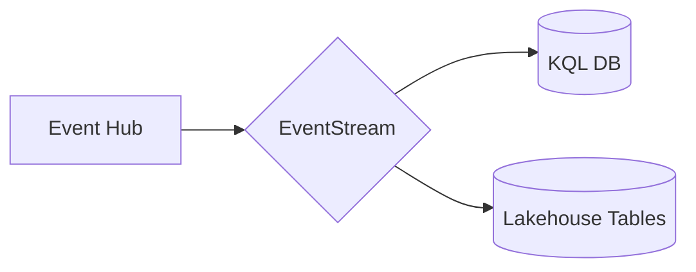
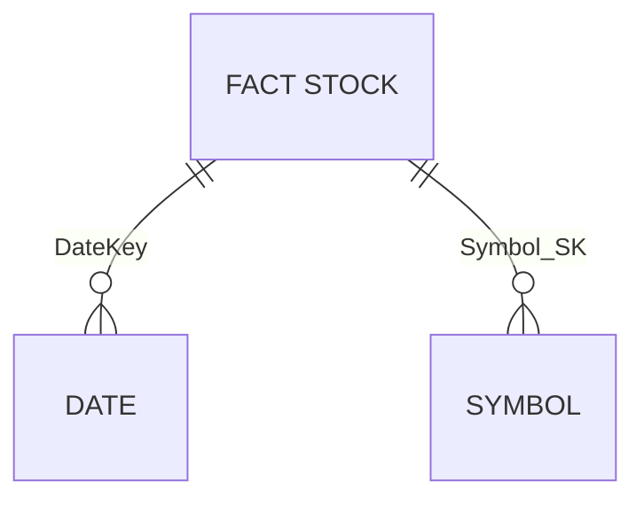

# Module 06 - Data Lakehouse

[< Previous Module](../modules/module05.md) - **[Home](../README.md)** - [Next Module >](./module07.md)

## :stopwatch: Estimated Duration

* 60 minutes 

## :thinking: Prerequisites

- [x] Lab environment deployed from [setup](../modules/module00.md)
- [x] Completed [Module 01](../modules/module01.md)
- [x] Completed [Module 02](../modules/module02.md)
- [x] Completed [Module 03](../modules/module03.md)

Completing [Module 05](../modules/module05a.md) is not required, but may be helpful in undertstanding developing a star schema.

## :loudspeaker: Introduction

This is an optional module. 

In this module, we'll build a Lakehouse architecture to ingest and store our stock data into a traditional star schema using fact and dimension tables. If you've completed the Data Warehouse module, this module is similar in result, but different in approach by using Notebooks within a Lakehouse.

From an architecture perspective, we'll look to implement a lambda architecture by splitting hot path and cold path data from the EventStream. Hot path will continue to the KQL database as already configured, and cold path will be added to write this raw data to our Lakehouse. Our event structure will resemble the following:

## :bulb: About Notebooks

Most of this lab will be done within a Jupyter Notebook, an industry standard way of doing exploratory data analyis, building models, and visualizing datasets, and processing data. A notebook itself is separated into indiviual sections called cells which contain code or text documentation. Cells, and even sections within cells, can adapt to different languages as needed (though Python is generally the most used language). The purpose of the cells are to break tasks down into manageable chunks and make collaboration easier; cells may be run individually or as a whole depending on the purpose of the notebook. 

## Table of Contents

1. [Create the Lakehouse](#1-create-the-lakehouse)
## 2. Add Lakehouse to EventStream
## 3. Import Notebooks
## 4. Create Schema
## 5. Load Fact Table
## 6. Build semantic model and simple report
## 7. Load additional data

## 1. Create the Lakehouse

Start by creating a lakehouse. Note: if you completing this module after the data science module or another module that uses a lakehouse, you may re-use that lakehouse or create a new one.

Within your Fabric workspace, switch to the data engineering persona (bottom left), and from the home page of the persona, create a new Lakehouse by clicking the Lakehouse button. Name the lakehouse StocksLakehouse. 

## 2. Add Lakehouse to EventStream

Open the EventStream created in the first module. Click the plus symbol on the output of the EventStream to add a new destination. select lakehouse and create a new database named StockData.

>> PIC OF EVENTSTREAM

configure table/etc.

## 3. Import Notebooks

Next, download the following notebooks and then import them into the Lakehouse. Note: if you have issues importing these notebooks, be sure you are downloading the raw notebook file, not the HTML page from GitHub that is displaying the notebook.

To view the notebook, click on the notebook link below for each notebook. The notebook is presented in a readable format in GitHub -- click the download button near the upper right to download the notebook, and save the ipynb notebook file to a convenient location.  

<!--
* [Lakehouse 1 - Create Schema](<https://github.com/bhitney/fabricrealtimelab/raw/main/resources/module06/Lakehouse 1 - Create Schema.ipynb>)
* [Lakehouse 2 - Stock Load](<./fabricrealtimelab/raw/main/resources/module06/Lakehouse 2 - Stock Load.ipynb>)
* [Lakehouse 3 - Historical Import](<https://github.com/bhitney/fabricrealtimelab/raw/main/resources/module06/Lakehouse 3 - Historical Import.ipynb>)
-->

* [Lakehouse 1 - Create Schema](<../resources/module07/Lakehouse 1 - Create Schema.ipynb>)
* [Lakehouse 2 - Stock Load](<../resources/module07/Lakehouse 2 - Stock Load.ipynb>)
* [Lakehouse 3 - Historical Import](<../resources/module07/Lakehouse 3 - Historical Import.ipynb>)

These may also be downloaded in the following zip file:

* [All Notebooks](../resources/module06/module6notebooks.zip)

From the data engineering persona home page, select Import notebook, and import each of the above notebooks into your workspace:

## 4. Create Schema

Click on your workspace to view all items in your RealTimeWorkshop workspace and open the Lakehouse 1 notebook. If you have trouble finding items as your workspace grows, you can view only the notebooks by clicking the filter and selecting notebooks:

If there is no lakehouse associated with the notebook, click Add underneath Add Lakehouse, and add the Lakehouse created in step 1. *Important*: You will need to add the lakehouse to every imported notebook.

With the notebook loaded and the lakehouse attached, notice the schema on the left. The StockData table was configured with our EventStream, and is the landing place for the data that is ingested from the Event Hub. This is our raw/bronze level data, as it represents data without any processing or validation.

The lakehouse has two types of storage: managed tables and unmanaged files. As you might expect, tables are delta tables managed by the lakehouse engine; files are unstructured files where we might import data files, text files, and other binary assets. 

The next step is to run through this first notebook. You can either click 'Run all' from the left top tool bar, but is recommended you run each cell individually by clicking the play button on the left side of each cell to follow along with the process. The location of these buttons is shown by the arrows in the above image. 

Most of the code in our notebooks is written in Python, but notebooks support a variety of languages. Several cells of the notebook are defined functions, such as 'def create_dim_symbol()': these contain the code, but do not run until the function is called. You will also notice the cell that drops the tables is *frozen*; frozen cells will not run and cannot be altered until unfrozen. This is helpful for testing where we might want to occasionally run code when working with notebooks interactively. While similar to 'commenting out' sections of code, freezing cells is more powerful in that any contents of the cells are also preserved.

When all cells have been run, refresh the schema by clicking the three dots (...) dots to the right of the Tables and clicking Refresh, as shown in the image below. You should see additional tables for our dimensional model:

With the schema in place, we're ready to look at our main notebook that will process the incremental load into the fact table.

## 5. Load Fact Table

With our schema ready, let's review the dimensional model for our data:

Our fact table contains the daily stock prices (the high, low, and closing price), while our dimensions are for our date and stock symbols (which might contain company details and other information). Although simple, conceptually this model represents a typical star schema that can be applied to larger datasets. 

Load the 

## 6. Build semantic model and simple report

## 7. Load additional data

This step is optional. If you are completing this lab in a single day, the fact table will only have a single data point for each stock as the data is aggregated to high/low/close prices for each day. Additional data is available that can be imported; this allows for more interesting reports and analysis. (These same files are shared by the data science module.)

To complete this step, load the Lakehouse 3 notebook. This notebook will download additional history data, and process it very similarly to the Lakehouse 2 notebook that loads the fact table. 

## References

https://en.wikipedia.org/wiki/Lambda_architecture

SELECT dwfact.PriceDateKey, 
(SELECT Symbol FROM dim_Symbol WHERE Symbol_SK = dwfact.Symbol_SK) as Symbol,
dwfact.MinPrice as dw_MinPrice, lhfact.MinPrice as lh_MinPrice,
dwfact.MaxPrice as dw_MaxPrice, lhfact.MaxPrice as lh_MaxPrice,
dwfact.ClosePrice as dw_ClosePrice, lhfact.ClosePrice as lh_ClosePrice
FROM dbo.fact_Stocks_Daily_Prices dwfact
INNER JOIN StocksLakehouse.dbo.fact_stocks_daily_prices lhfact
ON dwfact.PriceDateKey = lhfact.PriceDateKey 
AND (SELECT Symbol FROM dim_Symbol WHERE Symbol_SK = dwfact.Symbol_SK) = 
(SELECT Symbol FROM StocksLakehouse.dbo.dim_symbol WHERE Symbol_SK = lhfact.Symbol_SK)
WHERE dwfact.PriceDateKey >= '2023-12-01' and 
dwfact.PriceDateKey <= '2023-12-03'
ORDER BY dwfact.PriceDateKey ASC, Symbol ASC