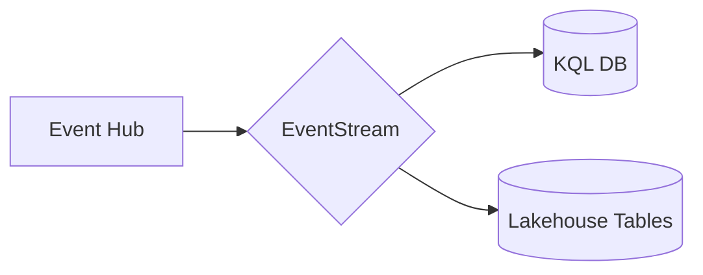
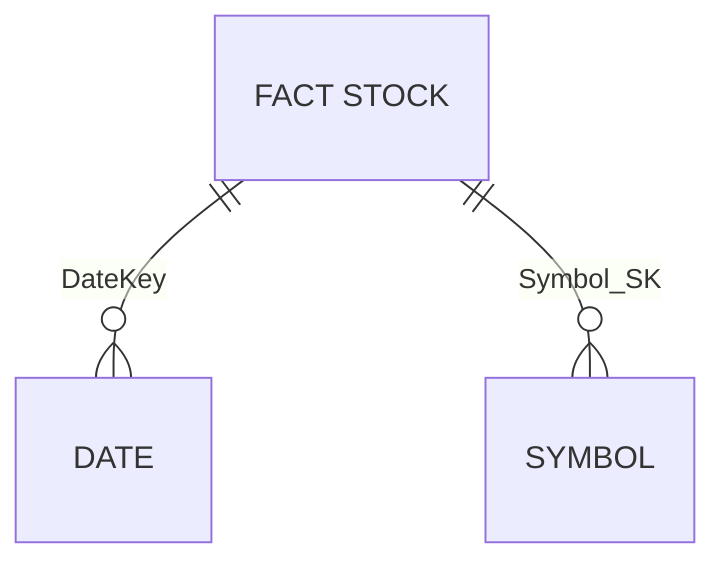

# Module 06 - Data Lakehouse

[< Previous Module](../modules/module05.md) - **[Home](../README.md)** - [Next Module >](./module07.md)

## :stopwatch: Estimated Duration

* 60 minutes 

## :thinking: Prerequisites

- [x] Lab environment deployed from [setup](../modules/module00.md)
- [x] Completed [Module 01](../modules/module01.md)
- [x] Completed [Module 02](../modules/module02.md)
- [x] Completed [Module 03](../modules/module03.md)

Completing [Module 05](../modules/module05a.md) is not required, but may be helpful in undertstanding developing a star schema.

## :loudspeaker: Introduction

This is an optional module. 

In this module, we'll build a Lakehouse architecture to ingest and store our stock data into a traditional star schema using fact and dimension tables. If you've completed the Data Warehouse module, this module is similar in result, but different in approach by using Notebooks within a Lakehouse.

From an architecture perspective, we'll look to implement a lambda architecture by splitting hot path and cold path data from the EventStream. Hot path will continue to the KQL database as already configured, and cold path will be added to write this raw data to our Lakehouse. Our event structure will resemble the following:

## :bulb: About Notebooks

Most of this lab will be done within a Jupyter Notebook, an industry standard way of doing exploratory data analyis, building models, and visualizing datasets, and processing data. A notebook itself is separated into indiviual sections called cells which contain code or text documentation. Cells, and even sections within cells, can adapt to different languages as needed (though Python is generally the most used language). The purpose of the cells are to break tasks down into manageable chunks and make collaboration easier; cells may be run individually or as a whole depending on the purpose of the notebook. 

## Table of Contents

1. [Create the Lakehouse](#1-create-the-lakehouse)
## 2. Add Lakehouse to EventStream
## 3. Import Notebooks
## 4. Create Schema
## 5. Load Fact Table
## 6. Build semantic model and simple report
## 7. Load additional data

## 1. Create the Lakehouse

Start by creating a lakehouse. Note: if you completing this module after the data science module or another module that uses the lakehouse, you may re-use that lakehouse or create a new one.

Within your Fabric workspace, select New > Lakehouse, and create a new lakehouse named StocksLakehouse. 

>> PIC OF CREATE LAKEHOUSE

## 2. Add Lakehouse to EventStream

Open the EventStream created in the first module. Click the plus symbol on the output of the EventStream to add a new destination. select lakehouse and create a new database named StockData.

>> PIC OF EVENTSTREAM

configure table/etc.

## 3. Import Notebooks

Next, download the following notebooks and then import them into the Lakehouse. Note: if you have issues importing these notebooks, be sure you are downloading the raw notebook file.

*Right click* and use *Save link as*:

* [Lakehouse 1 - Create Schema](<https://github.com/bhitney/fabricrealtimelab/raw/main/resources/module06/Lakehouse 1 - Create Schema.ipynb>)
* [Lakehouse 2 - Stock Load](<https://github.com/bhitney/fabricrealtimelab/raw/main/resources/module06/Lakehouse 2 - Stock Load.ipynb>)
* [Lakehouse 3 - Historical Import](<https://github.com/bhitney/fabricrealtimelab/raw/main/resources/module06/Lakehouse 3 - Historical Import.ipynb>)

These may also be downloaded in the following zip file:

* [All Notebooks](../resources/module06/module6notebooks.zip)

From the Lakehouse, select Import notebook from the data engineering home page.

## 4. Create Schema

From the workspace items, open the Lakehouse 1 notebook. If there is no default lakehouse, click ....

## 5. Load Fact Table

## 6. Build semantic model and simple report

## 7. Load additional data

This step is optional. If you are completing this lab in a single day, the fact table will only have a single data point for each stock as the data is aggregated to high/low/close prices for each day. Additional data is available that can be imported; this allows for more interesting reports and analysis. (These same files are shared by the data science module.)

To complete this step, load the Lakehouse 3 notebook. This notebook will download additional history data, and process it very similarly to the Lakehouse 2 notebook that loads the fact table. 

## References

https://en.wikipedia.org/wiki/Lambda_architecture