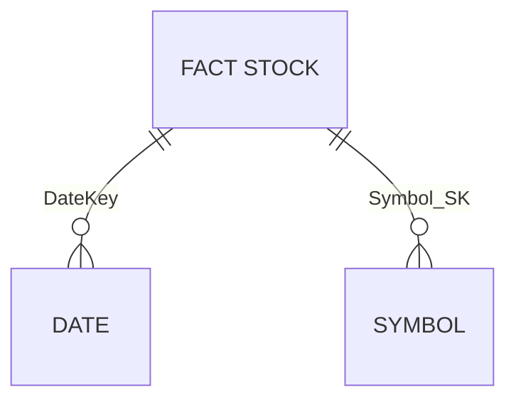

# Module 06 - Data Lakehouse

[< Previous Module](../modules/module05.md) - **[Home](../README.md)** - [Next Module >](./module07.md)

## :stopwatch: Estimated Duration

* 60 minutes 

## :thinking: Prerequisites

- [x] Lab environment deployed from [setup](../modules/module00.md)
- [x] Completed [Module 01](../modules/module01.md)
- [x] Completed [Module 02](../modules/module02.md)
- [x] Completed [Module 03](../modules/module03.md)

Completing [Module 05](../modules/module05a.md) is not required, but may be helpful in undertstanding developing a star schema.

## :loudspeaker: Introduction

This is an optional module. 

In this module, we'll build a Lakehouse architecture to ingest and store our stock data into a traditional star schema using fact and dimension tables.




flowchart LR
    A[Event Hub] --> B{EventStream}
    B --> C[(KQL DB)]
    B --> D[(Lakehouse Tables)]
```

Currently in development.