# Module 06 - Data Lakehouse

[< Previous Module](../modules/module05.md) - **[Home](../README.md)** - [Next Module >](./module07.md)

## :stopwatch: Estimated Duration

* 60 minutes 

## :thinking: Prerequisites

- [x] Lab environment deployed from [setup](../modules/module00.md)
- [x] Completed [Module 01](../modules/module01.md)
- [x] Completed [Module 02](../modules/module02.md)
- [x] Completed [Module 03](../modules/module03.md)

Completing [Module 05](../modules/module05a.md) is not required, but may be helpful in undertstanding developing a star schema.

## :loudspeaker: Introduction

This is an optional module. 

In this module, we'll build a Lakehouse architecture to ingest and store our stock data into a traditional star schema using fact and dimension tables. If you've completed the Data Warehouse module, this module is similar in result, but different in approach by using Notebooks within a Lakehouse.

From an architecture perspective, we'll look to implement a lambda architecture by splitting hot path and cold path data from the EventStream. Hot path will continue to the KQL database as already configured, and cold path will be added to write this raw data to our Lakehouse. Our event structure will resemble the following:

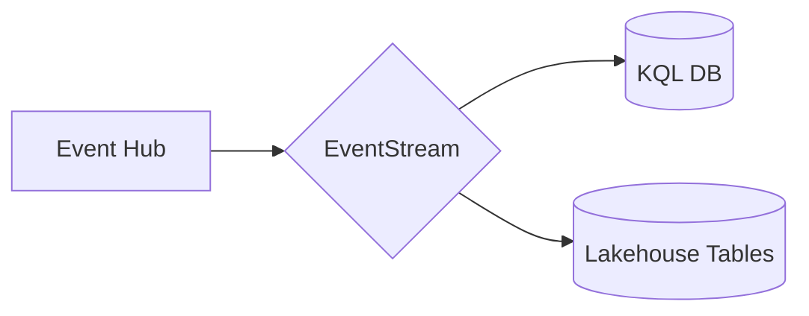

## :bulb: About Notebooks

Most of this lab will be done within a Jupyter Notebook, an industry standard way of doing exploratory data analyis, building models, and visualizing datasets, and processing data. A notebook itself is separated into indiviual sections called cells which contain code or text documentation. Cells, and even sections within cells, can adapt to different languages as needed (though Python is generally the most used language). The purpose of the cells are to break tasks down into manageable chunks and make collaboration easier; cells may be run individually or as a whole depending on the purpose of the notebook. 

## Table of Contents

1. [Create the Lakehouse](#1-create-the-lakehouse)
2. [Add Lakehouse to EventStream](#2-add-lakehouse-to-eventstream)
3. [Import Notebooks](#3-import-notebooks)
4. [Create Schema](#4-create-schema)
5. [Load Fact Table](#5-load-fact-table)
6. [Build semantic model and simple report](#6-build-semantic-model-and-simple-report)
7. [Load additional data](#7-load-additional-data)

## 1. Create the Lakehouse

Start by creating a lakehouse. Note: if you completing this module after the data science module or another module that uses a lakehouse, you may re-use that lakehouse or create a new one.

Within your Fabric workspace, switch to the data engineering persona (bottom left), and from the home page of the persona, create a new Lakehouse by clicking the Lakehouse button. Name the lakehouse StocksLakehouse. 

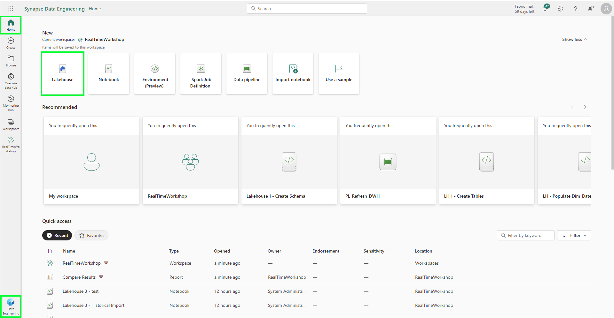

## 2. Add Lakehouse to EventStream

Open the EventStream created in the first module. Click the plus symbol on the output of the EventStream to add a new destination. Select Lakehouse from the context menu, and in the side panel that opens, select the Lakehouse created above and create a new table called StockData. Ensure the input data format is Json; this should look similar to the image below:

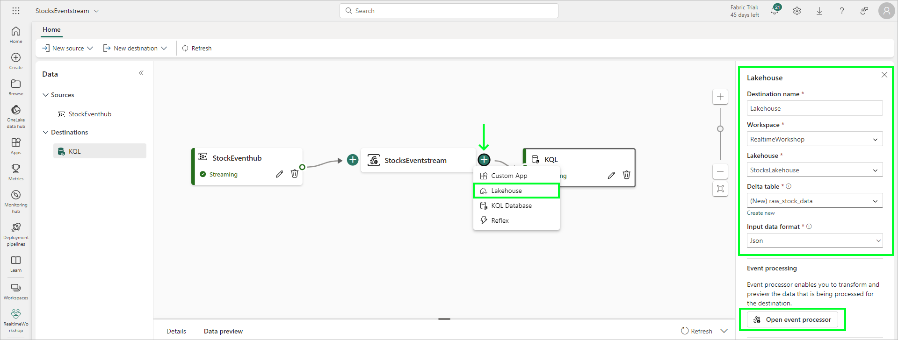

Once complete, we should have our EventStream publishing data to both the KQL Database (hot path) and our Lakehouse (cold path), and look similar to the image below:

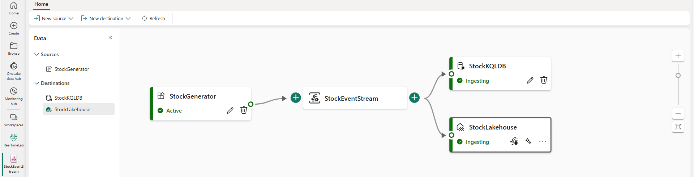

## 3. Import Notebooks

Next, download the following notebooks and then import them into the Lakehouse. Note: if you have issues importing these notebooks, be sure you are downloading the raw notebook file, not the HTML page from GitHub that is displaying the notebook.

To view the notebook, click on the notebook link below for each notebook. The notebook is presented in a readable format in GitHub -- click the download button near the upper right to download the notebook, and save the ipynb notebook file to a convenient location.  

<!--
* [Lakehouse 1 - Create Schema](<https://github.com/bhitney/fabricrealtimelab/raw/main/resources/module06/Lakehouse 1 - Create Schema.ipynb>)
* [Lakehouse 2 - Stock Load](<./fabricrealtimelab/raw/main/resources/module06/Lakehouse 2 - Stock Load.ipynb>)
* [Lakehouse 3 - Historical Import](<https://github.com/bhitney/fabricrealtimelab/raw/main/resources/module06/Lakehouse 3 - Historical Import.ipynb>)
-->

* [Lakehouse 1 - Create Schema](<../resources/module07/Lakehouse 1 - Create Schema.ipynb>)
* [Lakehouse 2 - Stock Load](<../resources/module07/Lakehouse 2 - Stock Load.ipynb>)
* [Lakehouse 3 - Historical Import](<../resources/module07/Lakehouse 3 - Historical Import.ipynb>)

These may also be downloaded in the following zip file:

* [All Notebooks](../resources/module06/module6notebooks.zip)

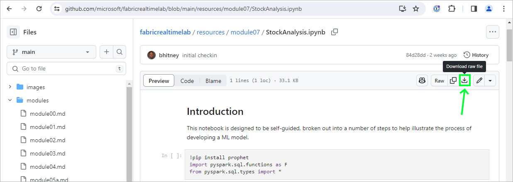

From the data engineering persona home page, select Import notebook, and import each of the above notebooks into your workspace:


## 4. Create Schema

Click on your workspace to view all items in your RealTimeWorkshop workspace and open the Lakehouse 1 notebook. If you have trouble finding items as your workspace grows, you can view only the notebooks by clicking the filter and selecting notebooks:

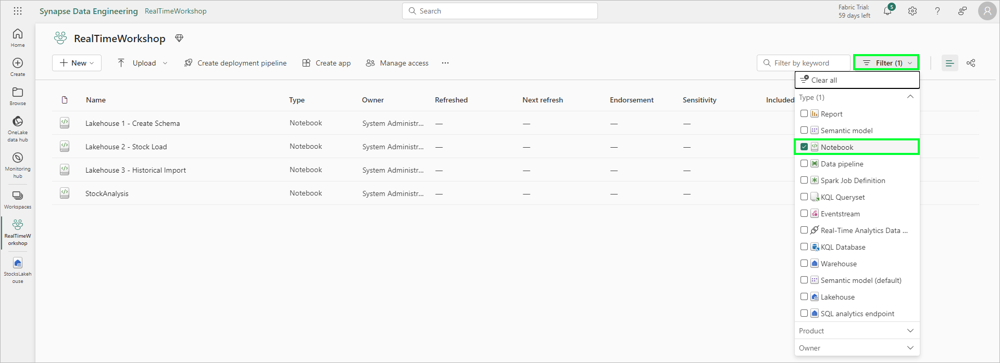

If there is no lakehouse associated with the notebook, click Add underneath Add Lakehouse, and add the Lakehouse created in step 1. *Important*: You will need to add the lakehouse to every imported notebook.

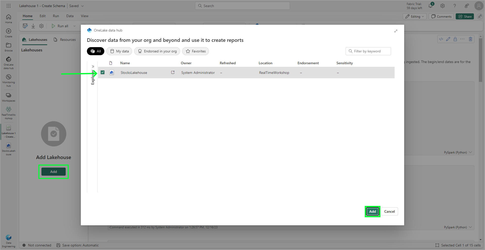

With the notebook loaded and the lakehouse attached, notice the schema on the left. The StockData table was configured with our EventStream, and is the landing place for the data that is ingested from the Event Hub. This is our raw/bronze level data, as it represents data without any processing or validation.

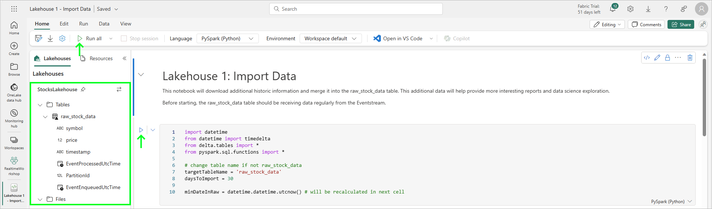

The lakehouse has two types of storage: managed tables and unmanaged files. As you might expect, tables are delta tables managed by the lakehouse engine; files are unstructured files where we might import data files, text files, and other binary assets. 

The next step is to run through this first notebook. You can either click 'Run all' from the left top tool bar, but is recommended you run each cell individually by clicking the play button on the left side of each cell to follow along with the process. The location of these buttons is shown by the arrows in the above image. 

Most of the code in our notebooks is written in Python, but notebooks support a variety of languages. Several cells of the notebook are defined functions, such as 'def create_dim_symbol()': these contain the code, but do not run until the function is called. You will also notice the cell that drops the tables is *frozen*; frozen cells will not run and cannot be altered until unfrozen. This is helpful for testing where we might want to occasionally run code when working with notebooks interactively. While similar to 'commenting out' sections of code, freezing cells is more powerful in that any contents of the cells are also preserved.

When all cells have been run, refresh the schema by clicking the three dots (...) dots to the right of the Tables and clicking Refresh, as shown in the image below. You should see additional tables for our dimensional model:

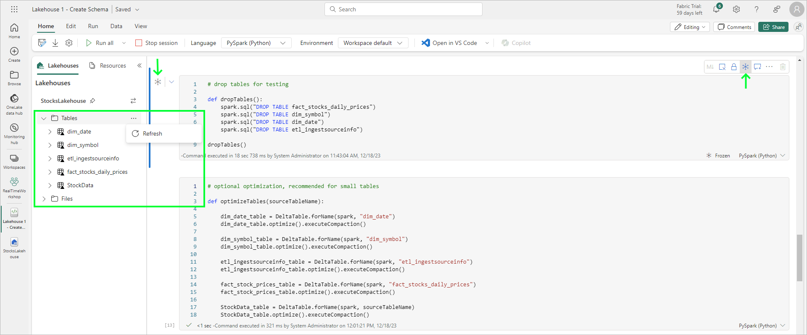

With the schema in place, we're ready to look at our main notebook that will process the incremental load into the fact table.

## 5. Load Fact Table

With our schema ready, let's review the dimensional model for our data:

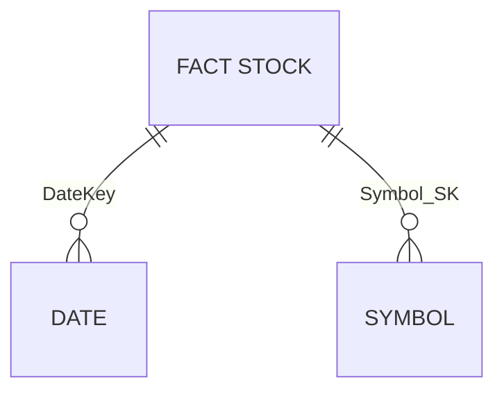

Our fact table contains the daily stock prices (the high, low, and closing price), while our dimensions are for our date and stock symbols (which might contain company details and other information). Although simple, conceptually this model represents a typical star schema that can be applied to larger datasets. 

Load the Lakehouse 2 notebook. Similarly to the above step, attach the Lakehouse to the notebook. We recommend you run each cell individually, but you can also click Run All. Be sure the sourceTableName in the first cell matches the name of your table that contains the imported data from the Event Hub.

When you have finished running through the notebook, feel free to run it a few times and observe the behavior. There are a few key points to keep in mind: 
* While this notebook can be run as a scheduled task, it's primarily designed to be used interactively. We could remove much of the display code and other artifacts to improve performance.
* Take note of the symbol incremental load (dim_symbol_incremental_load). A business question that must be asked is, "Can we handle new stock symbols in the data feed?" In a real world scenario, this might not be possible, or it may be very possible depending on the data source. We made the decision here to support new symbols that might not exist, however, this takes processing time. As with all business problems, this is a tradeoff between performance and functionality.

To scheduled the notebook to run periodically, click on the Run tab, and click schedule. The notebook can be configured to run periodically (such as every 15 minutes):

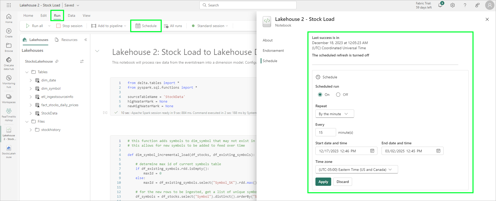

## 6. Build semantic model and simple report

In this step, we'll create a new semantic model that we can use for reporting, and create a simple Power BI report.

Open the StocksLakehouse, and from the top nav bar, select New Semantic Model. Name the model StocksDimensionalModel and select the fact and two dimension tables, as show below:

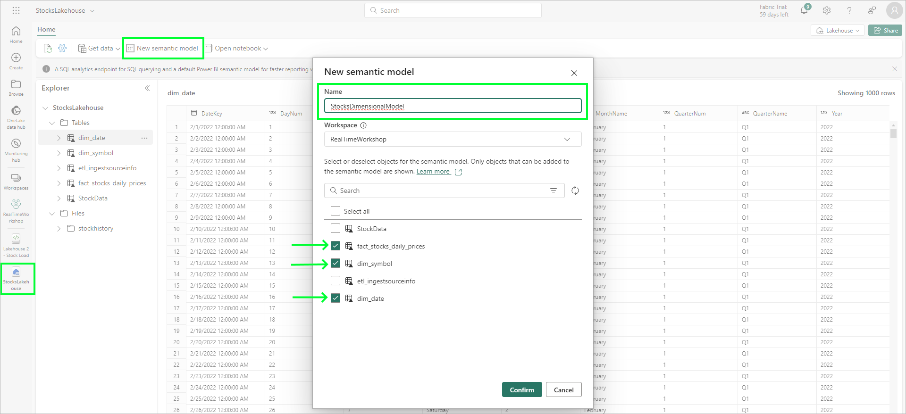

When the semantic model opens, we need to define relationships between the fact and dimension tables. The easiest way to do this is to drag the Symbol_SK from the fact table to the Symbol_SK on the dim_symbol table, and ensure there is a 1:many relationship between the dim_symbol (1) and the fact table (many). Similarly, drag the PriceDateKey from the fact table to the DateKey column on the dim_date table:

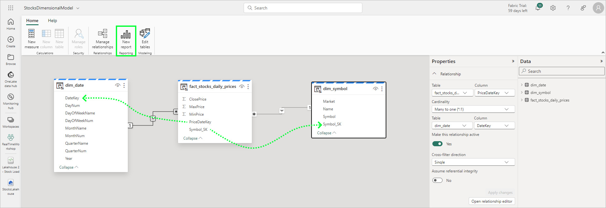

When complete, click the New Report button to create a new report. Similar to our reports created in earlier modules, add a line chart to our canvas, and configure it as follows:

* X-axis: PriceDateKey (fact_stocks_daily_prices)
* Y-axis: ClosePrice (fact_stocks_daily_prices)
* Legend: Symbol (dim_symbol)

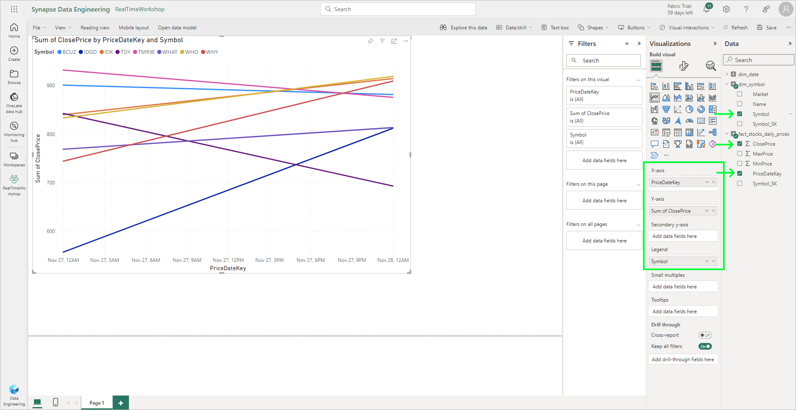

Of course, our report doesn't contain much data because the stock data is aggregated per day. If you'd like to add more data, complete the next step. Save the report with a name like 'DailyStockReport'.

## 7. Load additional data

This step is optional. 

If you are completing this lab in a single day, the fact table will only have a single data point for each stock as the data is aggregated to high/low/close prices for each day. Additional data is available that can be imported; this allows for more interesting reports and analysis. (These same files are shared by the data science module.)

To complete this step, load the Lakehouse 3 notebook. This notebook will download additional history data, and process it very similarly to the Lakehouse 2 notebook that loads the fact table. Run through the notebook -- notice the difference is that the data is being loaded from CSV files and then loaded into the fact table.

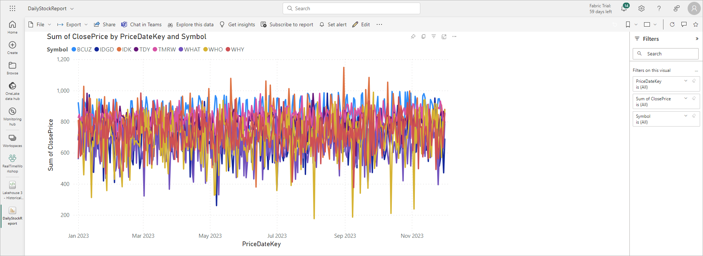

With more data to work with, what kind of interesting reports can be made?

## 8. Additional challenge for the overachiever

This step is optional.

Have you completed both the Synapse Data Warehouse and Lakehouse (this) modules? If so, you have two dimensional models made with very different approaches, but yield the same results. At least, they _should_ yield the same results. How can you check?

Fortunately, this is quite easy. The Lakehouse exposes a SQL Analytics endpoint that can be queried, so we can very easily join to Lakehouse tables as if they were in our Synapse Data Warehouse. Alternatively, we can join to the Synapse Data Warehouse from the Lakehouse.

In this example, we'll use SQL from the Synapse Data Warehouse to compare results. 

In our Synapse Data Warehouse, create a new SQL Query, and enter the following T-SQL. Note that the names of the Lakehouse may need to be modified slightly depending on how it was named, and the dates can be set automatically or specifically as needed:

```sql
declare @beginDate date = '2023-12-01'
declare @endDate date = '2023-12-03'

-- set @endDate = (SELECT coalesce(max(PriceDateKey),convert(Date, getdate())) FROM dbo.fact_Stocks_Daily_Prices)
-- set @beginDate = DATEADD(day, 2, @endDate)

print @beginDate
print @endDate

SELECT dwfact.PriceDateKey, 
(SELECT Symbol FROM dim_Symbol WHERE Symbol_SK = dwfact.Symbol_SK) as Symbol,
dwfact.MinPrice as dw_MinPrice, lhfact.MinPrice as lh_MinPrice,
dwfact.MaxPrice as dw_MaxPrice, lhfact.MaxPrice as lh_MaxPrice,
dwfact.ClosePrice as dw_ClosePrice, lhfact.ClosePrice as lh_ClosePrice
FROM dbo.fact_Stocks_Daily_Prices dwfact
INNER JOIN StocksLakehouse.dbo.fact_stocks_daily_prices lhfact
ON dwfact.PriceDateKey = lhfact.PriceDateKey 
AND (SELECT Symbol FROM dim_Symbol WHERE Symbol_SK = dwfact.Symbol_SK) = 
(SELECT Symbol FROM StocksLakehouse.dbo.dim_symbol WHERE Symbol_SK = lhfact.Symbol_SK)
WHERE dwfact.PriceDateKey >= @beginDate and 
dwfact.PriceDateKey <= @endDate
ORDER BY dwfact.PriceDateKey ASC, Symbol ASC
```

The query above will pull the min, max, and close price for each stock over the time period from both the Data Warehouse and Lakehouse, and place them side-by-side in the query results. The results should be identical for the Data Warehouse and Lakehouse. However, because the data for the Lakehouse may have been set up later, it is possible some values may not be equal if the max or min prices occured before data was being ingested into the Lakehouse.

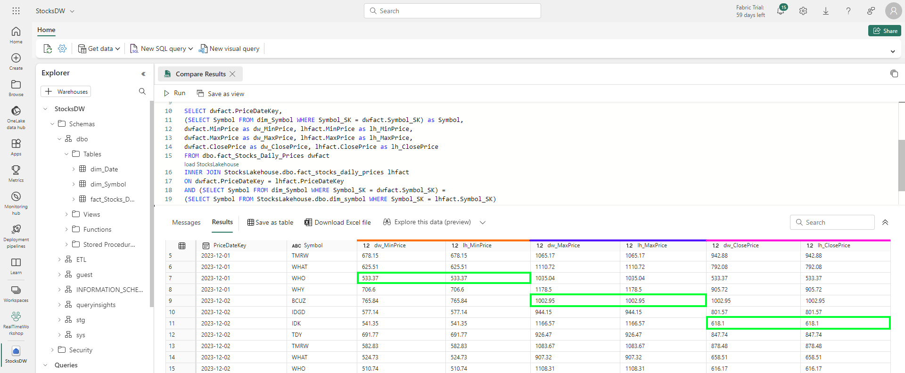

From the Lakehouse, the same query can be run. From within the Lakehouse, switch to the SQL analytics endpoint in the top right of the Lakehouse page. Using the same query, modify the data warehouse connection to be fully qualified. For example, instead of *from dim_symbol* change to match your data warehouse name, such as *from StocksDW.dbo.dim_symbol*. There are a few tables where this will need to be changed: 

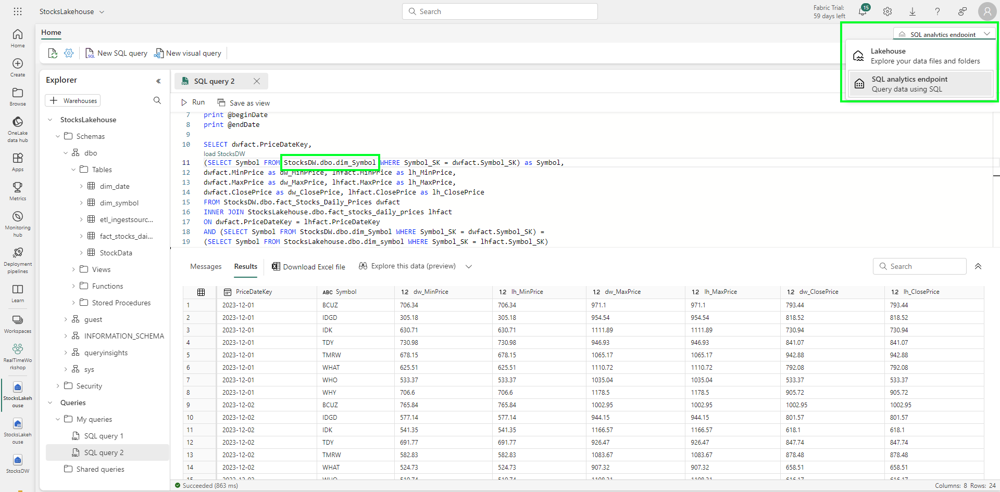

Congratulations! You've not only compared the results, you've seen how easy it is to integrate both data warehouse and lakehouse artifacts. Notebooks can query the data warehouse from Spark, as well. Keep in mind: a lakehouse is read-only from a SQL analytics endpoint. A Synapse Data Warehouse is read-only from Spark. See [this decision guide](https://learn.microsoft.com/en-us/fabric/get-started/decision-guide-data-store) for more information.

## :tada: Summary

In this module, you implemented a lambda architecture to store data in the lakehouse from the Event Hub, and ran several notebooks to process the data into a dimensional model. You then created a semantic model for reporting, and used that model in a Power BI report.

## References

* [Wikipedia page on Lambda architecture](https://en.wikipedia.org/wiki/Lambda_architecture)
* [Fabric Storage Decision Guide](https://learn.microsoft.com/en-us/fabric/get-started/decision-guide-data-store)

## :white_check_mark: Results

- [x] Modified EventStream to ingest data to the lakehouse
- [x] Ran several notebooks to create the dimensional model and process the data
- [x] Created a semantic model and simple report

[Continue >](./module07.md)


<!--

SELECT dwfact.PriceDateKey, 
(SELECT Symbol FROM dim_Symbol WHERE Symbol_SK = dwfact.Symbol_SK) as Symbol,
dwfact.MinPrice as dw_MinPrice, lhfact.MinPrice as lh_MinPrice,
dwfact.MaxPrice as dw_MaxPrice, lhfact.MaxPrice as lh_MaxPrice,
dwfact.ClosePrice as dw_ClosePrice, lhfact.ClosePrice as lh_ClosePrice
FROM dbo.fact_Stocks_Daily_Prices dwfact
INNER JOIN StocksLakehouse.dbo.fact_stocks_daily_prices lhfact
ON dwfact.PriceDateKey = lhfact.PriceDateKey 
AND (SELECT Symbol FROM dim_Symbol WHERE Symbol_SK = dwfact.Symbol_SK) = 
(SELECT Symbol FROM StocksLakehouse.dbo.dim_symbol WHERE Symbol_SK = lhfact.Symbol_SK)
WHERE dwfact.PriceDateKey >= '2023-12-01' and 
dwfact.PriceDateKey <= '2023-12-03'
ORDER BY dwfact.PriceDateKey ASC, Symbol ASC

-->