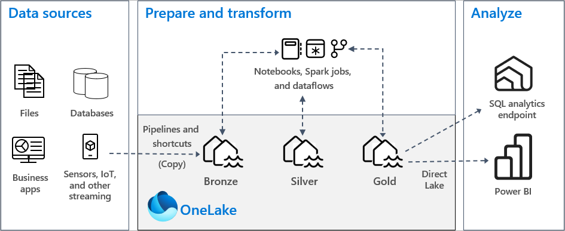
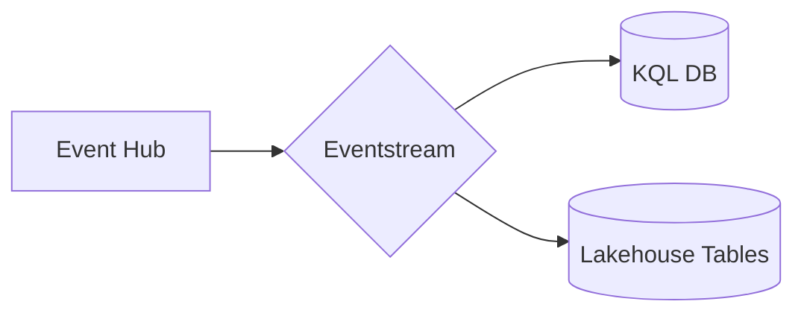

# Module 06a - Data Lakehouse: Setting up the Lakehouse

[< Previous Module](./module05c.md) - **[Home](../README.md)** - [Next Module >](./module06b.md)

## :stopwatch: Estimated Duration

* 20 minutes

## :thinking: Prerequisites

- [x] Lab environment deployed from [setup](../modules/module00.md)
- [x] Completed [Module 01](../modules/module01.md)
- [x] Completed [Module 02](../modules/module02.md)
- [x] Completed [Module 03](../modules/module03.md)

Completing [Module 05](../modules/module05a.md) is not required, but may help illustrate the different ways to implement a star schema.

## :book: Sections

This module is broken down into the following sections:

* [Module 06a - Setting up the Lakehouse](./module06a.md)
* [Module 06b - Building the Aggregation Tables](./module06a.md)
* [Module 06c - Building the Dimensional Model](./module06b.md)

## :loudspeaker: Introduction

Throughout the lakehouse modules, we'll build a lakehouse architecture to ingest and store our stock data. In this first part, we'll begin by adding the lakehouse to the Eventstream, importing the notebooks, and loading some historical data.

## :bulb: About Notebooks

Most of this lab will be done within a Jupyter Notebook, an industry standard way of doing exploratory data analyis, building models, and visualizing datasets, and processing data. A notebook itself is separated into indiviual sections called cells which contain code or text documentation. Cells, and even sections within cells, can adapt to different languages as needed (though Python is generally the most used language). The purpose of the cells are to break tasks down into manageable chunks and make collaboration easier; cells may be run individually or as a whole depending on the purpose of the notebook. 

## :bulb: About Medallion Architecture

In a lakehouse medallion architure (with bronze, silver, gold layers) data is ingested in the raw/bronze layer, typically "as-is" from the source. Data is processed through an Extract, Load, and Transform (ELT) process where the data is incrementally processed, until it reaches the curated gold layer for reporting. A typical architecture may look similar to:

These layers are not intended to be a hard rule, but rather a guiding principle. Layers are often separated into different lakehouses, but for the purposes of our lab, we'll be using the same lakehouse to store all layers. Read more on implementing a [medallion architecture in Fabric here](https://learn.microsoft.com/en-us/fabric/onelake/onelake-medallion-lakehouse-architecture).

## Table of Contents

1. [Create the lakehouse]
2. [Add lakehouse to Eventstream]
3. [Import notebooks]
4. [Import additional data]

## 1. Create the lakehouse

Start by creating a lakehouse. Note: if you completing this module after the data science module or another module that uses a lakehouse, you may re-use that lakehouse or create a new one, but we'll assume the same lakehouse is shared across all modules.

Within your Fabric workspace, switch to the data engineering persona (bottom left), and from the home page of the persona, create a new lakehouse by clicking the *Lakehouse* button. Name the lakehouse *StocksLakehouse*. 

## 2. Add lakehouse to Eventstream

From an architecture perspective, we'll look to implement a [Lambda architecture](https://en.wikipedia.org/wiki/Lambda_architecture) by splitting hot path and cold path data from the Eventstream. Hot path will continue to the KQL database as already configured, and cold path will be added to write the raw data to our lakehouse. Our data flow will resemble the following:

Open the Eventstream created in the first module. Click the plus symbol on the output of the Eventstream to add a new destination. Select *Lakehouse* from the context menu, and in the side panel that opens, select the lakehouse created above and create a new table called *raw_stock_data*. Ensure the input data format is *JSON*; this should look similar to the image below:

Once complete, the Eventstream will be publishing data to both the KQL Database (hot path) and our lakehouse (cold path); this should look similar to the image below:

## 3. Import notebooks

Next, download the following notebooks and import them into the lakehouse. Note: if you have issues importing these notebooks, be sure you are downloading the raw notebook file and not the HTML page from GitHub that is displaying the notebook.

In addition to the links below, all assets for this workshop may also be downloaded in the following zip file. Download and extract to a convenient location. The notebooks are located in the */module06* folder:

* [All Workshop Resources (resources.zip)](https://github.com/microsoft/fabricrealtimelab/raw/main/files/resources.zip)

To manually view and download each notebook, click on the notebook link below for each notebook. The notebook is presented in a readable format in GitHub -- click the download button near the upper right to download the notebook, and save the ipynb notebook file to a convenient location.

* [Lakehouse 1 - Import Data](<../resources/module06/Lakehouse 1 - Import Data.ipynb>)
* [Lakehouse 2 - Build Aggregation Tables](<../resources/module06/Lakehouse 2 - Build Aggregation Tables.ipynb>)
* [Lakehouse 3 - Create Star Schema](<../resources/module06/Lakehouse 3 - Create Star Schema.ipynb>)
* [Lakehouse 4 - Load Star Schema](<../resources/module06/Lakehouse 4 - Load Star Schema.ipynb>)

From the data engineering persona home page, select *Import notebook*, and import each of the above notebooks into your workspace:

## 4. Import additional data

In order the make the reports more interesting, we need a bit more data to work with. For both the lakehouse and data science modules, additional historical data can be imported to supplement the data that is already being ingested. In this step, we'll run a notebook that downloads and imports this data into the *raw_stock_data* table.

Click on your workspace to view all items in your *RealTimeWorkshop* workspace and open the *Lakehouse 1 - Import Data* notebook. If you have trouble finding items as your workspace grows, you can view only the notebooks by clicking the filter and selecting *Notebook*:

If there is no lakehouse associated with the notebook (which will usually be the case when importing a new notebook), click *Add* underneath the text *Add Lakehouse*, and add the lakehouse created earlier. *Important*: You will need to add the lakehouse to every imported notebook -- do this each time you open a notebook for the first time.

With the notebook loaded and the lakehouse attached, notice the schema on the left. The *raw_stock_data* table was configured with our Eventstream, and is the landing place for the data that is ingested from the Event Hub. This is our raw/bronze level data, as it represents data without any processing or validation.

The lakehouse has two types of storage: managed tables and unmanaged files. As you might expect, tables are Delta tables managed by the lakehouse engine; files are unstructured files where we might import data files, text files, and other binary assets. 

The next step is to run through this first notebook. By default, the notebook will load 30 days of data prior to the current day, adding to the *raw_stock_data* table. You can either click *Run all* from the left top tool bar, but is recommended you run each cell individually by clicking the play button on the left side of each cell to follow along with the process. The location of these buttons is shown by the arrows in the above image. 

Most of the code in our notebooks is written in Python, but notebooks support a variety of languages. Several cells of the notebook are defined functions, such as *def getDownloadInfo(year)*: these contain code, but do not run until the function is called. You may also come across cells that are *frozen*; frozen cells will not run and cannot be altered until unfrozen. This is helpful for testing where we might want to occasionally run code when working with notebooks interactively. While similar to 'commenting out' sections of code, freezing cells is powerful in that any output of the cells are also preserved.

> :bulb: **Frozen Cells**
> Important! Frozen cells are intended for interactive notebook use. When notebooks are executed by a scheduled task, frozen cells are currently executed like normal cells.

## :tada: Summary

In this module, you set up the lakehouse by implementing a Lambda architecture for the hot path (real-time) and cold path(batch). You also loaded several notebooks, running the first notebook to load historical data. 

## References

* [Fabric Medallion Architecture](https://learn.microsoft.com/en-us/fabric/onelake/onelake-medallion-lakehouse-architecture)
* [Wikipedia:Lambda architecture](https://en.wikipedia.org/wiki/Lambda_architecture)
* [Fabric Storage Decision Guide](https://learn.microsoft.com/en-us/fabric/get-started/decision-guide-data-store)

## :white_check_mark: Results

- [x] Created a lakehouse
- [x] Imported notebooks
- [x] Imported historical data 

[Continue >](./module06b.md)