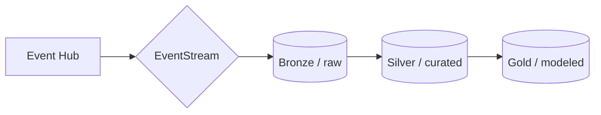
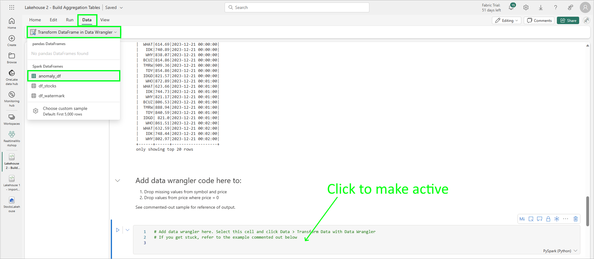
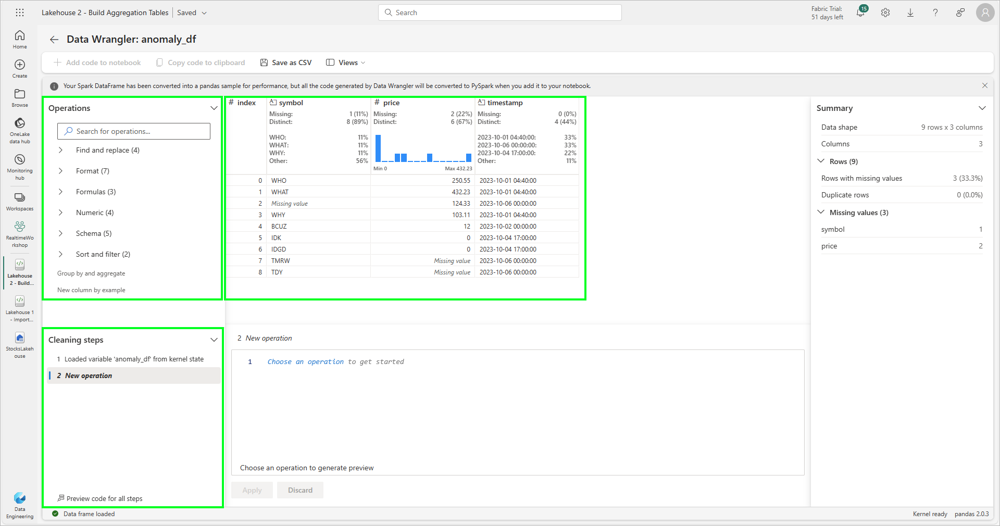
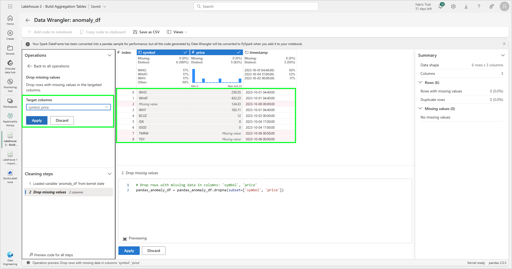
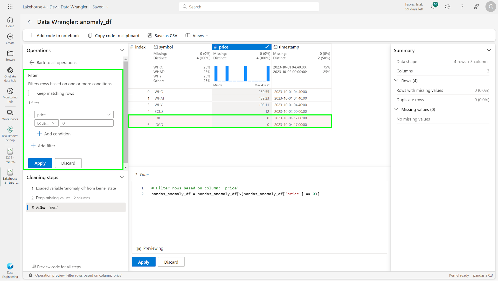
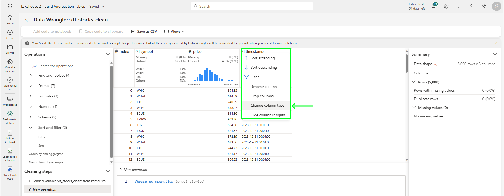
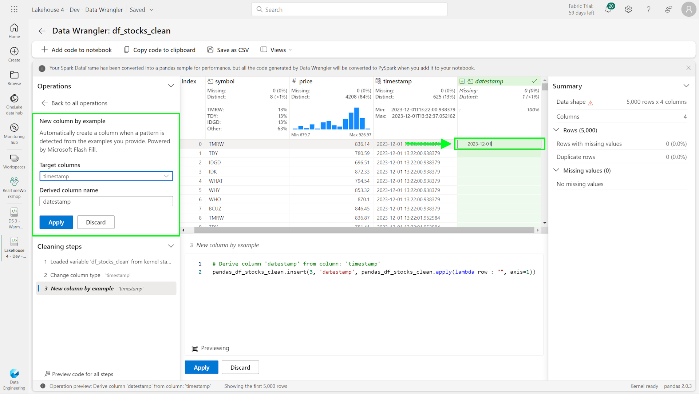
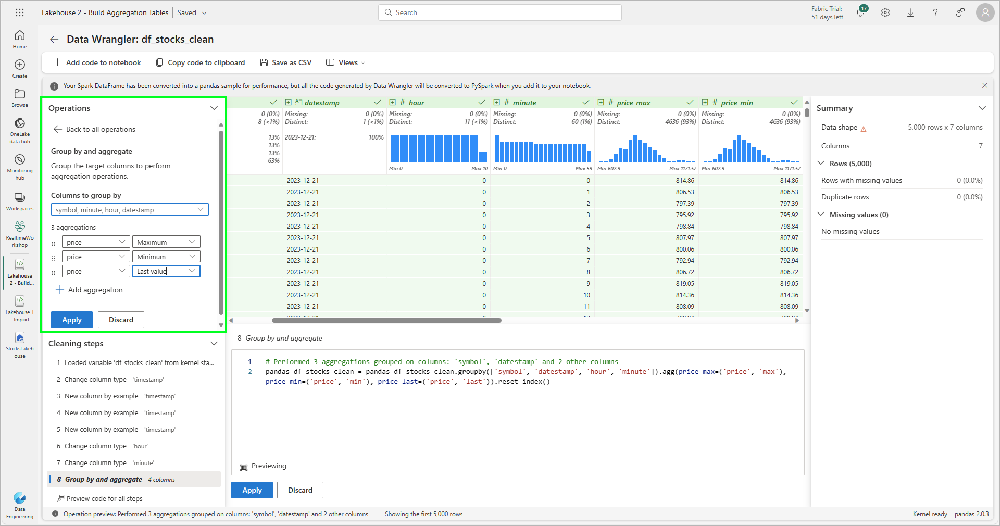
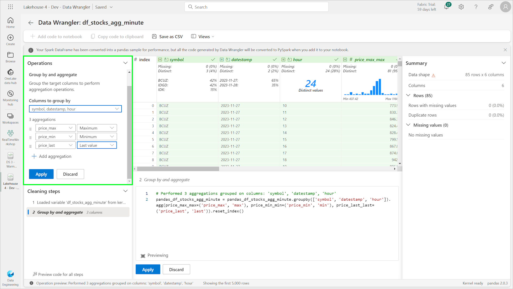

# Module 06b - Data Wrangler

[< Previous Module](../modules/module06a.md) - **[Home](../README.md)** - [Next Module >](./module07a.md)

## :stopwatch: Estimated Duration

* 60 minutes 

## :thinking: Prerequisites

- [x] Completed [Module 06a - Data lakehouse](../modules/module06a.md)

This module is broken down into 2 sections:
* [Module 06a - Building a data lakehouse](./module06a.md)
* [Module 06b - Using data wrangler to add an aggregation table](./module06b.md)

## :loudspeaker: Introduction

In this module, we'll use *data wrangler* to preprocess and aggregate data, and store the data in a new aggregation table. 

A traditional medallion architecture may look similar to:



Our goal in this module is to build curated / silver data suitable for use in data science and anywhere else curated data is needed. With the raw data having a per-second frequency, this data size is often not ideal for reporting or analysis. Further, the data isn't cleansed, so we're at risk of non-conformed data causing issues in reports or pipelines where erronious data isn't expected. The goal is to build cleansed data aggregation tables that store the data in per minute and per hour level frequency. Fortunately, data wrangler makes this an easy task.

## Table of Contents

1. [Import Notebook](#1-import-notebook)
2. [Review the notebook](#2-review-the-notebook-)
3. [Build cleansing routine](#3-build-cleansing-routine)
4. [Build aggregation routine](#4-build-aggregation-routine)
5. [Run the merge](#5-run-the-merge)
6. [Modifying the data wrangler steps](#6-modifying-the-data-wrangler-steps)
7. [Additional steps](#7-additional-steps)

## 1. Import Notebook

For this module, we'll use the *Lakehouse 4 - Data Wrangler* notebook. If you haven't already loaded the notebooks from the previous module, all of the notebooks are listed below.

<!--
* [Lakehouse 1 - Create Schema](<https://github.com/bhitney/fabricrealtimelab/raw/main/resources/module06/Lakehouse 1 - Create Schema.ipynb>)
* [Lakehouse 2 - Stock Load](<./fabricrealtimelab/raw/main/resources/module06/Lakehouse 2 - Stock Load.ipynb>)
* [Lakehouse 3 - Historical Import](<https://github.com/bhitney/fabricrealtimelab/raw/main/resources/module06/Lakehouse 3 - Historical Import.ipynb>)
-->

* [Lakehouse 1 - Create Schema](<../resources/module06/Lakehouse 1 - Create Schema.ipynb>)
* [Lakehouse 2 - Stock Load](<../resources/module06/Lakehouse 2 - Stock Load.ipynb>)
* [Lakehouse 3 - Historical Import](<../resources/module06/Lakehouse 3 - Historical Import.ipynb>)
* [Lakehouse 4 - Data Wrangler](<../resources/module06/Lakehouse 4 - Data Wrangler.ipynb>)

These may also be downloaded in the following zip file:

* [All Module 06 Notebooks](../resources/module06/module6notebooks.zip)


From the data engineering persona home page, select *Import notebook*, and import each of the above notebooks into your workspace:


## 2. Review the notebook

Take a moment to scroll through the notebook. Be sure to add the default lakehouse if it is not already added. Several of the components should look familiar to the notebooks used previously. Notice the following:

1. Two tables in the lakehouse are created: *stocks_minute_agg* and *stocks_hour_agg* if they do not already exist.
2. An 'anomaly' data frame is created to illustrate data cleansing.
3. A merge function writes the data to the tables.
4. The latest data written to the tables is queried. Notice that we are not using a watermark to keep track of what has been imported. Because we're aggregating to the minute or hour, we'll process all data from the most recent hour/minute.
5. There are placeholders for our data wrangler code, which will be completed below. Example data wrangler code is commented-out for reference/troubleshooting.

## 3. Build cleansing routine

Run all of the cells until the first cell with the content "# add data wrangler here", running the cell immediately above that loads *df_stocks* from the table. Click in the "# add data wrangler here" cell to make it the active cell. From the top window, select the *Data* tab, and click *Transform DataFrame in Data Wrangler*:



A list of all dataframes (both pandas and Spark) will be listed. Data wrangler can work with both types of dataframes. For this first exercise, select *anomaly_df* to load the dataframe in data wrangler. Once loaded, the screen should look like:



In data wrangler, we'll record a number of steps to process data. In the screenshot above, notice the data is visualized in the central column. Operations are in the top left, while an overview of each step is in the bottom left. Once completed, the code that performs these steps will be added to our notebook where we can further refine as needed. For this first task and to get familiar with data wrangler, we'll preprocess the data by getting rid of invalid/null data, or where prices are zero. 

To remove null/empty values:

*Click Operations* > *Find and replace* > *Drop missing values*. Select the *symbol* and *price* columns and click *Apply*. Notice the rows that match are highlighted in red in the middle window (in the screenshot below). Click *Apply*.



To remove zero-price values:

Click *Operations* > *Sort and filter* > *Filter*. Uncheck *Keep matching rows*, select *price*, and set the condition to *equal* to *0*. Notice the rows with zero are dropped.



Click *Add code to notebook* in the upper left. On the *Add code to notebook* window, ensure *Include pandas code* is unchecked and click *Add*. The code inserted will look similar to the below:

```python
# Code generated by Data Wrangler for PySpark DataFrame

def clean_data(anomaly_df):
    # Drop rows with missing data in columns: 'symbol', 'price'
    anomaly_df = anomaly_df.dropna(subset=['symbol', 'price'])
    # Filter rows based on column: 'price'
    anomaly_df = anomaly_df.filter(~(anomaly_df['price'] == 0))
    return anomaly_df

anomaly_df_clean = clean_data(anomaly_df)
display(anomaly_df_clean)
```

Run the cell and observe the output has removed the invalid rows.

The function created, *clean_data*, contains all of the steps in sequence and can be modified as needed. Because we loaded data wrangler with the *anomaly_df*, the method is written to take that dataframe by name, but this can be any dataframe that matches the schema. Additionally, we can edit the name of the function if we'd like it to be a bit clearer. 

Modify the function name from *clean_data* to *remove_invalid_rows*, and change the line *anomaly_df_clean = clean_data(anomaly_df)* to *df_stocks_clean = remove_invalid_rows(df_stocks)* as shown below. Also, while not necessary for functionality, you can change the name of the dataframe used in the function to simply *df* as shown below:

```python
# Code generated by Data Wrangler for PySpark DataFrame

def remove_invalid_rows(df):
    # Drop rows with missing data in columns: 'symbol', 'price'
    df = df.dropna(subset=['symbol', 'price'])
    # Filter rows based on column: 'price'
    df = df.filter(~(df['price'] == 0))
    return df

df_stocks_clean = remove_invalid_rows(df_stocks)
display(df_stocks_clean)
```

This function will now remove the invalid rows from our *df_stocks* dataframe and return a new dataframe called *df_stocks_clean*. It is common to used a different name for the output dataframe (such as *df_stocks_clean*) to make the cell idempotent. 

Run this cell before continuing to the next step.

## 4. Build aggregation routine

This step will be more involved because we'll build more steps in data wrangler. In this step, we'll add several derived columns in order to group the data.

Load data wranger again, this time selecting the *df_stocks_clean* dataframe. Perform the following steps:

**Step 1: Convert timestamp from string to timestamp type**

Click on the three dots in the corner of the *timestamp* column and select *Change column type*. For the *New type*, select *datetime64[ns]* and click *Apply*:



**Step 2: Add new datestamp column**

Select *Operations* > *New column by example*. Under *Target columns*, choose *timestamp*. Enter a *Derived column name* of *datestamp*. Do not yet click *Apply*; in the new *datestamp* column, enter an example value for any given row. For example, if the *timestamp* is *2023-12-01 13:22:00* enter *2023-12-01*. This allows data wrangler to infer we are looking for the date without a time component; once the columns autofill, click *Apply*:



**Step 3: Add new hour column**

Following the steps above, create another new column named *hour*, also using *timestamp* as a *Target columns*. In the new *hour* column, enter an hour for any given row. For example, if the *timestamp* is *2023-12-01 13:22:00* enter *13*. This allows data wrangler to infer we are looking for the hour component, and should build code similar to:

```python
# Derive column 'hour' from column: 'timestamp'
def hour(timestamp):
    """
    Transform based on the following examples:
       timestamp                  Output
    1: 2023-12-01T13:22:00.938 => "13"
    """
    number1 = timestamp.hour
    return f"{number1:01.0f}"
```

**Step 4: Add new minute column**

Same as above, create a new *minute* column. In the new *minute* column, enter a minute for any given row. For example, if the *timestamp* is *2023-12-01 13:22:00* enter *22*. The code generated should look similar to:

```python
# Derive column 'minute' from column: 'timestamp'
def minute(timestamp):
    """
    Transform based on the following examples:
       timestamp                  Output
    1: 2023-12-01T13:22:00.938 => "22"
    """
    number1 = timestamp.minute
    return f"{number1:01.0f}"
```

**Step 5: Group by symbol, datestamp, hour, and minute**

Click *Operations* > *Group by and aggregate*. For *Columns to group by*, select *symbol*, *datestamp*, *hour*, *minute*. Click *Add aggregation*. Create three new aggregations: price - Maximum, price - Minimum, and price - Last value, which should look similar to the image below:



Click *Apply* and add the code to the notebook. 

**Step 6: Review the code**

In the cell that is added, in the last two lines of the cell, notice the dataframe returned is named *df_stocks_clean_1*. Rename this *df_stocks_agg_minute*, like below: 

```python
# old
# df_stocks_clean_1 = clean_data(df_stocks_clean)
# display(df_stocks_clean_1)

df_stocks_agg_minute = clean_data(df_stocks_clean)
display(df_stocks_agg_minute)
```

## 5. Run the merge

Run the next cell that calls the merge function, which writes the data into the table:

```python
# write the data to the stocks_minute_agg table

merge_minute_agg(df_stocks_clean)
```

You can query the table to verify rows are written, and even re-reun the entire notebook to continue ingesting data.

## 6. Modifying the data wrangler steps

By now, hopefully you'll agree how useful data wrangler can be. The code generated follows the exact steps executed in the tool, and is either generated for Spark or pandas dataframes and should work across virtually any scenario. Most importantly, the code generated is there as a template for us to modify if we'd like. Sometimes, the code may not be exactly what we have in mind or we might know a more optimal method.

For example, consider the code that generates the datestamp:

```python
 # Derive column 'datestamp' from column: 'timestamp'
    
    # Transform based on the following examples:
    #    timestamp                  Output
    # 1: 2023-12-01T13:22:00.938 => "2023-12-01"
    udf_fn = F.udf(lambda v : v.strftime("%Y-%m-%d"), T.StringType())
    df_stocks_clean = df_stocks_clean.withColumn("datestamp", udf_fn(F.col("timestamp")))
```

This code creates a user-defined function that takes a timestamp, and returns a string in the format *%Y-%m-%d*. If we'd like a native datetime value, we could accomplish this using the pyspark sql method *to_date()* in a single line like this:

```python
df_stocks_clean = df_stocks_clean.withColumn("datestamp", to_date(F.col("timestamp")))
```

As another example, the data wrangler code generate below creates the hour column:

```python
# Derive column 'hour' from column: 'timestamp'
    
    def hour(timestamp):
        """
        Transform based on the following examples:
           timestamp                  Output
        1: 2023-12-01T13:22:00.938 => "13"
        """
        number1 = timestamp.hour
        return f"{number1:01.0f}"
    
    udf_fn = F.udf(lambda v : hour(v), T.StringType())
    df_stocks_clean = df_stocks_clean.withColumn("hour", udf_fn(F.col("timestamp")))
```

The code creates a user-defined function that expects a timestamp, extracts the timestamp.hour, and returns a formatted number as a string. Since we're only interested in the hour as an integer, we could reduce the code to:

```python
df_stocks_clean = df_stocks_clean.withColumn("hour", date_format(F.col("timestamp"), "H"))
```

Always keep in mind you can adapt the code to suit your needs.

## 7. Additional steps

For an added challenge, create a new data wrangler step that further aggregates the data to per-hour precision. This can be done by loading the existing *df_stocks_agg_minute* into data wrangler, grouping by symbol, datestamp, and hour, and then creating new min/max/last based on the existing aggregations columns, which would look like:



Example code is shown below. In addition to renaming the function, the alias' of the columns have also been changed to keep the column names the same. Because we are aggregating data that has already been aggregating, data wrangler is naming the columns like price_max_max, price_min_min; it's important to modify the aliases to keep the names the same.

Finally, we also named the return dataframe *df_stocks_agg_hour* as shown in the code snippet below:

```python
# Code generated by Data Wrangler for PySpark DataFrame

from pyspark.sql import functions as F

def aggregate_data_minute(df_stocks_agg_minute):
    # Performed 3 aggregations grouped on columns: 'symbol', 'datestamp', 'hour'
    df_stocks_agg_minute = df_stocks_agg_minute.groupBy('symbol', 'datestamp', 'hour').agg(
        F.max('price_max').alias('price_max'), 
        F.min('price_min').alias('price_min'), 
        F.last('price_last').alias('price_last'))
    df_stocks_agg_minute = df_stocks_agg_minute.dropna()
    df_stocks_agg_minute = df_stocks_agg_minute.sort(df_stocks_agg_minute['symbol'].asc(), df_stocks_agg_minute['datestamp'].asc(), df_stocks_agg_minute['hour'].asc())
    return df_stocks_agg_minute

df_stocks_agg_hour = aggregate_data_minute(df_stocks_agg_minute)
display(df_stocks_agg_hour)
```

The code to merge can be completed as shown below, which is commented-out in the notebook.

```python
merge_hour_agg(df_stocks_agg_hour)
```

## :tada: Summary

In this module, you leveraged data wrangler to quickly preprocess and transform raw data into silver-level tables suitable for use in data science and reporting. 

## References

* [Fabric Medallion Architecture](https://learn.microsoft.com/en-us/fabric/onelake/onelake-medallion-lakehouse-architecture)
* [Wikipedia page on Lambda architecture](https://en.wikipedia.org/wiki/Lambda_architecture)
* [Fabric Storage Decision Guide](https://learn.microsoft.com/en-us/fabric/get-started/decision-guide-data-store)

## :white_check_mark: Results

- [x] Cleansed raw data
- [x] Built aggregation routine in data wrangler
- [x] Loaded new aggregation tables 

[Continue >](./module07a.md)