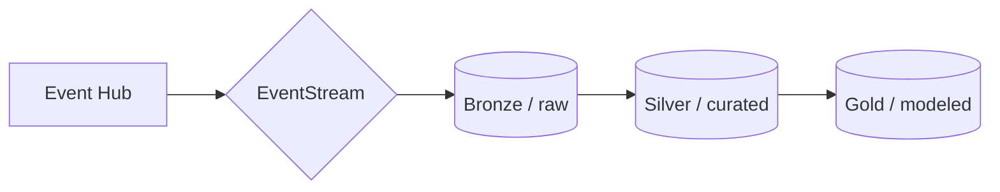

# Module 06 - Data Wrangler

[< Previous Module](../modules/module06a.md) - **[Home](../README.md)** - [Next Module >](./module07a.md)

## :stopwatch: Estimated Duration

* 60 minutes 

## :thinking: Prerequisites

- [x] Completed [Module 06a - Data Lakehouse](../modules/module06a.md)

This module is broken down into 2 sections:
* [Module 06a - Building a data lakehouse](./module06a.md)
* [Module 06b - Using data wrangler to add an aggregation table](./module06b.md)

## :loudspeaker: Introduction

In this module, we'll use *data wrangler* to preprocess and aggregate data, and store the data in a new aggregation table. 

A traditional medallion architecture may look similar to:

Our goal in this module is to build curated / silver data suitable for use in data science and anywhere else curated data is needed. With the raw data having a per-second frequency, this data size is often not ideal for reporting or analysis. Further, the data isn't cleansed at all, so we're at risk of non-conformed data causing problems. The goal is to build cleansed data aggregation tables that store the data in per minute and per hour level frequency. Fortunately, data wrangler makes this an easy task.

## Table of Contents

1. [Import Notebook](#1-import-notebook)
2. [Review the notebook](#2-review-the-notebook-)
1. 

## 1. Import Notebook

For this module, we'll use Lakehouse 4 - Data Wrangler. If you haven't already loaded the notebooks from the previous module, all of the notebooks are listed below.

<!--
* [Lakehouse 1 - Create Schema](<https://github.com/bhitney/fabricrealtimelab/raw/main/resources/module06/Lakehouse 1 - Create Schema.ipynb>)
* [Lakehouse 2 - Stock Load](<./fabricrealtimelab/raw/main/resources/module06/Lakehouse 2 - Stock Load.ipynb>)
* [Lakehouse 3 - Historical Import](<https://github.com/bhitney/fabricrealtimelab/raw/main/resources/module06/Lakehouse 3 - Historical Import.ipynb>)
-->

* [Lakehouse 1 - Create Schema](<../resources/module06/Lakehouse 1 - Create Schema.ipynb>)
* [Lakehouse 2 - Stock Load](<../resources/module06/Lakehouse 2 - Stock Load.ipynb>)
* [Lakehouse 3 - Historical Import](<../resources/module06/Lakehouse 3 - Historical Import.ipynb>)
* [Lakehouse 4 - Data Wrangler](<../resources/module06/Lakehouse 4 - Data Wrangler.ipynb>)

These may also be downloaded in the following zip file:

* [All Module 06 Notebooks](../resources/module06/module6notebooks.zip)

From the data engineering persona home page, select *Import notebook*, and import each of the above notebooks into your workspace:

## 2. Review the notebook

Take a moment to scroll through the notebook. Several of the components should look familiar the notebooks used previously. Notice the following:

1. Two tables in the Lakehouse are created: *stocks_minute_agg* and *stocks_hour_agg* ift they do not already exist.
2. An 'anomaly' data frame is created to illustrate data cleansing.
3. A merge function writes the data to the tables.
4. The latest data written to the tables is queried. Notice that we are not using a watermark to keep track of what has been imported. Because we're aggregating to the minute or hour, we'll process all data from the most recent hour/minute.
5. There are placeholders for our data wrangler code, which will be completed below. Example data wrangler code is commented-out for reference/troubleshooting.

## 3. Build cleansing routine

Run all of the cells until the first cell that says "# add data wrangler here", running the cell immediately above that loads df_stocks from the table. Click in the "# add data wrangler here" cell to make it the active cell. From the top window, select Data, and click Open in Data Wrangler:

IMAGE OF DATA WRANGLER

A list of all dataframes (both Pandas and Spark) will be listed. Data wrangler can work with both types of dataframes. For this first exercise, select *anomaly_df* to load the dataframe in data wrangler. Once loaded, the screen should look like:

IMAGE OF anomaly_df IN WRANGLER

In data wrangler, we'll record a number of steps to process data. Once completed, the code that performs these steps will be added to our notebook where we can further refine as needed. For this first task and to get familiar with data wrangler, we'll preprocess the data by getting rid of invalid/null data, or where prices are zero. 

To remove null/empty values:
To remove zero-price values:

IMAGE OF STEPS

Notice that each step is recorded (and can be deleted/examined), and example code is shown. The data modification in data wrangler is shown using Pandas dataframes, but code will be written to process Spark dataframes once data wrangler is closed. Click *Add to notebook* to add the code to the notebook.

IMAGE OF DATA WRANGLER DONE

The code will then be added to the cell and look similar to:

IMAGE OF CODE IN CELL

The function takes a dataframe, processes it, and returns a new dataframe with the name *_cleansed* added to the end of the dataframe. Even though this was built using the anomaly dataframe, we can pass in the df_stocks dataframe just the same. It is common to used a different name for the output dataframe (such as *df_stocks_cleansed*) to make the cell idempotent. Run the cell and observe the output has removed the rows:

ROWS REMOVED

Notice that the sample code that is commented out has been renamed and modified to use df_stocks. Do the same with your code: modify the call to pass in df_stocks instead, and rename the created dataframe to *df_stocks_cleansed*. This is a great benefit to data wrangler: it produces code that we can modify as needed. Run the new cell -- the output should be same dataframe passed in, because the data should be clean with no outliers. You don't have to rename the function, but it can be convenient to keep multiple data wrangler routines distinct. 

## 4. Build aggregation routine

This step will be more involved because we'll build more steps in data wrangler.

Load data wranger again, this time selecting the *df_stocks_cleansed* dataframe. Perform the following steps:

Step 1: Convert timestamp to timestamp type

Step 2: Add new datestamp column

Step 3: Add new hour column

Step 4: Add new minute column

Step 5: Group by symbol, datestamp, hour, and minute
    1. Add aggregations for minimum price, maximum price, and last price

You may keep the output the same *df_stocks_cleansed* or make a new dataframe based on preference. Even though we want individual steps to be idempotent, this may be applied to a series of like steps, as is the case here. Run the cell, and observe the output has changed considerably to aggregate the data from per-second to per-minute.

## 5. Run the merge

Run the next cell that calls the merge function, which writes the data into the table. You can query the table to verify rows are written, and even re-reun the entire notebook to continue ingesting data.

## 6. Additional steps

For an added challenge, create a new data wrangler step that further aggregates the data to per-hour precision. This can be done by loading *df_stocks_cleansed* into data wrangler, grouping by symbol, datestamp, and hour, and then creating new min/max/last based on the existing aggregations columns.

## :tada: Summary

In this module, you leveraged data wrangler to quickly preprocess and transform raw data into silver-level tables suitable for use in data science and reporting. 

## References

* [Fabric Medallion Architecture](https://learn.microsoft.com/en-us/fabric/onelake/onelake-medallion-lakehouse-architecture)
* [Wikipedia page on Lambda architecture](https://en.wikipedia.org/wiki/Lambda_architecture)
* [Fabric Storage Decision Guide](https://learn.microsoft.com/en-us/fabric/get-started/decision-guide-data-store)

## :white_check_mark: Results

- [x] Cleansed raw data
- [x] Built aggregation routine in data wrangler
- [x] Loaded new aggregation tables 

[Continue >](./module07.md)