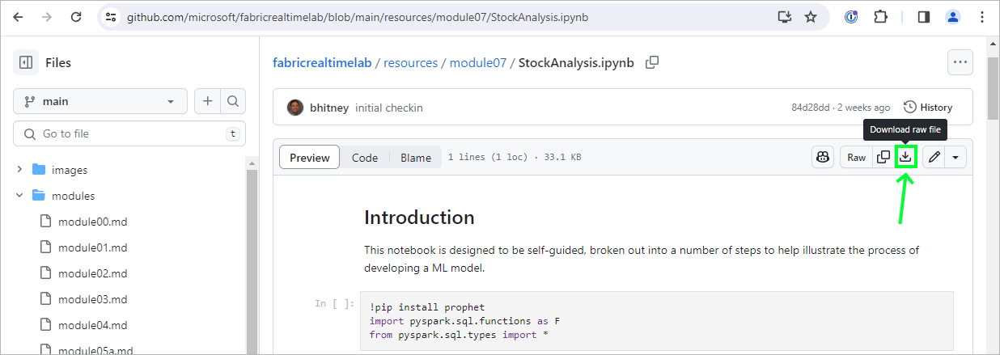
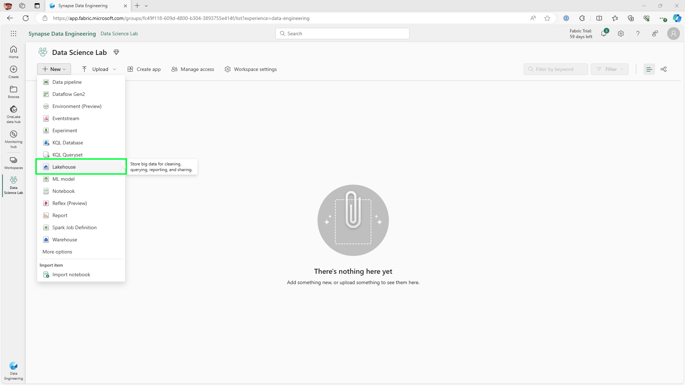
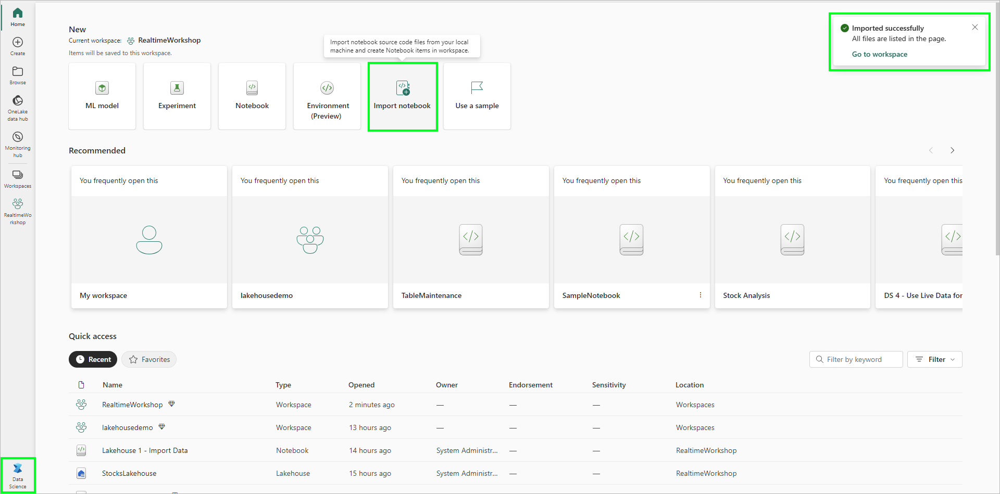
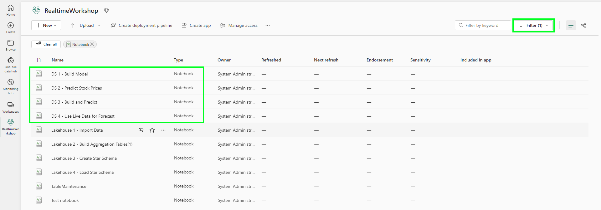
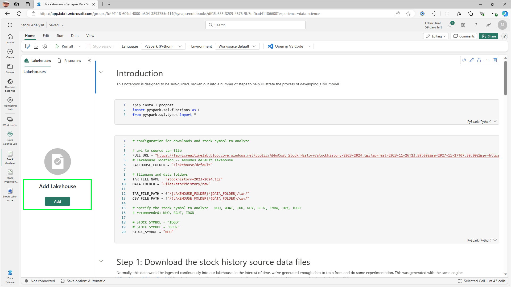
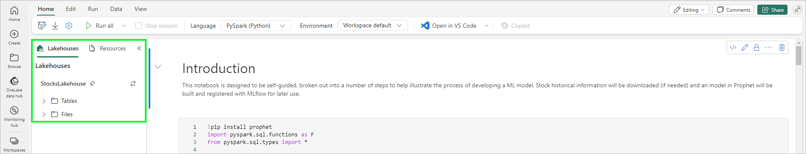
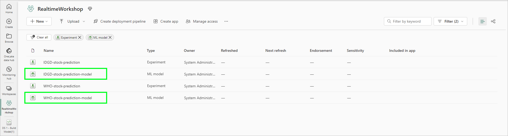
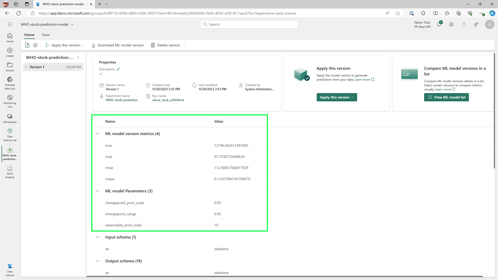

# Module 07a - Data Science: Building and storing an ML model

[< Previous Module](./modules/module06.md) - **[Home](../README.md)** - [Next Module >](./module07b.md)

## :stopwatch: Estimated Duration

* 45 minutes for 07a
* 2 hours overall

## :thinking: Prerequisites

- [x] Access to a Fabric environment

We've designed this module to be stand-alone with no dependencies on earlier modules. However, it may be helpful to have completed [Module 01 - Initial Setup](./module01.md) and [Module 06 - Lakehouse](./module06.md). Module 01 will help you get familiar with the scenario, while Module 06 will introduce the Lakehouse. Our data science solution will be storing data in a Lakehouse, so if you've completed Module 06, you will be ready to dive right in.

If you have not created any Fabric resources and consuming this module as a stand-alone exercise, you can follow the instructions in [Module 01 - Create Fabric Capacity](./module01.md?#1-create-fabric-capacity) to get a Fabric environment up and running.

This module is broken down into 3 sections:
* [Module 07a - Building and storing an ML model](./module07b.md)
* [Module 07b - Using models, saving to the lakehouse, building a report](./module07b.md)
* [Module 07c - Solution in practice](./module07c.md)

## :loudspeaker: Introduction

As a refresher on the scenario, AbboCost Financial has been modernizing their stock market reporting for their financial analysts. In previous modules, we've developed the solution by creating real-time dashboards, a data warehouse, and more.

In this module, AbboCost would like to explore predictive analytics help inform their advisors. The goal is to analyze historical data for patterns that can be used to create forecasts of future values. Microsoft Fabric's Data Science capability is the ideal place to do this kind of exploration.

## :bulb: About Notebooks

Most of this lab will be done within a Jupyter Notebook, an industry standard way of doing exploratory data analyis, building models, and visualizing datasets, and processing data. A notebook itself is separated into indiviual sections called cells which contain code or text documentation. Cells, and even sections within cells, can adapt to different languages as needed (though Python is generally the most used language). The purpose of the cells are to break tasks down into manageable chunks and make collaboration easier; cells may be run individually or as a whole depending on the purpose of the notebook. 

## :crystal_ball: About Prophet

[Prophet](https://facebook.github.io/prophet/) is a library created by Facebook's core data science team to analyze and predict time-series data. Prophet is univariate, meaning it only uses a single variable (our stock price at a given point in time). This is ideal for our scenario because this is the extent of the data that is currently available in our feed. In more complex scenarios, we'd typically use a multivariate model to find correlations -- for example, is weather impacting our sales data? This eliminates the need for feature engineering in this context.

Additionally, Prophet handles outliers and missing data well. In many data science scenarios, we'd do extensive cleaning and data preparation, such as looking for erronious, missing, or null values. Fabric has this capability built-in with [Data Wrangler](https://learn.microsoft.com/en-us/fabric/data-science/data-wrangler), but is not needed in this circumstance.

Finally, Prophet has built-in validation. In developing most models, we'd typically divide the data into training and test datasets. The training dataset is used to create the model, and this model is then subsequently evaluated using the test dataset. This is the gold standard because a model is most accurately evaluated by using data the model has not yet seen. While this can be done manually, the built in validation routines provides functionality to perform model validation in a number of ways, as you'll see in the notebook.

## Table of Contents

1. [Download the Notebook](#1-download-the-notebook)
2. [Prepare the Environment](#2-prepare-the-environment)
3. [Import the Notebook](#3-import-the-notebook)
4. [Explore the Notebook](#4-explore-the-notebook)
5. [Run the notebook](#5-run-the-notebook)
6. [Examine the model and runs](#6-examine-the-model-and-runs)

## 1. Download the Notebook

Notebook files are JSON documents with a .ipynb extension (short for Interactive Python Notebook). To view the notebook, click on the notebook link below. The notebook is presented in a readable format in GitHub -- click the download button near the upper right to download the notebook, and save the ipynb notebook file to a convenient location. There are three notebooks for this module. 

* [Download the DS 1 - Build Model Notebook](<../resources/module07/DS 1 - Build Model.ipynb>)
* [Download the DS 2 - Predict Stock Prices Notebook](<../resources/module07/DS 2 - Predict Stock Prices.ipynb>)
* [Download the DS 3 - Build and Predict Notebook](<../resources/module07/DS 3 - Build and Predict.ipynb>)

## 2. Prepare the Environment

For most tasks within data science, we'll need to persist data within a Lakehouse. If you've completed the Lakehouse module, you already have a Lakehouse and can skip this step. Alternatively, if you have a Lakehouse in an existing Fabric environment, you can skip this step.

Within your Fabric workspace, select New > Lakehouse, and create a new lakehouse named StocksLakehouse. 

## 3. Import the Notebook

Switch to the Data Science persona using the persona switcher in the bottom left. On the Data Science homepage, click Import Notebook, and import the three notebooks listed above. Once the file is imported successfully, a notification should appear allowing you to switch directly to the workspace listing all of the assets.

Once imported, the notebook should be visible on the workspace:

Click the DS 1 - Build Model notebook to open. It should appear like the image below:

Once loaded, click Add Lakehouse to the left of the notebook, select Existing Lakehouse, and select the StocksLakehoues you created earlier and click Add. This action adds the Lakehouse to the context of the existing notebook and makes it the default lakehouse. This should look similar to the image below:

If this is a new lakehouse, there should be no tables or files, but if you're continuing from another module that used a lakehouse, you may have other tables or files.

## 4. Explore the Notebook

The DS 1 notebook is documented throughout the notebook, but in short, the notebook carries out the following tasks:

* Downloads historical data to analyze in CSV format
* Allows us to configure a stock to analyze (such as WHO or IDGD)
* Reads the data into a dataframe
* Completes some basic data cleansing
* Loads [Prophet](https://facebook.github.io/prophet/), a module for conducting time series analysis and prediction
* Builds a model based on historical data
* Validates the model
* Stores the model using MLflow
* Completes a future prediction

The routine that generates the stock data is largely random, but there are some trends that should emerge. Because we don't know when you might be doing this lab, we've generated several years worth of data. The notebook will load the data and will truncate future data when building the model. As part of an overall solution, we'd then supplement the historical data with new real-time data in our lakehouse, re-training the model as necessary (daily/weekly/monthly).

> :bulb: **Notes about data prediction**
> The purpose of this module is to demonstrate one way to approach a data science solution in Fabric. Predicting stock prices (ficticious or otherwise) is challenging, particularly with univariate time-series data. Improving the accuracy (as measured by root mean squared error, r2, and other metrics) is not the focus of the challenge.

## 5. Run the notebook

You can either run each cell manually as you follow along with the notebook, or click 'run all' in the top toolbar and follow along as the work progresses. The notebook will take roughly 15-20 minutes to execute -- some steps, like training the model and cross validation, will take the longest.

From this point, follow along with documentation in the notebook for an explanation of the steps. 

## 6. Examine the model and runs

Experiments and runs can be viewed in the workspace resource list. An experiment acts as a container for a given data science solution -- in this case, we'll create an experiment for every stock. Within each experiment, all of the runs are logged along with their metadata. From the workspace, click on the model we just created (by default, for the WHO stock):

Metadata, in our case, includes input parameters we may tune for our model, as well as metrics on the model's accuracy, such as root mean square error (RMSE). RMSE represents the average error -- a zero would be a perfect fit between model and actual data, while higher numbers show an increase error. While lower numbers are better, what is "good" is subjective based on the scenario. 

## :thinking: Additional Learning

* [Data Wrangler](https://learn.microsoft.com/en-us/fabric/data-science/data-wrangler)
* [Prophet](https://facebook.github.io/prophet/)

## :tada: Summary

In this module, you learned how to approach a data science solution in Fabric by importing and executing a notebook that processed data, created a ML model of the data using Prophet, and stored the model in MLflow. Additionally, you evaluated the model using cross validation and tested the model using additional data.

## :white_check_mark: Results

- [x] Loaded a notebook into your Fabric environment, created an ML model and stored the model in MLflow, and evaluated the model performance.

