# Module 07b - Data Science: Using models, saving to Lakehouse, building a report

[< Previous Module](./modules/module07a.md) - **[Home](../README.md)** - [Next Module >](./module07c.md)

## :stopwatch: Estimated Duration

* 45 minutes for 07b
* 2 hours overall

## :thinking: Prerequisites

- [x] Completed Module 07a

Recommended modules for reports:

- [x] Completed [Module 01 - KQL Database ](../modules/module01.md)
- [x] Completed [Module 02 - KQL Queries](../modules/module02.md)
- [x] Completed [Module 03 - Reporting](../modules/module03.md)
- [x] Completed [Module 06 - Lakehouse](../modules/module03.md)

You can complete the reporting section without the recommended modules above, but the functionality will be limited.

This module is broken down into 3 sections:
* [Module 07a - Building and storing an ML model](./module07a.md)
* [Module 07b - Using models, saving to the lakehouse, building a report](./module07b.md)
* [Module 07c - Solution in practice](./module07c.md)

## :loudspeaker: Introduction

This module is a continuation of module 07a. In module 07a, the stock data was analyzed and an ML model was built and registered in MLflow.

In this module, we'll build a notebook that queries MLflow for available models, and builds predictions. We'll then build a semantic model for the predictions to leverage in Power BI. We'll build a report in Power BI Desktop that uses multiple datasets.

## Table of Contents

1. [Open and explore the notebook](#1-open-and-explore-the-notebook)
2. [Run the notebook](#2-run-the-notebook)
3. [Build a semantic model](#3-build-a-semantic-model)
4. [Build a simple report in Power BI Desktop](#4-build-a-simple-report-in-power-bi-desktop)
5. [Publish the report](#5-publish-the-report)

## 1. Open and explore the notebook

Open the *DS 2 - Predict Stock Prices* notebook. For reference, the three notebooks used throughout this module are listed below. More details on importing these are in module 07a.

* [Download the DS 1 - Build Model Notebook](<../resources/module07/DS 1 - Build Model.ipynb>)
* [Download the DS 2 - Predict Stock Prices Notebook](<../resources/module07/DS 2 - Predict Stock Prices.ipynb>)
* [Download the DS 3 - Build and Predict Notebook](<../resources/module07/DS 3 - Build and Predict.ipynb>)

Take a few moments to explore the *DS 2* notebook, and be sure to add the same default lakehouse to the notebook similar to the steps in module 07a. Many of the elements in this notebook should look familiar to *DS 1*. 

Notice that much of the notebook has been broken out into function definitions, such as *def write_predictions*, which help encapsulate logic into smaller steps. Notebooks can include other libraries (as you've seen already at the top of most notebooks), and can also execute other notebooks. This notebook completes these tasks at a high level:

* Creates the stock predictions table in the lakehouse, if it doesn't exist
* Gets a list of all stock symbols 
* Creates a prediction list by examining available ML models in MLflow
* Loops through the available ML models:
    * Generates predictions
    * Stores predictions in the lakehouse

## 2. Run the notebook

You can either run each cell manually as you follow along with the notebook, or click *Run all* in the top toolbar and follow along as the work progresses. The cells at the bottom of the notebook that delete the predictions and query the prediction data are *frozen* -- that is, they will not run and are there for testing purposes; you can use them for deleting rows or examining the table. To use them, you'll need to unfreeze the cells first, but be sure to freeze them (or comment them out) because if the entire notebook is run, these cells will be run if left unfrozen.

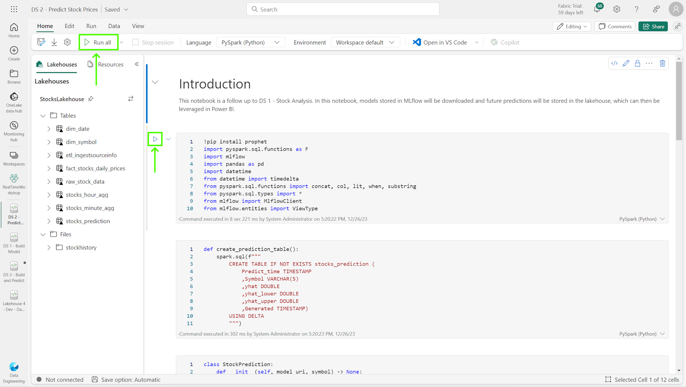

For the rest of this step, follow along with documentation in the notebook for an explanation of each cell. The key areas to examine closely include the interaction with MLflow (to find the ML models), and how the data is written to the lakehouse using a merge statement.

For additional exploration, return to the previous section and generate ML models for other stock symbols. Notice how this notebook should find those new ML models and generate predictions. If new ML models are created where an existing stock exists, a new version of the model will be created.

Once the notebook has been run, you are ready to move to the next step. 

## 3. Build a semantic model

In this step, we'll build a semantic model (formerly called Power BI datasets) to use in our Power BI report. A semantic model represents data that is ready for reporting and acts as an abstraction on top of a data source. ([Read more on semantic models here](https://learn.microsoft.com/en-us/power-bi/connect-data/service-datasets-understand)); typically a semantic model will be purpose built (serving a specific reporting need) and may have transformations, relationships, and enrichments like measures to make developing reports easier.

> :bulb: **About the word 'model':**
> In order to disambiguate the term 'model,' we'll do our best to always qualify the type of model we're referring to. Because this is a machine learning module, we use the term 'model' frequently to refer to a machine learning model (or ML model), which is different from a semantic model.

To create a semantic model, open the lakehouse. You can build a new semantic model by either method:
* From the lakehouse mode, select *New semantic model* from the top toolbar
* From the SQL analytics endpoint mode, select the *Reporting* tab, and select *New semantic model*

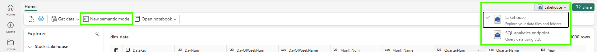

Name the model *StocksLakehousePredictions*. If you completed the lakehouse module and have the *dim_symbols* dimension table, add both the *dim_symbols* and the *stocks_prediction* tables to the semantic model. Otherwise, add only the *stocks_prediction* table.

When the model appears, if you have the *dim_symbols* table, create a relationship between the *stocks_prediction* symbol column (many) to the *dim_symbol* symbol column (one), to create a 1:many relationship between these two entities. This can be done by drag/dropping the columns, or using the *Manage Relationships* button in the top navbar. If you don't have the *dim_symbol* table, that's ok -- just use the single *stocks_prediction* table. The model should look similar to:

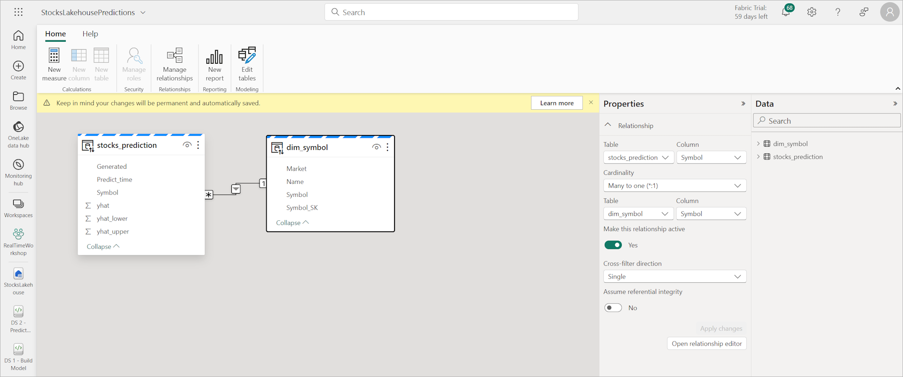

## 4. Build a simple report in Power BI Desktop

[Download Power BI Desktop](https://powerbi.microsoft.com/en-us/desktop/) and install. We'll use Power BI Desktop for the richer integration experience and ability to bring in multiple data sources. If you are unable to run Power BI Desktop on your machine, and no lab environment is available to run Power BI Desktop, you can make due by creating some elements of the report in the Power BI service. Instead of bringing in multiple datasets as outlined in these steps, instead focus on bringing only the single semantic model of the stock prediction data (created above) into the report; to do this, from the semantic model page, click the *Create report* button to create a new report based on this model. 

Launch Power BI Desktop and create a new report. On the *Home* ribbon, click the *OneLake data hub* and first bring in the KQL *StockDB* *StockHistory* table and then the *StocksLakehousePredictions* semantic model: 

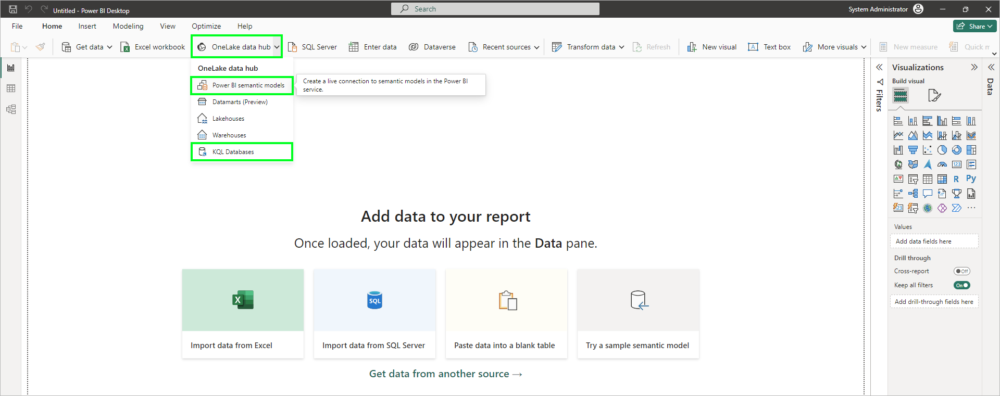

When adding the *StockHistory* table from the KQL database, be sure to select DirectQuery (and not Import) on the Connection Settings page. When adding the *StocksLakehousePredictions* semantic model, be sure to select all of the tables in the model. 

Select the *Modeling* tab, and click on *Manage relationships*. Create a new many-to-many relationship between the *StockHistory* symbol and the *stocks_prediction* Symbol. Set the cross filter direction to *Both*, and be sure the cardinality is set to *Many-to-many*:

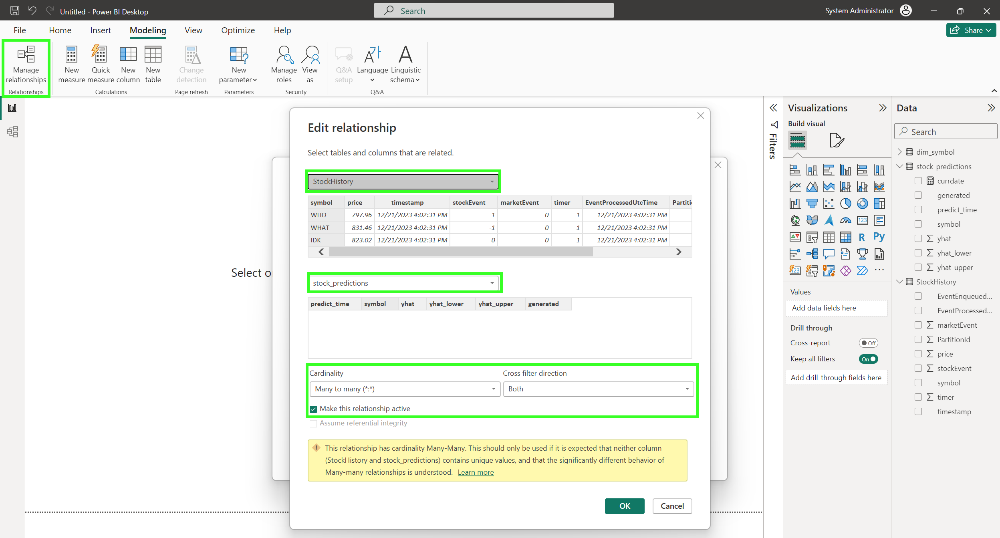

> :bulb: **Many to Many Relationships:**
> Using many-to-many relationships is fairly rare in visuals because data sources are typically normalized for performance and data integrity. However, they are more commonly used in situations where we are mashing up like data from different data sources. This is one of those cases.

Next, add 3 line charts to your report: 2 across the top row, and 1 across the bottom row. Configure them as follows:

Top left chart: StockHistory (KQL)
* X-axis: Timestamp
* Y-axis: Price
* Legend: Symbol

Top right chart: StockHistory (KQL)
* X-axis: Timestamp
* Y-axix: Price
* Legend: 
    * Without *dim_symbol* table: None (will show overall market)
    * With *dim_symbol* table: *Market* from *dim_symbol* (will show the NYSE/NASDAQ markets)

Bottom chart: Prediction
* X-axis: Timestamp
* Y-axis: yhat
* Legend: Symbol

On each visual, configure the filter to only show data as follows:

* For the top left StockHistory / real-time chart, set the *timestamp* to *Relative time* within the last 15 minutes.
* For the top right StockHistory / market chart, set the *timestamp* to *Relative time* within the last 4 hours (as shown in the screenshot below)
* For the bottom stocks_prediction chart, set the *predict_time* to a *Relative date* in the next 3 days, including today.

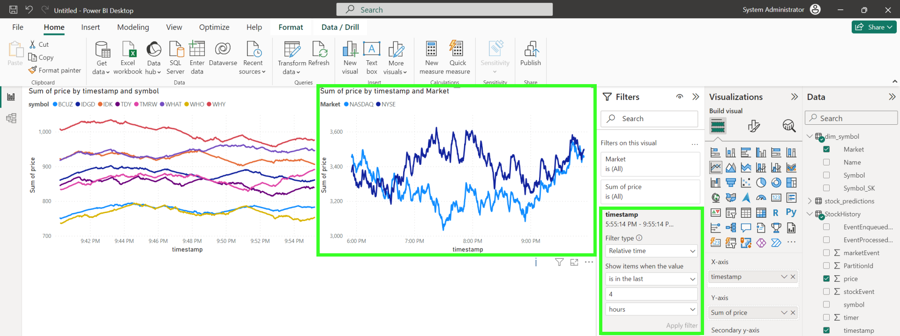

Once complete, your report should look similar to the image below, showing the time filter on the bottom visual:

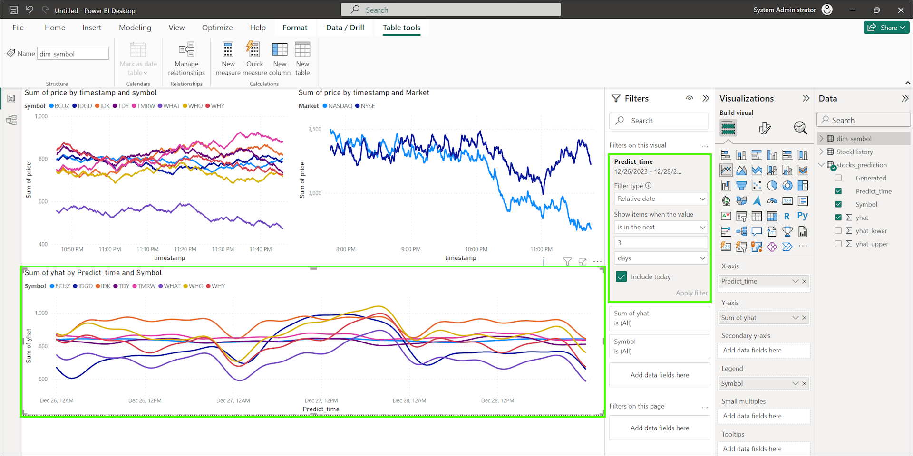

Let's review what we are looking at in the screenshot above. The top left chart shows the stock prices in real time (and will ultimately update every second or so). The upper right shows the prices grouped by market, and the bottom chart shows future predictions. Note: if you do not have the *dim_symbol* table available, the top-right market chart will simply show the overall market.

Next, right click the *predicted_price* table and select *New measure*. Measures are formulas written in the Data Analysis Expressions (DAX) language; for this DAX formula, enter *currdate = NOW()* as shown below:

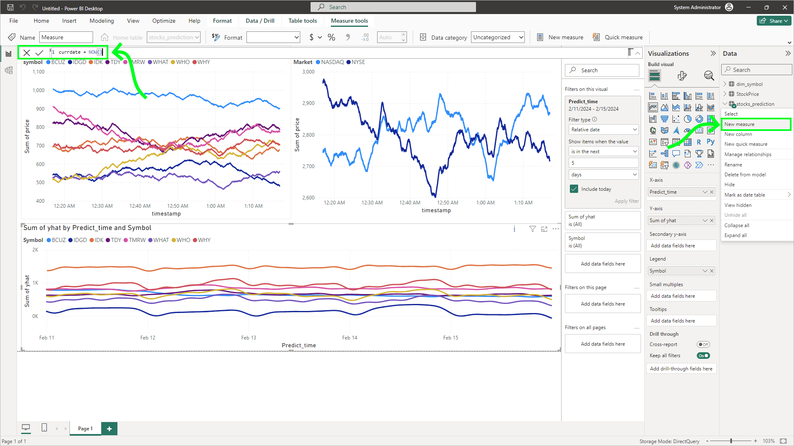

With the prediction chart selected, navigate to the additional visualizaton options (the magnifying glass/chart icon) and add a new *X-Axis Constant Line*. Under *Value*, use the formula button (fx) to choose a field, and select the *currdate* measure, as shown in the image below. Enable the *Shade area* to *Before*, and configure the transparency and colors to your preference.

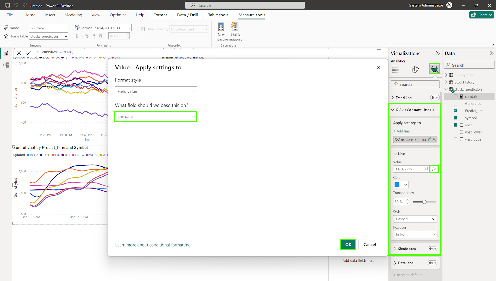

You can also add other features, like solid veritcal lines (modifying the visual's gridlines). When complete, your chart should look similar to the image below, where the dashed line on the predictions chart shows the current time, the past is shaded slightly, and lines appear for 12 hour block:

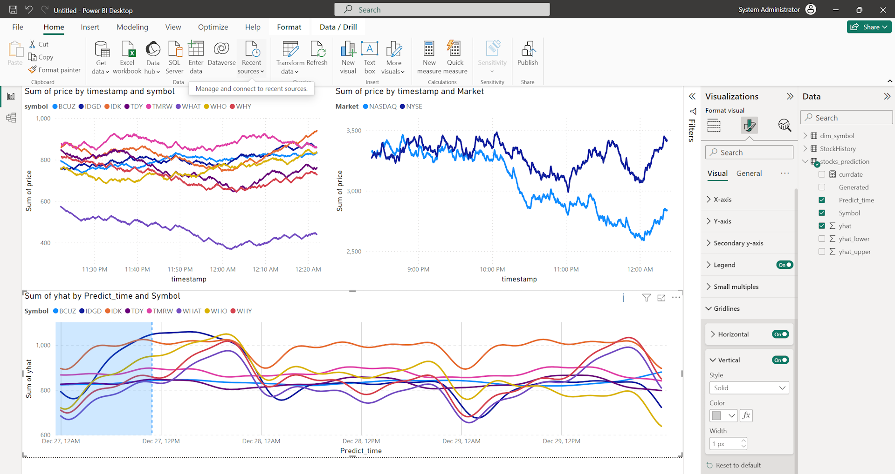

With the relationships in place, all visual should cross filter, so when selecting either a symbol on a chart, or market, all elements should react accordingly. In the image below, the IDGD stock is selected on the real-time chart, and it updated the prediction chart to show only the selected symbol, as well as the market the stock is in:

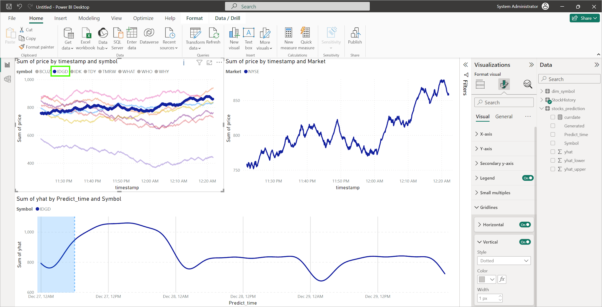

The last thing we can do is clean up the names, titles, and so on to add a finishing touch.

## 5. Publish the report

On the Power BI Desktop Home tab, you can publish the report to the Power BI service by clicking the *Publish* button. You may also publish the report to a dashboard, change the refresh interval, and make additional modifications for end-users. 

## :thinking: Additional Learning

* [Power BI Desktop](https://powerbi.microsoft.com/en-us/desktop/) 
* [Semantic Models](https://learn.microsoft.com/en-us/power-bi/connect-data/service-datasets-understand)
* [Data Wrangler](https://learn.microsoft.com/en-us/fabric/data-science/data-wrangler)
* [Prophet](https://facebook.github.io/prophet/)

## :tada: Summary

In this module, you followed up on the creation of the ML model by consuming the ML model, generating predictions, and storing those predictions in the lakehouse. You then created a report in Power BI Desktop that shows the current stock prices with predicted values.

## :white_check_mark: Results

- [x] Loaded and ran the DS 2 notebook, which loaded available ML models and generated predictions
- [x] Stored the predictions in a new lakehouse table
- [x] Build a Power BI report incorporating the prediction data