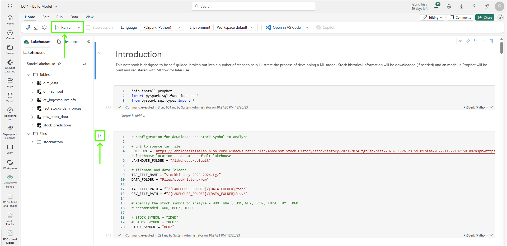

# Module 07b - Data Science: Using models, saving to Lakehouse, building a report

[< Previous Module](./modules/module07a.md) - **[Home](../README.md)** - [Next Module >](./module07c.md)

## :stopwatch: Estimated Duration

* 45 minutes for 07b
* 2 hours overall

## :thinking: Prerequisites

- [x] Completed Module 07a

Recommended modules for reports:

- [x] Completed [Module 01 - KQL Database ](../modules/module01.md)
- [x] Completed [Module 02 - KQL Queries](../modules/module02.md)
- [x] Completed [Module 03 - Reporting](../modules/module03.md)
- [x] Completed [Module 06 - Lakehouse](../modules/module03.md)

You can complete the reporting section without the recommended modules above, but the functionality will be limited.

This module is broken down into 3 sections:
* [Module 07a - Building and storing an ML model](./module07b.md)
* [Module 07b - Using models, saving to Lakehouse, building a report](./module07b.md)
* [Module 07c - Solution in practice](./module07c.md)

## :loudspeaker: Introduction

This module is a continuation of module 07a. In module 07a, the stock data was analyzed and an ML model was built and registered in MLflow.

In this module, we'll build a notebook that queries MLflow for available models, and builds predictions. We'll then build a semantic model for the predictions to leverage in Power BI. We'll build a report in Power BI Desktop that uses multiple datasets.

## Table of Contents

1. [Open and explore the Notebook](#1-open-and-explore-the-notebook)
2. [Run the notebook](#2-run-the-notebook)
3. [Build a semantic model](#3-import-the-notebook)
4. [Build a simple report in Power BI Desktop](#4-explore-the-notebook)
5. 
6. 

## 1. Open and explore the notebook

Open the DS 2 - Predict Stock Prices notebook. For reference, the three notebooks used throughout this module are listed below. More details on importing these are in module 07a.

* [Download the DS 1 - Build Model Notebook](<../resources/module07/DS 1 - Build Model.ipynb>)
* [Download the DS 2 - Predict Stock Prices Notebook](<../resources/module07/DS 2 - Predict Stock Prices.ipynb>)
* [Download the DS 3 - Build and Predict Notebook](<../resources/module07/DS 3 - Build and Predict.ipynb>)

Take a few moments to explore the DS 2 notebook, and be sure to add the same default lakehouse to the notebook similar to the steps in module 07a. Many of the elements in this notebook should look familiar to DS 1. 

Notice that much of the notebook has been broken out into function definitions, such as "def write_predicitions," which help encapsulate logic into smaller steps. The notebook completes these tasks at a high level:

* Creates the stock predictions table in the lakehouse, if it doesn't exist
* Gets a list of all stock symbols 
* Creates a predicition list by examining available ML models in MLflow
* Loops through the available ML models:
    * Generates predicitions
    * Stores predicitions in the lakehouse

## 2. Run the notebook

You can either run each cell manually as you follow along with the notebook, or click 'run all' in the top toolbar and follow along as the work progresses. The cells at the bottom of the notebook that delete the predictions and query the prediction data are *frozen* -- that is, they will not run and are there for testing purposes; you can use them for deleting rows or examining the table. To use them, you'll need to unfreeze the cells first, but be sure to freeze them (or comment them out) because if the entire notebook is run, these cells will be run if left unfrozen.

For the rest of this step, follow along with documentation in the notebook for an explanation of the steps. The key areas to examine closely include the interaction with MLflow (to find the ML models), and how the data is written to the lakehouse using a merge statement.

For additional exploration, return to the previous section and generate ML models for other stock symbols. Notice how this notebook should find those new ML models and generate predicitions.

Once the notebook has been run, you are ready to move to the next step. 

## 3. Build a semantic model

In this step, we'll build a semantic model (formerly called Power BI datasets) to use in our Power BI report. A semantic model represents data that is ready for reporting and acts as an abstraction on top of a data source. Semantic models offer several advantages ([read more on them here](https://learn.microsoft.com/en-us/power-bi/connect-data/service-datasets-understand)); typically a semantic model will be purpose built (serving a specific reporting need) and may have transformations, relationships, and enrichments like measures to make developing reports easier.

In order to disambiguate the term 'model,' we'll do our best to always qualify the type of model we're referring to. Because this is a machine learning module, we use the term 'model' frequently to refer to a machine learning model, which is quite a bit different than a semantic model.

To create a semantic model, open the lakehouse. You can build a new semantic model by either method:
* From the lakehouse mode, select New Semantic Model
* From the SQL analytics endpoint mode, select the Reporting tab, and select New Semantic Model

Name the model StocksLakehousePredicitions. If you completed the Lakehouse module and have the dim_symbols dimension, add both the dim_symbols and the stocks_predicitions tables to the semantic model. Otherwise, add only the stock_predicitions table.

When the model appears, if you have the dim_symbols table, create a relationship between the stock_predicitions symbol column (many) to the dim_symbol symbol column (one), to create a 1:many relationship between these two entities. This can be done by drag/dropping the columns, or using the Manage Relationships button in the top navbar.

## 4. Build a simple report in Power BI Desktop

[Download Power BI Desktop](https://powerbi.microsoft.com/en-us/desktop/) and install. We'll use Power BI Desktop for the richer integration experience and ability to bring in multiple data sources. If you are unable to run Power BI desktop on your machine, and no lab environment is available to run Power BI Desktop, you can make due by creating some elements of the report in the Power BI service. Instead of bringing in multiple datasets as outlined in these steps, instead focus on bringing only the single semantic model of the stock prediction data (created above) into the report. To get started without Power BI Desktop, from the semantic model page, click the create report button to create a new report based on this model. 

Launch Power BI Desktop and create a new report. 

-In PBID, get data, get the KQL database. Get the prediction data semantic model. If completed the lakehouse model, bring in the dim_symbol dimension.

-Add relationships between the Symbol columns on the data sources. This will result in a many:many between the predicition table and the KQL data, and a many to one on the dim_symbol table, if it is available.

-Add a total of 3 line charts; 2 across the top half, one across the bottom half, like shown in the image below:

Configure the charts as follows:

Top Left Chart: Real-time KQL
* X-axis: Timestamp
* Y-axis: Price
* Label: Symbol

Top Right Chart: Real-time Overall Market
* X-axis: Timestamp
* Y-axix: Price
* Label: 
    * Without dim_symbol: None (will show overall market)
    * With dim_symbol: Market (will show the NYSE/NASDAQ markets)

Bottom chart: Predicition
* X-axis: Timestamp
* Y-axis: yhat
* Label: Symbol

-Add a new measure to the predicted_price table, named CurrDate. Set CurrDate = NOW():

-On the prediction chart, add an X-Axis Constant Line under the additional visualizations (hour glass icon):

-Next, we'll add a line to the prediction so we can see the current time on the chart. Using the formula button, choose the CurrDate measure created above. Choose a color of your liking, and set the style to your preference (we used blue, 50% transparency, dashed line). Enable the Shade Area, set the position to before, and select a color and transparency to your preference (we used blue, 86% transparency). Feel free to explore other options, like a Data label.

-Set the filter on the Timestsamp on the prediction chart to Relative date to show items when the value is in the next 2 days, and check the box for Include today.

-Set the filter on the Timestamp on the current price (upper left) to Relative time and show items when the value is in the last 30 minutes.

-Set the filter on the Timestamp on the market report (upper right) to Relative time and show items when the value is in the last 2 hours.

Your final report should appear like:

Lastly, without any visual selected, change the Page refresh rate to a something like every 5 or 10 seconds, though this setting may be limited by your administrator.

## 5. Publish the report

From within Power BI Desktop, publish the report to your workspace:

You may also publish the report to a dashboard...

## :thinking: Additional Learning

* [Power BI Desktop](https://powerbi.microsoft.com/en-us/desktop/) 
* [Semantic Models](https://learn.microsoft.com/en-us/power-bi/connect-data/service-datasets-understand)
* [Data Wrangler](https://learn.microsoft.com/en-us/fabric/data-science/data-wrangler)
* [Prophet](https://facebook.github.io/prophet/)

## :tada: Summary

In this module, you followed up on the creation of the model by consuming the model, generating predictions, and storing those predictions in the lakehouse. You then created a report in Power BI Desktop.

## :white_check_mark: Results

- [x] Loaded and ran the DS 2 notebook, which loaded available ML models and generated predictions
- [x] Stored the predictions in a new lakehouse table
- [x] Build a Power BI report incorporating the prediction data