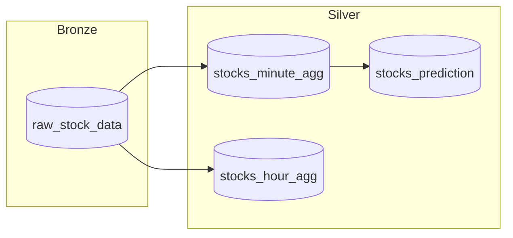

# Module 07c - Data Science: Solution in practice

[< Previous Module](./module07b.md) - **[Home](../README.md)** - [Next Module >](./module07d.md)

## :stopwatch: Estimated Duration

* 30 minutes for 07c
* 2 hours overall

## :thinking: Prerequisites

- [x] Completed Module 07a
- [x] Completed Module 07b
- [x] Completed Module 06

## :book: Sections

This module is broken down into 4 sections:

* [Module 07a - Building and storing an ML model](./module07a.md)
* [Module 07b - Using models, saving to the lakehouse](./module07b.md)
* [Module 07c - Solution in practice](./module07c.md)
* [Module 07d - Building a Prediction Report](./module07d.md)

## :loudspeaker: Introduction

Prefer video content? These videos illustrate the content in this module:
* [Getting Started with Data Science in Microsoft Fabric, Part 1](https://youtu.be/kdUIUPwIy4g)
* [Getting Started with Data Science in Microsoft Fabric, Part 2](https://youtu.be/GFTDxnPDTpQ)

The first two sections in this module are common approaches to developing a data science solution. The first section covered the development of the model (exploration, feature engineering, tuning, etc.), building, and then deploying the model. The second section covered the consumption of the model, which is typically a separate process and may even be done by different teams.

However, in this specific scenario, there is little benefit to creating the model and generating predictions separately. This is because the model we developed is time-based univariate: the predictions the model generates will not change without retraining the model with new data.

Most ML models are multivariate: for example, consider a travel time estimator that calculates travel time between two locations. Such a model could have dozens of input variables, but two major variables would certainly include the time of day and weather conditions. Because the weather is changing frequently, we'd pass this data into the model to generate new travel time predictions (inputs: time of day and weather, output: travel time).

This being the case, we should generate our predictions immediately after creating the model. For practical purposes, this section shows how we could implement the ML model building and forecasting in a single step. Instead of using the downloaded historical data, this process will use the aggregation tables built in module 06. Our data flow can be visualizad like so:

## Table of Contents

1. [Methods to retrain](#1-methods-to-retrain)
2. [Open and explore the notebook](#2-open-and-explore-the-notebook)
3. [Run the notebook](#3-run-the-notebook)
4. [Examine the results](#4-examine-the-results)
5. [Additional challenges](#5-additional-challenges)

## 1. Methods to retrain

Recently, Prophet incorporated the ability to warm-start the model generation. Read the [Updating Fitted Models section](https://facebook.github.io/prophet/docs/additional_topics.html) of this document for information on how this works. 

Warm-starting involves first loading the existing model and refitting the model with new data, which is faster than building the model from scratch. However, because this is fairly complex to orchestrate, and because Prophet is very fast at fitting models, the models here will be rebuilt completely each run. If we were building thousands of models daily and needed to find ways to increase performance, retraining models would be a great way to achieve increased performance.

When working on data science solutions, it's a good idea to evaluate the performance of building and retraining models to fit the business requirements.

## 2. Open and explore the notebook

Open the *DS 3 - Forecast All* notebook. For reference, the notebooks used throughout this module are listed below. More details on importing these are in module 07a.

All resources (notebooks, scripts, etc.) for all modules can be downloaded in this zip file:

* [All Workshop Resources (resources.zip)](https://github.com/microsoft/fabricrealtimelab/raw/main/files/resources.zip)

Individually view and download:

* [Download the DS 1 - Build Model Notebook](<../resources/module07/DS 1 - Build Model.ipynb>)
* [Download the DS 2 - Predict Stock Prices Notebook](<../resources/module07/DS 2 - Predict Stock Prices.ipynb>)
* [Download the DS 3 - Forecast All](<../resources/module07/DS 3 - Forecast All.ipynb>)

Take some time exploring the *DS 3 - Forecast All* notebook, and notice a few key things:

* Stock data is read from the stock_minute_agg table.
* All symbols are loaded, and predictions are made on each.
* The routine will check MLflow for matching models, and load their parameters. This allows data science teams to build optimal parameters.
* Predictions for each stock are logged to the stock_predicitions table. There is no persistence of the model.
* There is no cross validation or other steps performed in 07a. While these steps are useful for the data scientist, it's not needed here.

## 3. Run the notebook

Run this notebook either entirely or step-by-step. 

The *get_symbols* method in the notebook has several options for how symbols are loaded; by default, all symbols in the dataframe are used. This can be modified if needed in order to process fewer records. Running the notebook for all symbols should take about 10 minutes.

If you are time-contrained, you can modify the way symbols are loaded to reduce run time (models will be built for all of the specified stocks). 

## 4. Examine the results

Use the last two cells of the notebook to query the *stocks_prediction* table to verify results are written to the table. Notice that the further out the predictions are, the larger the range of yhat_lower and yhat_upper values are, showing increased uncertainty for predictions further out in time. 

With data in the table, we're ready to move on to integrating this data in the Power BI reports.

## 5. Additional Challenges

### Predict vs Actual

For even more exploration, if you completed the lakehouse module, check out the [Prediction vs Actual Reporting](../modules/moduleex03.md) extra module. This module details how to create a report that mashes-up actual prices and predicted prices.

## :thinking: Additional Learning

* [Machine Learning Experiments in Microsoft Fabric](https://learn.microsoft.com/en-us/fabric/data-science/machine-learning-experiment)
* [Prophet](https://facebook.github.io/prophet/)

## :tada: Summary

In this module, we further refined the process to build a model and generate predictions in a single step, streamlining the process of creating predictions and operationalizing the model generation. 

## :white_check_mark: Results

- [x] Loaded a notebook into your Fabric environment that focuses on building an ML model and generating predictions.

[Continue >](./module07d.md)