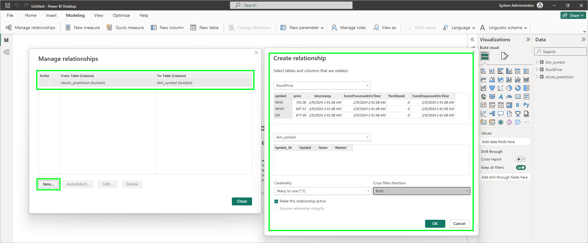
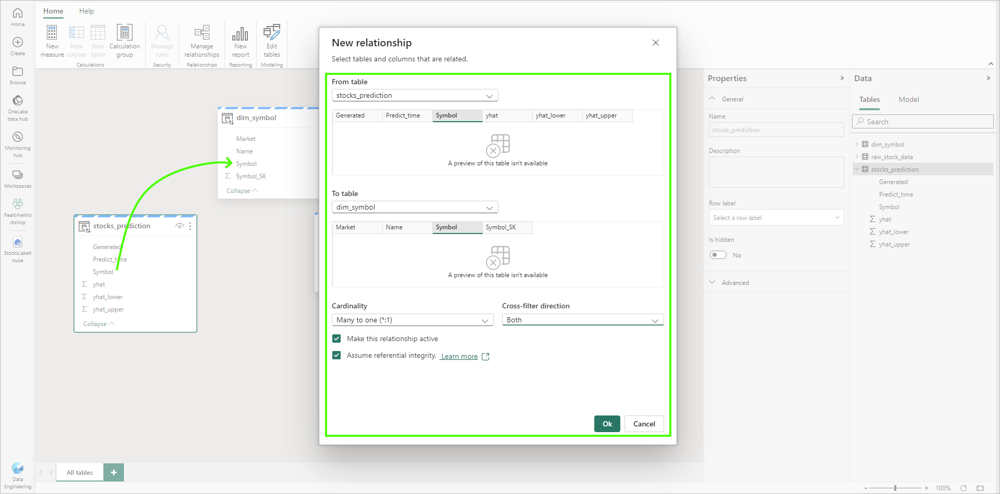
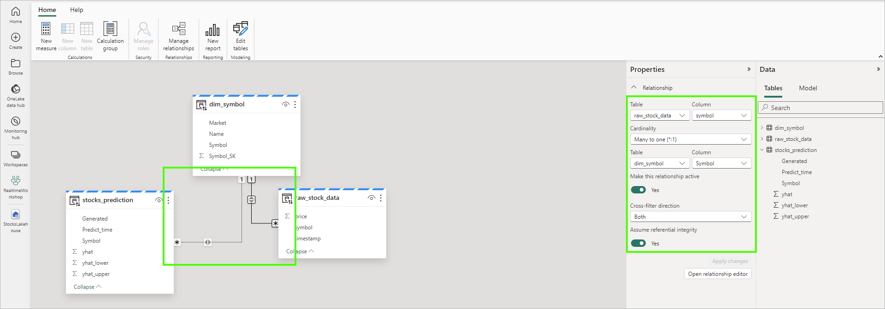
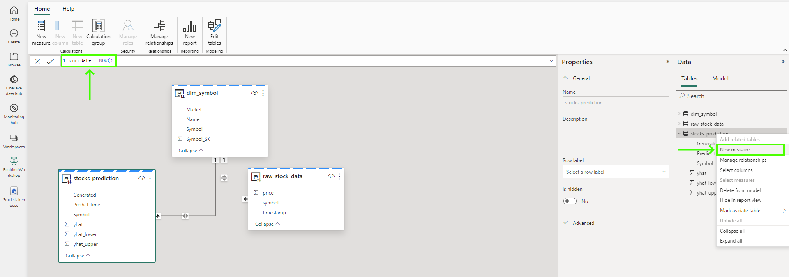
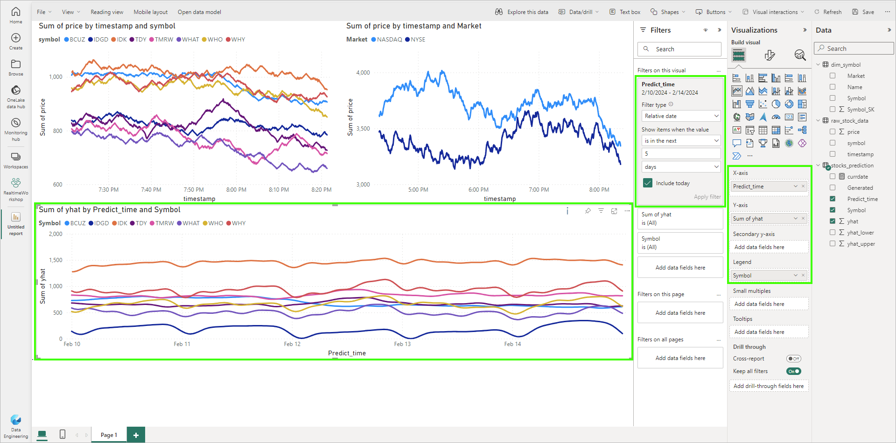
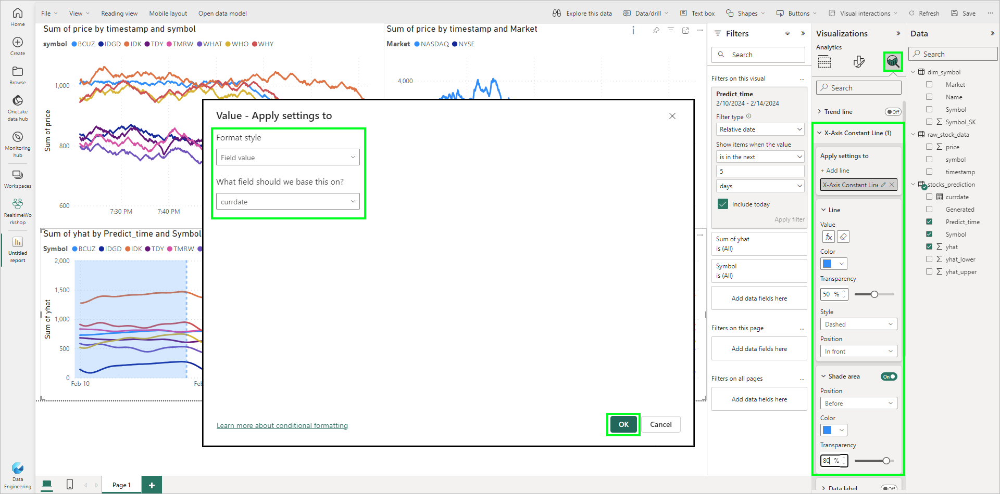
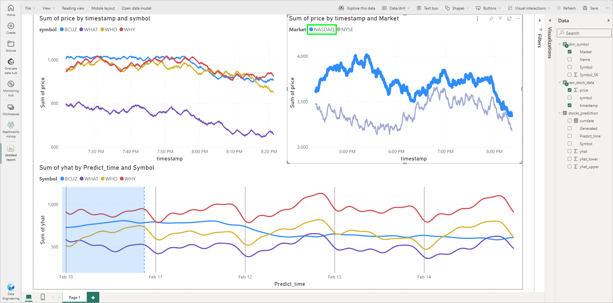

# Module 07d - Data Science: Building a Prediction Report

[< Previous Module](./module07c.md) - **[Home](../README.md)** - [Next Module >](./moduleex00.md)

## :stopwatch: Estimated Duration

* 25 minutes for 07d
* 2 hours overall

## :thinking: Prerequisites

- [x] Completed Module 07a
- [x] Completed Module 07b

Recommended modules:

- [x] Completed [Module 01 - KQL Database](../modules/module01.md)
- [x] Completed [Module 02 - KQL Queries](../modules/module02.md)
- [x] Completed [Module 03 - Reporting](../modules/module03.md)
- [x] Completed [Module 06 - Lakehouse](../modules/module06a.md)

## :book: Sections

This module is broken down into 4 sections:

* [Module 07a - Building and storing an ML model](./module07a.md)
* [Module 07b - Using models, saving to the lakehouse, building a report](./module07b.md)
* [Module 07c - Solution in practice](./module07c.md)
* [Module 07d - Building a Prediction Report](./module07d.md)

## :loudspeaker: Introduction

In the previous data science sections, data was analyzed, models were built, and predictions generated. But, this data was limited to analysis within the notebooks. This module completes the data science module by building a report that integrates the prediction data, making the data accessible to business users.

There are two options for building this report: we can use Power BI Desktop, or use the Power BI service as we've done in other modules. These options are listed in two different steps below -- you can complete either or both as you'd prefer.

Power BI Desktop has a number of advantages, but the primary advantage in this scenario is the ability to create [composite models](https://learn.microsoft.com/en-us/power-bi/transform-model/desktop-composite-models). Composite models allow us to bring many data sources together -- we'll bring the KQL real-time data together with the predictions data in the lakehouse.

If you would prefer to build the report within the Power BI service (or are unable to use or run Power BI Desktop), we can create a very similar report in the Power BI service. Instead of using the KQL database for real-time data, we'll use the *raw_stock_data* from the lakehouse that contains near real-time data; this data will be delayed about 2 to 5 minutes, and is micro-batched into the lakehouse. This approach requires the completion of [Module 06 - Lakehouse](../modules/module06a.md).

Prefer video content? These videos illustrate the content in this module:
* [Getting Started with Data Science in Microsoft Fabric, Part 1](https://youtu.be/kdUIUPwIy4g)
* [Getting Started with Data Science in Microsoft Fabric, Part 2](https://youtu.be/GFTDxnPDTpQ)

## Table of Contents

1. [Build a report in Power BI Desktop](#1-build-a-report-in-power-bi-desktop)
    1. [Build a semantic model](#1-1-build-a-semantic-model)
    2. [Build a report in Power BI Desktop](#1-2-build-the-report-in-power-bi-desktop)
    3. [Publish the report](#1-3-publish-the-report)
2. [Build a Report in the Power BI service](#2-build-a-report-in-the-power-bi-service)
    1. [Build a semantic model](#2-1-build-a-semantic-model)
    2. [Build a report in the Power BI service](#2-2-build-the-report-in-the-power-bi-service)

## 1. Build a report in Power BI Desktop

If you are unable to use [Power BI Desktop](https://powerbi.microsoft.com/en-us/desktop/) or prefer to work in the Power BI service, continue to [the step 2](#2-build-a-report-in-the-power-bi-service) to build a similar report using the Power BI service.

### 1-1. Build a semantic model

In this step, we'll build a semantic model (formerly called Power BI datasets) to use in our Power BI report. A semantic model represents data that is ready for reporting and acts as an abstraction on top of a data source ([read more on semantic models here](https://learn.microsoft.com/en-us/power-bi/connect-data/service-datasets-understand)). Typically, a semantic model will be purpose built (serving a specific reporting need) and may have transformations, relationships, and enrichments like measures to make developing reports easier.

> :bulb: **About the word 'model':**
> In order to disambiguate the term 'model,' we'll do our best to always qualify the type of model we're referring to. Because this is a machine learning module, we use the term 'model' frequently to refer to a machine learning model (or ML model), which is different from a semantic model.

To create a semantic model, open the lakehouse. You can build a new semantic model by either method below:
* From the lakehouse mode, select *New semantic model* from the top toolbar
* From the SQL analytics endpoint mode, select the *Reporting* tab, and select *New semantic model*

Name the model *StocksLakehousePredictions*. If you completed the lakehouse module and have the *dim_symbols* dimension table, add both the *dim_symbols* and the *stocks_prediction* tables to the semantic model. Otherwise, add only the *stocks_prediction* table. The *dim_symbol* table will allow us to do a bit more filtering, but is not required.

When the model appears, if you have the *dim_symbols* table, create a relationship between the *stocks_prediction* symbol column (many) to the *dim_symbol* symbol column (one), to create a 1:many relationship between these two entities. This can be done by drag/dropping the Symbol column in one table and dropping it on the other Symbol column, or using the *Manage Relationships* button in the top navbar. Set the Cross-filtering to *Both* and check *Assume referential integrity*.

If you don't have the *dim_symbol* table, just use the single *stocks_prediction* table. The model should look similar to:

### 1-2. Build the report in Power BI Desktop

[Download Power BI Desktop](https://powerbi.microsoft.com/en-us/desktop/) and install. Launch Power BI Desktop and create a new report. On the *Home* ribbon, click the *OneLake data hub* and first bring in the KQL *StockDB* *StockPrice* table. When the *Connection settings* window appears, be sure to select *DirectQuery*.

From the *OneLake data hub*, select *Power BI semantic models* and load the *StocksLakehousePredictions* semantic model created above. When the *Connect to your data* window opens, be sure to select all tables in the semantic model and click *Submit*. You may receive a security warning: by bringing in disparate data sources, there's a potential for data exposure between these data sources -- in this case, we can dismiss the warning. 

Select the *Modeling* tab, and click on *Manage relationships*. The steps we take to configure the relationships will depend on whether or not we have the *dim_symbol* table in our semantic model. Having the *dim_symbol* table is ideal because it can help connect all of the tables, making cross-filtering easy and automatic. 

If your semantic model includes *dim_symbol*:

Notice the relationship between *stocks_prediction* and *dim_symbol* already exists, as it was created as part of the semantic model. Click *New...* to create a new relationship, and create a relationship between *StockPrice* (many) and *dim_symbol* (one). Set the *Cross filter direction* to *Both*. This should look similar to:

If your semantic model does **not** included *dim_symbol*:

Create a new many-to-many relationship between the *StockPrice* *symbol* and the *stocks_prediction* Symbol. Set the cross filter direction to *Both*, and be sure the cardinality is set to *Many-to-many*:

> :bulb: **Many to Many Relationships:**
> Using many-to-many relationships is fairly rare in visuals because data sources are typically normalized for performance and data integrity. However, they are more commonly used in situations where we are mashing up like data from different data sources.

With the relationships configured, we can now add the visuals to the design surface.

Begin by adding 3 line charts to your report: 2 across the top row, and 1 across the bottom row. Configure them as follows -- you may receive an error on the visuals until the filters are set; this is due to the visual trying to display too many rows.

Top left chart: StockPrice (KQL)
* X-axis: timestamp
* Y-axis: price
* Legend: symbol
* Filter: timestamp to *Relative time is in the last 1 hour*.

Top right chart: StockPrice (KQL)
* X-axis: timestamp
* Y-axis: price
* Legend: 
    * Without *dim_symbol* table: None (will show overall market)
    * With *dim_symbol* table: *Market* from *dim_symbol* (will show the NYSE/NASDAQ markets)
* Filter: timestamp to *Relative time is in the last 1 hour*.

Bottom chart: Prediction
* X-axis: Timestamp
* Y-axis: yhat
* Legend: Symbol
* Filter: Predict_time to *Relative date is in the next 5 days*, with *include today* checked.

Once complete, your report should look similar to the image below, showing the time filter on the bottom visual:

Let's review what we are looking at in the screenshot above. The top left chart shows the stock prices in real time (and will ultimately update every second or so). The upper right shows the prices grouped by market, and the bottom chart shows future predictions. Note: if you do not have the *dim_symbol* table available, the top-right market chart will simply show the overall market.

Next, right click the *stocks_prediction* table and select *New measure*. Measures are formulas written in the Data Analysis Expressions (DAX) language; for this DAX formula, enter *currdate = NOW()* as shown below:

With the prediction chart selected, navigate to the additional visualization options (the magnifying glass/chart icon) and add a new *X-Axis Constant Line*. Under *Value*, use the formula button (fx) to choose a field, and select the *currdate* measure, as shown in the image below. Enable the *Shade area* to *Before*, and configure the transparency and colors to your preference.

You can also add other features, like solid vertical lines (modifying the visual's gridlines). When complete, your chart should look similar to the image below, where the dashed line on the predictions chart shows the current time while the past is shaded slightly. Naturally, the position of the line and shaded area will vary slightly depending on the time of day:

With the relationships in place, all visual should cross filter, so when selecting either a symbol on a chart, or market, all elements should react accordingly. In the image below, the IDGD stock is selected on the predictions chart:

If you'd like to add some finishing touches, clean up the names, titles, and other elements on each visual to be more readable.

### 1-3. Publish the report

On the Power BI Desktop Home tab, you can publish the report to the Power BI service by clicking the *Publish* button. You may also publish the report to a dashboard, change the refresh interval, and make additional modifications for end-users. 

## 2. Build a report in the Power BI service

If you completed building the report in Power BI Desktop, this step is optional. 

In this step, we'll create a report in the Power BI service that combines near real-time data with the predicted data. This approach requires the completion of [Module 06 - Lakehouse](../modules/module06a.md)

### 2-1. Build a semantic model

In this step, we'll build a semantic model (formerly called Power BI datasets) to use in our Power BI report. A semantic model represents data that is ready for reporting and acts as an abstraction on top of a data source ([read more on semantic models here](https://learn.microsoft.com/en-us/power-bi/connect-data/service-datasets-understand)). Typically, a semantic model will be purpose built (serving a specific reporting need) and may have transformations, relationships, and enrichments like measures to make developing reports easier.

To create a semantic model, open the lakehouse. You can build a new semantic model by either method below:
* From the *Lakehouse* mode (the mode is chosen in the upper-right of the lakehouse window), select *New semantic model* from the top toolbar
* From the *SQL analytics endpoint* mode, select the *Reporting* tab, and select *New semantic model*

Name the semantic model *StocksRawWithPredictions*. Add these tables to the model, and then click *Confirm*:

* raw_stock_data
* dim_symbol
* stocks_prediction

The designer will load, showing the three tables. Create relationships by drag/dropping the columns below or by using the *Manage Relationships* button in the top navbar. Create the following relationships, setting the cross-direction filter to *Both* and enabling *Assume referential integrity*:

* *raw_stock_data* *symbol* (*) to *dim_symbol* *Symbol* (1)
* *stocks_prediction* *Symbol* (*) to *dim_symbol* *Symbol* (1)

When drag/dropping and configuring the relationship properties, the UI should look similar to:

Once complete, the model should look like the image below; verify the relationships are configured properly with the correct many to one cardinality, cross-filter direction set to both, and Assume referential integrity is set to *Yes*:

Next, we'll add a new measure to the *stocks_prediction* table. On the right *Data* panel, click the ellipsis to the right of the *stocks_prediction* table for *More options*, and select *New measure*. In the expression editor, enter the following expression:

* currdate = NOW()

See the image below for reference:

The semantic model is complete -- leave the semantic model designer open for the next step.

### 2-2. Build the report in the Power BI service

On the top of the semantic model designer, click *New report*. This should open the semantic model (with all three tables) into a new Power BI report. Add 3 line charts to the report: 2 across the top row, and 1 across the bottom row. Configure them as follows:

Top left chart (current stock prices):
* X-axis: raw_stock_data - timestamp
* Y-axis: raw_stock_data - price
* Legend: raw_stock_data - symbol
* Filter: timestamp to *Relative time is in the last 1 hour*.

Top right chart (overall by market):
* X-axis: raw_stock_data - timestamp
* Y-axis: raw_stock_data - price
* Legend: dim_symbol - market
* Filter: timestamp to *Relative time is in the last 4 hours*.

Bottom chart (predictions):
* X-axis: stocks_prediction - Predict_time
* Y-axis: stocks_prediction - yhat
* Legend: stocks_prediction - Symbol
* Filter: Predict_time to *Relative date is in the next 5 days*, with *include today* checked.

The initial report should look similar to the image below -- the prediction chart settings are highlighted:

With the predictions chart selected, navigate to the additional visualization options (the magnifying glass/chart icon -- see image below) and add a new *X-Axis Constant Line*. Click *Add line*, and under the line settings, select the formula button (fx). On the *Value* window that opens, set the *Format style* to *Field value*, and select *currdate* as the field and click *OK*. Refer to this image as a reference:

Adjust the colors and transparency to preference. The dotted line on the chart (the *currdate* measure) shows the current date/time. You can also adjust the *gridlines*, titles, and other visual options. Verify that cross-filtering works -- for example, selecting NASDAQ in the top right chart should filter all charts to show only the NASDAQ stocks:

As a final step, configure the report's *Page refresh* to automatically refresh every few minutes as desired.

## :thinking: Additional Learning

* [Power BI Desktop](https://powerbi.microsoft.com/en-us/desktop/) 
* [Semantic Models](https://learn.microsoft.com/en-us/power-bi/connect-data/service-datasets-understand)
* [Power BI Desktop vs Power BI service](https://learn.microsoft.com/en-us/power-bi/fundamentals/service-service-vs-desktop)
* [Power BI Composite Models](https://learn.microsoft.com/en-us/power-bi/transform-model/desktop-composite-models)

## :tada: Summary

In this module, we created a report (or reports) that show the current stock prices with predicted values, making the data available for business users. 

## :white_check_mark: Results

- [x] Build a Power BI report incorporating the prediction data, using either Power BI Desktop or the Power BI service.

[Continue >](./moduleex00.md)