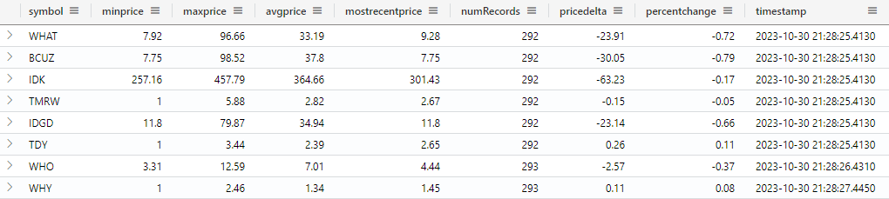
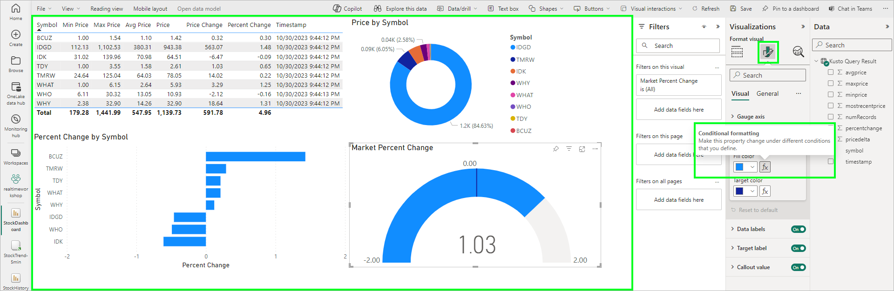
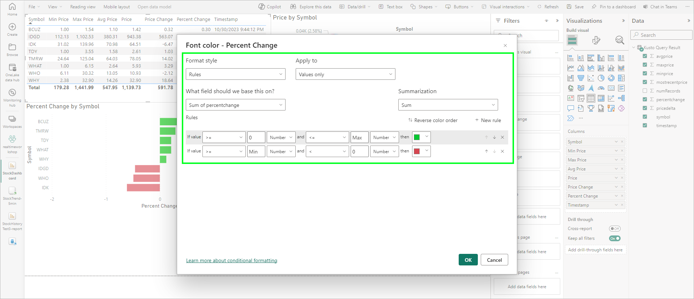
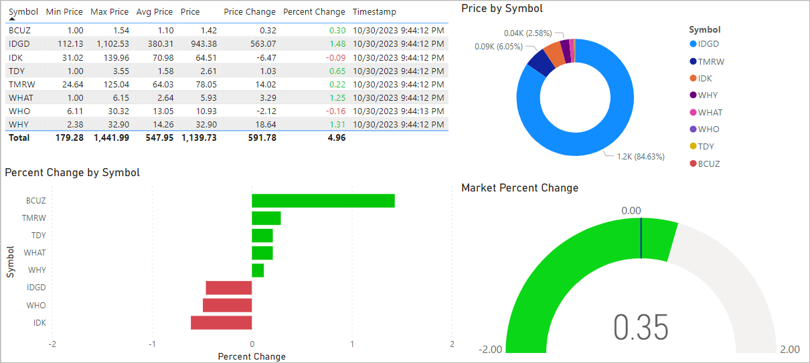

# Module Ex-02 - Additional Real-time Dashboard

[< Previous Module](../modules/moduleex01.md) - **[Home](../README.md)** - [Next Module >](./moduleex03.md)

## :stopwatch: Estimated Duration

20 minutes

## :thinking: Prerequisites

- [x] Lab environment deployed from [setup](../modules/module00.md)
- [x] Completed [Module 01](../modules/module01.md)
- [x] Completed [Module 02](../modules/module02.md)
- [x] Completed [Module 03](../modules/module03.md)

## :loudspeaker: Introduction

KQL is a powerful tool for data aggregation; using KQL, we can aggregate data to help create additional real-time dashboards. This module will introduce a few additional KQL concepts.

## Table of Contents

1. [Build a KQL aggregation query](#1-build-a-kql-aggregation-query)
2. [Build a new dashboard](#2-build-a-new-dashboard)
3. [One More KQL Tip - Bin](#3-one-more-kql-tip---bin)

## 1. Build a KQL aggregation query

At the heart of many aggregation KQL queries is the [summarize operator](https://learn.microsoft.com/en-us/azure/data-explorer/kusto/query/summarizeoperator) and the [arg_max aggregate function](https://learn.microsoft.com/en-us/azure/data-explorer/kusto/query/arg-max-aggfunction). For SQL gurus, this is similar to a *group-by*. Try a simple query:

```text
StockHistory
| summarize arg_max(timestamp,*) by symbol
| project symbol, timestamp, mostrecentprice=price;
```

This query retrieves all rows based on the most recent timestamp, grouped by symbol. This should produce a table similar to:

| symbol | timestamp | mostrecentprice |
| --- | --- | --- |
| BCUZ | 2023-10-30T17:14:33.028569Z | 425.03
| IDK |	2023-10-30T17:14:33.028569Z | 308.69
| TMRW | 2023-10-30T17:14:33.028569Z | 924.3
| IDGD | 2023-10-30T17:14:33.028569Z | 7.03
| TDY |	2023-10-30T17:14:33.028569Z | 15.34
| WHO |	2023-10-30T17:14:33.028569Z | 1189.33
| WHY |	2023-10-30T17:14:34.052792Z | 559.62
| WHAT | 2023-10-30T17:14:35.067309Z | 1200

This is essentially a table of the unique symbols, and the timestamp/price of the most recent update.

Another useful KQL command is the [let statement](https://learn.microsoft.com/en-us/azure/data-explorer/kusto/query/letstatement). The *let* statement will set a variable to an expression that contains either a scalar or tabular value. This might be a simple variable, or the results of a table that can joined against. It helps make the query more readable and maintainable by breaking down the logic into concrete components.

In the query below, LatestPrices stores this table, which is then joined across the latest 5 minutes of data for min price, max price, average price over the time period. Run the query below, but *important*: in a KQL queryset in Fabric, you'll need to highlight the entire query (both statements) to run it.

```text
let LatestPrices = 
StockHistory
| summarize arg_max(timestamp,*) by symbol
| project symbol, timestamp, mostrecentprice=price;

StockHistory
| where timestamp >= ago(5m)
| summarize avgprice = avg(price), 
    minprice = min(price), 
    maxprice = max(price),
    numRecords = count() by symbol
| join kind=inner LatestPrices on symbol
| project symbol, round(minprice,2), round(maxprice,2)
    ,round(avgprice,2), round(mostrecentprice,2)
    ,numRecords
    ,pricedelta = round(mostrecentprice - avgprice,2)
    ,percentchange = round((mostrecentprice - avgprice)/avgprice,2)
    ,timestamp
```

In the results, we see a real-time summarized table of the current data by symbol over the previous 5 minutes. Of course, realistically we might look at data since the previous close or open.



## 2. Build a new dashboard

With the entire query highlighted, click Build Report. Add a single table and save the report (you can optionally work in the preview window, or save the report and continue working in the full editor which is often preferred). With the report open in the full editor, add a donut visual, stacked bar chart, and gauge visual to the canvas. 

For the table: add the symbol, minimum price, maximum price, average price, current price, price difference, percent difference, and timestamp.

For the donut: add the symbol and the price.

For the stacked bar chart: add the percent changed to the x-axis, and symbol to the y-axis. 

For the gauge, add the percent changed, and change the value from sum to average. 

The initial report should look similar to:



On all visuals except the donut, the colors can changed conditionally based on the value. In the above initial report image, note the conditional formatting button for each element on the visual. Click this to open the conditional formatting window. In the conditional formatting window, configure Rules on the sum of percentage, declaring two rules:

1. If value >= 0 (number) and value <= Max (number) then [Color Green]
2. If value >= Min (number) and value < 0 (number) then [Color Red]

This should look similar to the image below:



This can be repeated for table, gauge, and stacked bar visuals -- and of course, modify to suite your preference. Once completed, the report should look similar to the report below.



All that is left is to configure the report to auto-refresh every second or two, and you've built a handy real-time report!

## 3. One More KQL Tip - Bin

In this step, let's look at one more fundamental aggregation KQL statement: [the bin function](https://learn.microsoft.com/en-us/azure/data-explorer/kusto/query/binfunction).

To capstone some common KQL statements, functions, and operators, the *bin* function allows us to create groups of a given size as specified by the bin parameters. This is especially powerful with *datetime* and *timespan* types, as we can combine this with the *summarize* operator to create broader views of our data. 

For example, our stock data has per-second precision -- useful for our real-time dashboard but too much data for most reports. Suppose we'd like to aggregate this into broader groups, such as days, hours, or even minutes. Further, let's make an assumption that the last price on each day (likely 23:59:59 for our data) will serve as our "closing price." 

To get the closing price for each day, we can build off our previous query and add a bin, like this:

```text
StockHistory
| summarize arg_max(timestamp,*) by bin(timestamp, 1d), symbol
| project symbol, price, timestamp
,previousprice = 0.00
,pricedifference = 0.00
,percentdifference = 0.00
| partition hint.strategy=native by symbol
  (
    order by timestamp asc 
    | scan with (step s output=all: true => previousprice = s.price;)
  )
| project timestamp, symbol, price, previousprice
    ,pricedifference = round((price-previousprice),2)
    ,percentdifference = round((price-previousprice)/previousprice,2)
| order by timestamp asc, symbol asc
```

This query should look very similar to our earlier real-time query, but leverages the *summarize* and *bin* statements to group the data by day and symbol. The result is the closing price for each stock price per day. We can also add min/max/avg prices as needed.

## :books: Resources

* [summarize operator](https://learn.microsoft.com/en-us/azure/data-explorer/kusto/query/summarizeoperator)
* [arg_max aggregate function](https://learn.microsoft.com/en-us/azure/data-explorer/kusto/query/arg-max-aggfunction)
* [let statement](https://learn.microsoft.com/en-us/azure/data-explorer/kusto/query/letstatement)

## :tada: Summary

In this module, you build a KQL queryset to summarize the data, and build a new dashboard powered by the query. 

## :white_check_mark: Results

- [x] Developed a new KQL query to summarize the data
- [x] Developed a new real-time dashboard
