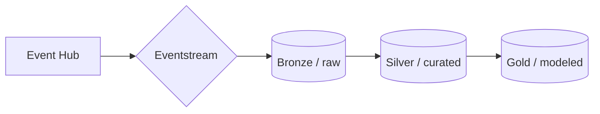
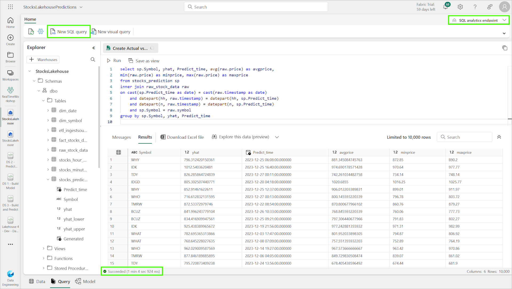
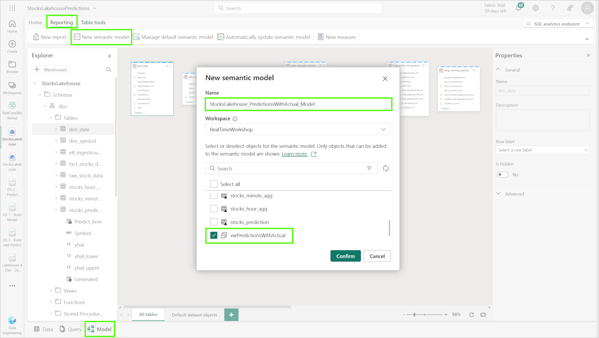
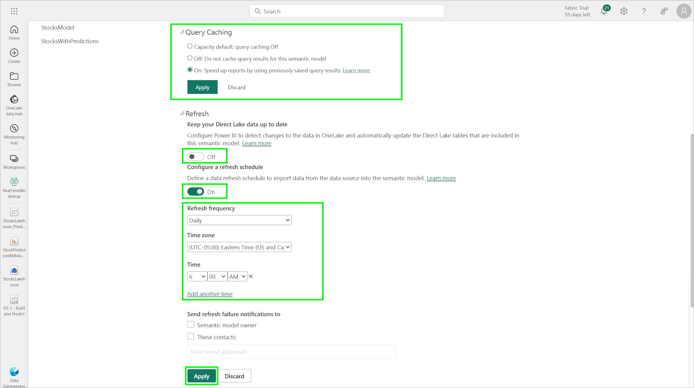
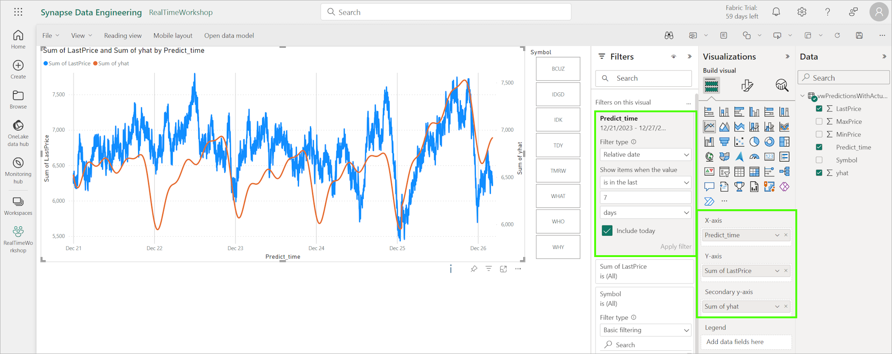
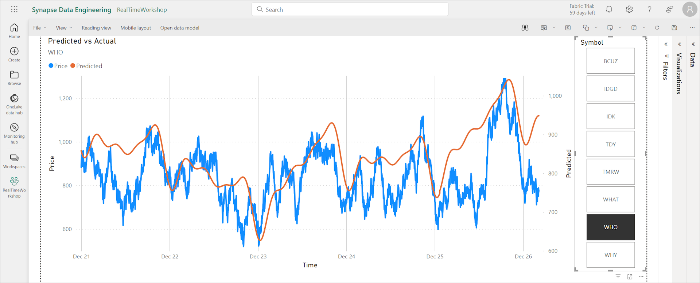
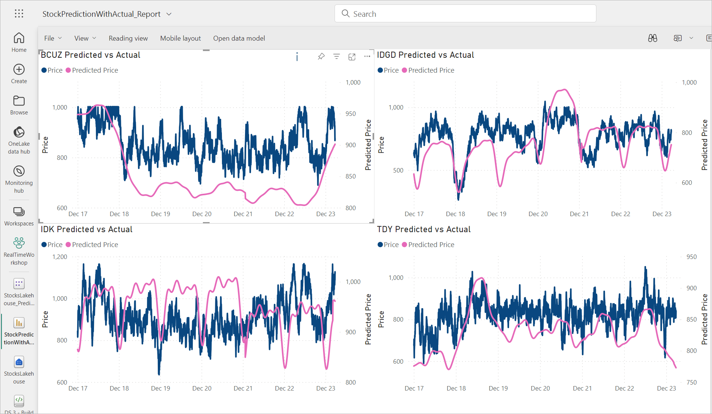

# Module 010c - Predicted vs Actual Reporting

[< Previous Module](../modules/moduleex02.md) - **[Home](../README.md)** 

## :stopwatch: Estimated Duration

30 minutes

## :thinking: Prerequisites

- [x] Lab environment deployed from [setup](../modules/module00.md)
- [x] Completed [Module 01](../modules/module01.md)
- [x] Completed [Module 02](../modules/module02.md)
- [x] Completed [Module 03](../modules/module03.md)
- [x] Completed [Module 06 - Data Lakehouse](../modules/module06.md)
- [x] Completed [Module 07 - Data Science](../modules/module07a.md)

## :loudspeaker: Introduction

In this module, you'll create a simple report that shows predicted vs actual values for diagnostic purposes. To do so, we'll leverage the lakehouse and predictions table, while also creating a semantic model to take advantage of query caching and creating views in the lakehouse. This requires the completion of Module 6 (Lakehouse) and Module 7 (Data Science), as we'll be leveraging the aggregation tables and prediction tables created in those modules.

## Table of Contents

1. [Mashing up the data](#1-mashing-up-the-data)
2. [Build the lakehouse views](#2-build-the-lakehouse-views)
3. [Build a semantic model](#3-build-a-semantic-model)
4. [Alter the model settings](#4-alter-the-model-settings)
5. [Next steps](#5-next-steps)

## 1. Mashing up the data

Creating a visual report that shows predicted vs actual is a bit more complicated than it might first appear if not for the additional 'silver' tables to assist with aggregation. While the predictions table has all of the predictions made to date, the stock price data exists in these locations:

* (Bronze) raw_stocks_data: the raw, per second feed of every stock symbol
* (Silver) stocks_minute_agg: per-minute aggregation of the high/low/close prices
* (Silver) stocks_hour_agg: per-hour aggregation of the high/low/close prices
* (Gold) fact_stocks_daily_prices: a daily look at the high/low/close prices

The fact table is a bit *too-curated* with daily views -- there isn't enough detail to see how the model performs throughout the day. The bronze raw table has all of the data, but it isn't curated enough -- while we could use this table (as you'll see below), it would be extremely slow do so. The aggregated silver-level tables can accomplish this perfectly.

With a medallion archicture, we can extend the concepts learned in Module 06, and this is one of the reasons medallion architecture is so useful: it offers the flexibility to model the data in many different ways to suit changing busines requirements. In this approach, the data is cleansed and summarized into the silver level, which could then be summarized for our fact tables at the gold level:



To support this report, we'll leverage the prediction and minute aggregation tables. To enhance performance, we'll create views in the lakehouse using the SQL analytics endpoint. This view will be represented in a semantic model, which will have a custom refresh schedule for better performance. While the performance of these queries should be excellent, modifying how semantic models can be refreshed is a useful technique.

## 2. Build the lakehouse views

To build a view that shows predictions and actual data, we'll combine the *stocks_prediction* table and the *stocks_minute_agg* table, as they both have the same precision (1 minute). 

In the stocks lakehouse, switch to the SQL analytics endpoint and create a new SQL query:



Before creating the view, let's do a little data exploration. Without the aggregation tables, we would need to join the predictions table with the *raw_stock_data* table like the query below. Copy and run the following:

```sql
select sp.Symbol, yhat, Predict_time, avg(raw.price) as avgprice, 
min(raw.price) as minprice, max(raw.price) as maxprice
from stocks_prediction sp
inner join raw_stock_data raw
on cast(sp.Predict_time as date) = cast(raw.timestamp as date)
    and datepart(hh, raw.timestamp) = datepart(hh, sp.Predict_time)
    and datepart(n, raw.timestamp) = datepart(n, sp.Predict_time)
    and sp.Symbol = raw.symbol
group by sp.Symbol, yhat, Predict_time
```

This query is incredibly expensive to run (over 1 minute on our relatively small dataset) because it has to aggregate a great deal of data. It may run quickly if the amount of data is small, but as the data size grows, this query can take several minutes. Rewriting the query to take advantage of the silver aggregate tables would look like the following query. Run the following:

```sql
select sp.Symbol, yhat, Predict_time, sma.LastPrice, 
sma.MinPrice, sma.MaxPrice
from stocks_prediction sp
inner join stocks_minute_agg sma
on cast(sp.Predict_time as date) = sma.Datestamp 
    and sma.Hour = datepart(hh, sp.Predict_time)
    and sma.Minute = datepart(n, sp.Predict_time)
    and sma.Symbol = sp.Symbol
```

The amount of time this query takes to execute is considerably less (on our test system, about 3 seconds). To turn this into a view, change the query to the T-SQL code below and run:

```sql
CREATE VIEW [dbo].[vwPredictionsWithActual] AS
(
select sp.Symbol, yhat, Predict_time, sma.LastPrice, 
sma.MinPrice, sma.MaxPrice
from stocks_prediction sp
inner join stocks_minute_agg sma
on cast(sp.Predict_time as date) = sma.Datestamp 
    and sma.Hour = datepart(hh, sp.Predict_time)
    and sma.Minute = datepart(n, sp.Predict_time)
    and sma.Symbol = sp.Symbol
)
GO
```
With the view created, we can build a semantic model. 

## 3. Build a semantic model

Switch to the *Model* tab (at the bottom of the screen), and then the *Reporting* tab near the top. Click *New semantic model*, adding the *vwPredictionsWithActual* view created above, and give it a name like StocksLakehouse_PredictionsWithActual_Model.



## 4. Alter the model settings

Although the query should perform just fine for even heavy use, this step is an example of how we can tune the semantic model to cache results for improved performance.

Switch to the workspace items view, filter or find the semantic model, and click the three ellipsis next to the *StocksLakehouse_PredictionsWithActual_Model* semantic model and select more settings. (Keep this context menu in mind -- you will revisit this in a moment.)


Under the *Query Caching*, select *On* and click *Apply*. Under *Refresh*, turn off *Keep your Direct Lake data up to date* and instead, define a daily refresh schedule using the options presented. Click *Apply*.



Ideally, the model refresh would occur just after the predictions are generated and periodically throughout the day. This an example of how we can tune performance for expensive queries, particularly in cases when there are infrequent updates to underlying data.

## 5. Create a new report 

Using the same context menu as above, select *Create report* to load the semantic model into a new report.

In the report, we'll create a line chart to display the predicted vs actual data. To get started, add a line chart to the canvas and configure it as follows:

* X-Axis: Predit_time
* Y-Axis: LastPrice
* Secondary y-axis: yhat
* Filter on Predict_time to within the last 7 days

Add a slicer to the canvas to the side of the report, and drag and drop the column *Symbol* to the slicer. Configure the slicer, under the slicer settings, to use the style *Tile*. When complete, the report should look similar to:



Colors and labels/column names may be customized to suit your preference. The slicer should allow the chart to be customized per stock, and when completed look similar to:



If you prefer more of a 'dashboard' style that shows multiple stocks, you can configure multiple charts on the same canvas. Each chart can be configured to filter a different stock, such as:



## 5. Next steps

With the initial report created, we can consider several next steps:

1. Enhancing the report with slicers, market filters, and other elements.
2. Evaluate performance of the queries using [Query Insights](https://learn.microsoft.com/en-us/fabric/data-warehouse/query-insights)

## :books: Resources

* [Query Insights in Fabric](https://learn.microsoft.com/en-us/fabric/data-warehouse/query-insights)

## :tada: Summary

In this module, we created a view in the lakehouse to aggregate predicted vs actual data, and cached the query for performance. We then built an example report to show how several stocks on a single report.

## :white_check_mark: Results

- [x] Developed a new lakehouse view
- [x] Modified the semantic model settings to cache the result
- [x] Developed a new predicted vs actual report
