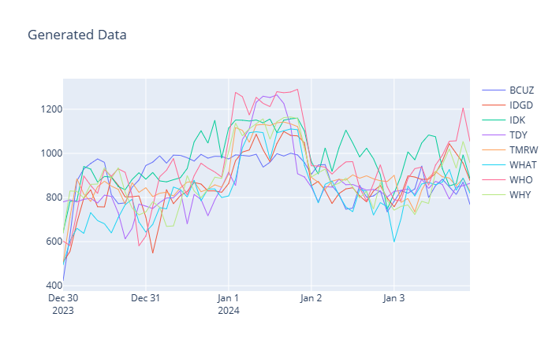

# Module Ex-04 - Generate Custom Historical Data

[< Previous Module](../modules/moduleex03.md) - **[Home](../README.md)** 

## :stopwatch: Estimated Duration

Not applicable

## :thinking: Prerequisites

- [x] Lab environment deployed from [setup](../modules/module00.md)

## :loudspeaker: Introduction

This module is an advanced topic and geared more for lab proctors or those looking to experiment with creating unique datasets to test. Familiarity with Python and customizing notebooks is highly recommended.

If you'd like to generate a block of your own historical data, you can use the [StockHistoryGenerator](../resources/moduleex/moduleex-04/StockHistoryGenerator.ipynb) notebook discussed here to do so. The notebook allows you to generate data between two dates and store the data in either a Delta table or a CSV file. 

This notebook differs from the *StockGeneratorNotebook* from Module 00 in that this notebook generates data as quickly as it can for the specified dates, rather than a steady stream of data every second. You might want to do this if you'd like to run custom parameters to test certain conditions, such as injecting bad values, changing the market conditions (described below); this could also be used to generate data for a challenge scenario: for example, an instructor may want to use a custom data set with clear stock "winners and losers" as part of the success criteria for a group of participants (winners are stocks that outperform the average, and losers underperform), or include intentional outliers to challenge data wrangling skills.

If you are building a large dataset for consumption by a group of participants, you'd typically save the dataset to CSV, and then distribute that CSV to participants to load into their environments.

## Table of Contents

1. [Understanding the variables](#1-understanding-the-variables)
2. [Stock parameters](#2-stock-parameters)
3. [Events and Timers](#3-events-and-timers)

## 1. Understanding the variables

First, the notebook is designed is a tool will various utility cells and not intended to be executed "as-is". 

Near the top of the notebook, you will see some variables like the ones below:

```python
 # seconds to add each interval/tick, default 1
intervalInSeconds = 1

# how often to record values, 60 = once per minute
writeFrequency = 60

# how often to print status - default once per day of data
statusFrequency = 86400

# seconds to sleep between intervals/ticks, default 0
sleepTime = 0 
```

The notebook will cycle one reading per second (*intervalInSeconds*), similar to the default generator. However, storing data at 1 second intervals creates large files and is often unnecessary, so the *writeFrequency* determines how often to record the values. Change this to 1 to record every second, but we recommend keeping this at 60. The default value of 60 means 1 reading every minute will be recorded. (While it may appear that it would be equivalent and faster to set *intervalInSeconds* to 60 and *writeFrequency* to 1 to produce data for each minute, this isn't the case. Having the notebook cycle the same as the generator app ensures trends and ranges are similar.)

## 2. Stock parameters

Stock variables may be left as-is or modified to suit.

*Note: all parameters can be copied to the ARM template for the ACI generator, or StockGeneratorNotebook, so the real-time generator produces consistent data. The ARM template requires single-line and escaped double-quotes (see current ARM template as an example).

The default stock JSON data looks like:

```json
StocksJson = '{"stocks": [ \
    {"name":"WHO","startprice":600,"minprice":100,"maxprice":1200,"mu":0.04,"sigma":0.9,"correctionchance":0.01,"correctionlength":60,"correctionmodifier":0.4,"increasechance0-20":0.510,"increasechance20-40":0.505,"increasechance40-60":0.500,"increasechance60-80":0.484,"increasechance80-100":0.442,"annualgrowthrate":0.08}, \
    {"name":"WHAT","startprice":500,"minprice":50,"maxprice":1050,"mu":0.04,"sigma":0.8,"correctionchance":0.01,"correctionlength":60,"correctionmodifier":0.4,"increasechance0-20":0.510,"increasechance20-40":0.502,"increasechance40-60":0.500,"increasechance60-80":0.481,"increasechance80-100":0.442,"annualgrowthrate":0.07}, \
    {"name":"IDK","startprice":500,"minprice":100,"maxprice":1100,"mu":0.04,"sigma":0.9,"correctionchance":0.01,"correctionlength":60,"correctionmodifier":0.4,"increasechance0-20":0.535,"increasechance20-40":0.540,"increasechance40-60":0.520,"increasechance60-80":0.500,"increasechance80-100":0.475,"annualgrowthrate":0.065}, \
    {"name":"WHY","startprice":550,"minprice":25,"maxprice":1200,"mu":0.04,"sigma":0.9,"correctionchance":0.01,"correctionlength":60,"correctionmodifier":0.4,"increasechance0-20":0.515,"increasechance20-40":0.515,"increasechance40-60":0.503,"increasechance60-80":0.480,"increasechance80-100":0.442,"annualgrowthrate":-0.02}, \
    {"name":"BCUZ","startprice":300,"minprice":5,"maxprice":950,"mu":0.03,"sigma":0.7,"correctionchance":0.01,"correctionlength":60,"correctionmodifier":0.4,"increasechance0-20":0.520,"increasechance20-40":0.510,"increasechance40-60":0.505,"increasechance60-80":0.500,"increasechance80-100":0.465,"annualgrowthrate":0.06}, \
    {"name":"TMRW","startprice":500,"minprice":50,"maxprice":1100,"mu":0.07,"sigma":1.0,"correctionchance":0.01,"correctionlength":60,"correctionmodifier":0.4,"increasechance0-20":0.530,"increasechance20-40":0.520,"increasechance40-60":0.515,"increasechance60-80":0.502,"increasechance80-100":0.430,"annualgrowthrate":0.052}, \
    {"name":"TDY","startprice":700,"minprice":225,"maxprice":1250,"mu":0.07,"sigma":1.0,"correctionchance":0.01,"correctionlength":60,"correctionmodifier":0.4,"increasechance0-20":0.530,"increasechance20-40":0.520,"increasechance40-60":0.515,"increasechance60-80":0.502,"increasechance80-100":0.430,"annualgrowthrate":0.02}, \
    {"name":"IDGD","startprice":500,"minprice":50,"maxprice":1050,"mu":0.04,"sigma":0.8,"correctionchance":0.01,"correctionlength":60,"correctionmodifier":0.4,"increasechance0-20":0.503,"increasechance20-40":0.500,"increasechance40-60":0.496,"increasechance60-80":0.492,"increasechance80-100":0.451,"annualgrowthrate":0.055} \
    ]}'
```

| Value | Explanation |
|---|---|
| Starting price | Initial price when script starts |
| Min price | Absolute minimum price for stock |
| Max price | Max price before factoring YoY growth |
| Mu | Mu (mean) value for normalvariate random generation |
| Sigma | Sigma (standard deviation) value for normalvariate generation | 
| Correction chance | Chance a trend will be begin for given reading |
| Correction length | If correction, stock will continually move up/down # of cycles |
| Correction modifier | Adjusts per cycle values to make runs more gradual |
| 0-20 increase chance | When stock is between 0-20% of its price range, % chance it will increase |
| 20-40 increase chance | When stock is between 20-40% of its price range, % chance it will increase |
| 40-60 increase chance | When stock is between 40-60% of its price range, % chance it will increase |
| 60-80 increase chance | When stock is between 60-80% of its price range, % chance it will increase |
| 80-100 increase chance | When stock is between 80-100% of its price range, % chance it will increase |
| Annual Growth Rate (%) | Growth rate of stock, compounded daily; negative values ok |

Each cycle (default is 1 second) a stock will move based on a absolute value of a Python normalvariate(mu,sigma). A mu of .04 indicates a stock will change a mean average of $0.04 per cycle. The sigma is the standard deviation from the mean -- a small value keeps the variability low, higher value increases volatility. 

Corrections refer to the chance a stock will trend up or down for a period of time. A length of 60 means a correction will last for 60 cycles. This can be increased to very long periods for multi-hour or multi-day runs, but recommend a high correction modifier to keep stocks from running away over long periods of time.

The 0-20, 20-40, etc., indicate the chance a stock will increase when the stock is trading between this percentage between its min/max. For example, a stock with a min of 1 and max of 1,000 trading at 100 would be in the 0-20 range. These can be identical for every range, or tweaked slightly to help keep stocks from bottoming-out or maxing out.

The AGR controls how high the max value grows per year and is compounded daily; a growth rate of 8% means the stock max value will increase 8% per year. A negative value means the stock will have a lower max price over time.

## 3. Events and Timers

Events and timers may be left as-is or modified to suit.

Price trends are primarily influenced by *events* and *timers*. Both are defined in JSON objects. 

Events affect every stock and designed to add brief periods of similar but unpredictable movement across all stocks. Only 1 event may be running at a time -- if another event is expected to run, it will be queued until after the current event completes. An event is defined like so:

```json
{"type": "random", "name": "Random Event", "frequency": 0.003, "increasechance": 0.504, "duration": 30, "modifier": 0.4}
```

The type may be *random* or *periodic*. The *frequency* for random events indicate the chance the event will trigger on each cycle; for periodic events, frequency is how often the event is triggered. An *increasechance* of 1 would cause all stocks to rise when triggered. *Duration* indicates how many cycles the event runs for, and *modifier* adjusts the per-cycle price change to make changes more gradual and prevent runaways. All stocks will either rise or fall accordingly.

Triggers are more granular and time-based. They act as modifiers to the stock's variables; multiple triggers can run concurrently and their modifiers stack. Triggers are defined like this example:

```json
{"name": "ET Business Hours MWF", "start":"14:00:00", "end":"22:00:00", "days":"0|2|4", "dayofmonth":"all", "months": "1|2|3|4|5|6|7|8|9|10|11|12", "modifier":0.04, "appliedTo": "WHO|WHAT|WHY"}
```

This trigger is active between 2pm and 10pm UTC, on Monday/Wednesday/Friday (0 is Monday, 6 is Sunday). This timer is active every month of the year, adding a 0.04 (4%) modifier to the stock increase chance and is applied to the WHO, WHAT, and WHY stocks. When active, these stocks gain a slightly higher chance to increase, given all other factors. Modifiers can be negative.

This next example occurs on New Years Day and is applied to all stocks, resulting in a +10% modifier. 

```json
{"name": "New Years Day", "start":"00:00:00", "end":"23:59:59", "days":"0|1|2|3|4|5|6", "dayofmonth":"1", "months": "1", "modifier":0.10, "appliedTo": "all"}
```

Using a combination of filters, you can create seasonal affects over either long or short time periods.

## 5. Saving the data

The routine takes about 6 seconds to generate data for 1 day. If you need the data faster and not concerned with the 1-second simulation, you can change the *intervalInSeconds* and *writeFrequency* to suit. 

Once the routine has completed, the data is loaded into a dataframe. You can then save the data to a table or CSV file based on preference -- modify the cells near the bottom of the notebook as needed.

## 6. Visualizing the data

Once the data is saved, you can visualize the result using the visualization cell. Depending on the size of the data, you may want to resample the result to prevent potentially millions of datapoints being plotted. As the data size grows, increase the resample rate. The default resamples the data to 2 hour buckets:

```python
# use resample when graphing to limit data points on graph
# dftemp = dftemp.resample("D").mean()
# dftemp = dftemp.resample("5min").mean()
dftemp = dftemp.resample("2H").mean()
```

Using the New Years Day example above over a 1 week window, the data will look similar to:




